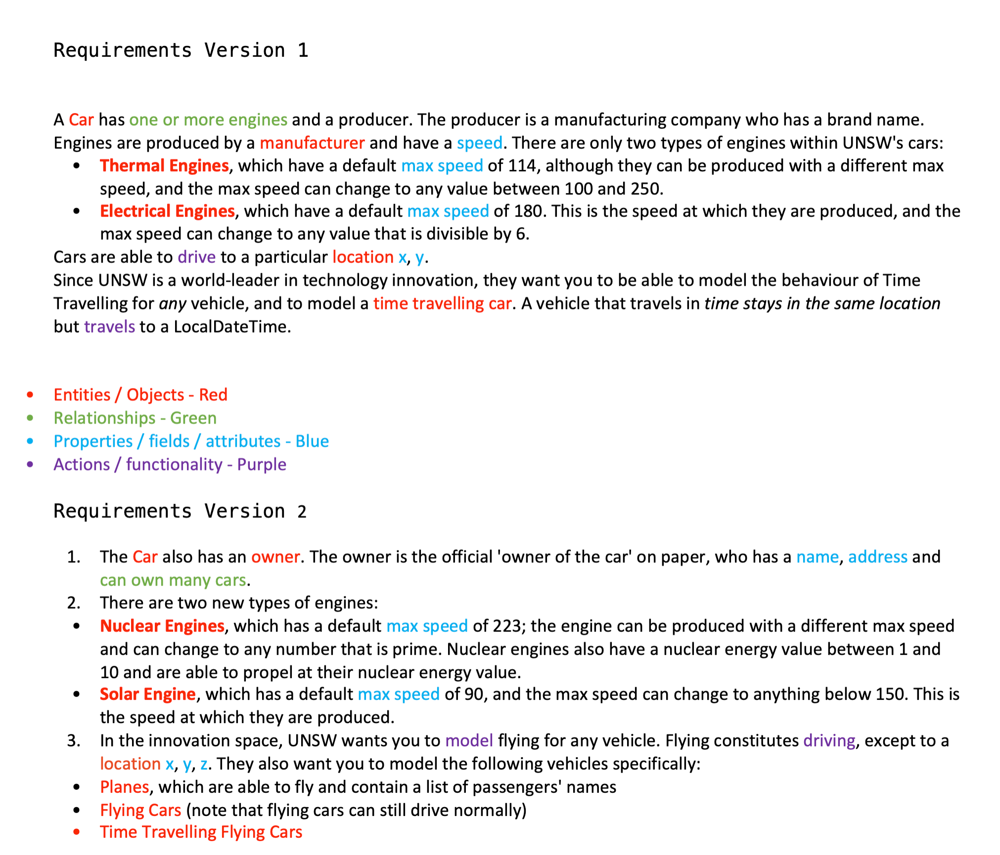
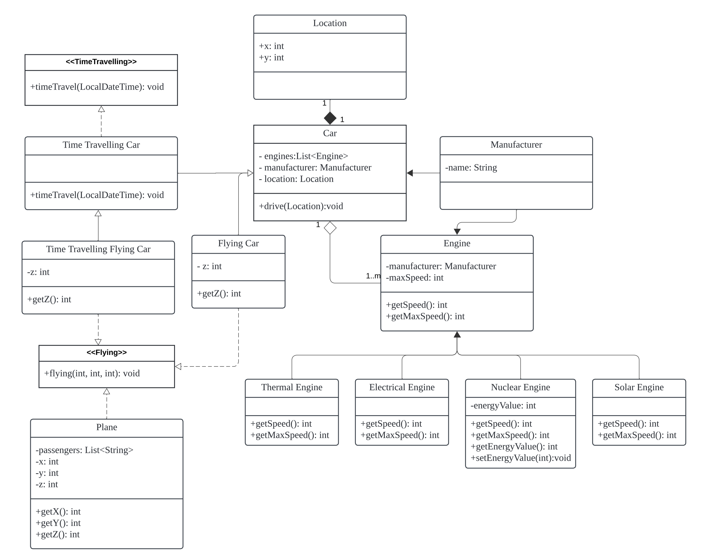

::: file-tree
- lab03/...
    - main/java/unsw/archaic_fs
        - exceptions
            - UNSWFileAlreadyExistsException.java
            - UNSWFileNotFoundException.java
            - UNSWNoSuchFileException.java
    - test/java/unsw/archaic_fs
        - ArchaicFsTest.java
    - blog.md
    - image.png
    - image-1.png
    - cars-design.pdf
:::

::: details 🚗 Core Exercise: Cars

- [Blog: Task1](#task-1)

:::


::: details 📂 Core Exercise: Files

::: tabs

@tab FileAlreadyExists

`UNSWFileAlreadyExistsException.java`

```java
package unsw.archaic_fs.exceptions;

import java.nio.file.FileAlreadyExistsException;

public class UNSWFileAlreadyExistsException extends FileAlreadyExistsException {
    public UNSWFileAlreadyExistsException(String message) {
        super(message);
    }
}

```

@tab FileNotFound

`UNSWFileNotFoundException.java`

```java
package unsw.archaic_fs.exceptions;

import java.io.FileNotFoundException;

public class UNSWFileNotFoundException extends FileNotFoundException {
    public UNSWFileNotFoundException(String message) {
        super(message);
    }
}

```

@tab NoSuchFile

`UNSWNoSuchFileException.java`

```java
package unsw.archaic_fs.exceptions;

import java.io.FileNotFoundException;

public class UNSWNoSuchFileException extends FileNotFoundException {
    public UNSWNoSuchFileException(String file) {
        super(file);
    }
}

```

@tab Test

`ArchaicFsTest.java`

```java
package unsw.archaic_fs;

import org.junit.jupiter.api.Test;

import static org.junit.jupiter.api.Assertions.assertDoesNotThrow;
import static org.junit.jupiter.api.Assertions.assertEquals;
import static org.junit.jupiter.api.Assertions.assertThrows;

import unsw.archaic_fs.exceptions.UNSWNoSuchFileException;

import unsw.archaic_fs.exceptions.UNSWFileAlreadyExistsException;
import unsw.archaic_fs.exceptions.UNSWFileNotFoundException;
import java.util.EnumSet;

public class ArchaicFsTest {
    @Test
    public void testCdInvalidDirectory() {
        ArchaicFileSystem fs = new ArchaicFileSystem();

        // Try to change directory to an invalid one
        assertThrows(UNSWNoSuchFileException.class, () -> {
            fs.cd("/usr/bin/cool-stuff");
        });
    }

    @Test
    public void testCdValidDirectory() {
        ArchaicFileSystem fs = new ArchaicFileSystem();

        assertDoesNotThrow(() -> {
            fs.mkdir("/usr/bin/cool-stuff", true, false);
            fs.cd("/usr/bin/cool-stuff");
        });
    }

    @Test
    public void testCdAroundPaths() {
        ArchaicFileSystem fs = new ArchaicFileSystem();

        assertDoesNotThrow(() -> {
            fs.mkdir("/usr/bin/cool-stuff", true, false);
            fs.cd("/usr/bin/cool-stuff");
            assertEquals("/usr/bin/cool-stuff", fs.cwd());
            fs.cd("..");
            assertEquals("/usr/bin", fs.cwd());
            fs.cd("../bin/..");
            assertEquals("/usr", fs.cwd());
        });
    }

    @Test
    public void testCreateFile() {
        ArchaicFileSystem fs = new ArchaicFileSystem();

        assertDoesNotThrow(() -> {
            fs.writeToFile("test.txt", "My Content", EnumSet.of(FileWriteOptions.CREATE, FileWriteOptions.TRUNCATE));
            assertEquals("My Content", fs.readFromFile("test.txt"));
            fs.writeToFile("test.txt", "New Content", EnumSet.of(FileWriteOptions.TRUNCATE));
            assertEquals("New Content", fs.readFromFile("test.txt"));
        });
    }

    // Now write some more!
    // Some ideas to spark inspiration;
    // - File Writing/Reading with various options (appending for example)
    // - Cd'ing .. on the root most directory (shouldn't error should just remain on
    // root directory)
    // - many others...

    @Test
    public void testAppendToFile() {
        ArchaicFileSystem fs = new ArchaicFileSystem();

        assertDoesNotThrow(() -> {
            fs.writeToFile("appendTest.txt", "Line 1", EnumSet.of(FileWriteOptions.CREATE, FileWriteOptions.TRUNCATE));
            fs.writeToFile("appendTest.txt", "\nLine 2", EnumSet.of(FileWriteOptions.APPEND));
            assertEquals("Line 1\nLine 2", fs.readFromFile("appendTest.txt"));
        });
    }

    @Test
    public void testCreateExistingDirectory() {
        ArchaicFileSystem fs = new ArchaicFileSystem();

        assertDoesNotThrow(() -> {
            fs.mkdir("/existing-dir", true, false);
        });

        assertThrows(UNSWFileAlreadyExistsException.class, () -> {
            fs.mkdir("/existing-dir", false, false);
        });
    }

    @Test
    public void testReadNonExistentFile() {
        ArchaicFileSystem fs = new ArchaicFileSystem();

        assertThrows(UNSWFileNotFoundException.class, () -> {
            fs.readFromFile("nonexistent.txt");
        });
    }

    @Test
    public void testWriteToFileCreateNew() {
        ArchaicFileSystem fs = new ArchaicFileSystem();

        assertDoesNotThrow(() -> {
            fs.writeToFile("/newFile.txt", "Initial Content",
                    EnumSet.of(FileWriteOptions.CREATE, FileWriteOptions.TRUNCATE));
            assertEquals("Initial Content", fs.readFromFile("/newFile.txt"));
        });
    }

    @Test
    public void testWriteToFileExistsWithCreateOption() {
        ArchaicFileSystem fs = new ArchaicFileSystem();

        assertDoesNotThrow(() -> {
            fs.writeToFile("/existingFile.txt", "Content",
                    EnumSet.of(FileWriteOptions.CREATE, FileWriteOptions.TRUNCATE));
        });

        assertThrows(UNSWFileAlreadyExistsException.class, () -> {
            fs.writeToFile("/existingFile.txt", "New Content",
                    EnumSet.of(FileWriteOptions.CREATE, FileWriteOptions.TRUNCATE));
        });
    }

    @Test
    public void testWriteToFileTruncateAndAppend() {
        ArchaicFileSystem fs = new ArchaicFileSystem();

        assertThrows(IllegalArgumentException.class, () -> {
            fs.writeToFile("/file.txt", "Content", EnumSet.of(FileWriteOptions.TRUNCATE, FileWriteOptions.APPEND));
        });
    }

    @Test
    public void testWriteToFileNoTruncateOrAppend() {
        ArchaicFileSystem fs = new ArchaicFileSystem();

        assertThrows(IllegalArgumentException.class, () -> {
            fs.writeToFile("/file.txt", "Content", EnumSet.noneOf(FileWriteOptions.class));
        });
    }

    @Test
    public void testWriteToFileNotExistsNoCreateOptions() {
        ArchaicFileSystem fs = new ArchaicFileSystem();

        assertThrows(UNSWFileNotFoundException.class, () -> {
            fs.writeToFile("/nonexistent.txt", "Content", EnumSet.of(FileWriteOptions.APPEND));
        });
    }

    //

    @Test
    public void testWriteToFileNotExistsWithCreateIfNotExistsOption() {
        ArchaicFileSystem fs = new ArchaicFileSystem();

        assertDoesNotThrow(() -> {
            fs.writeToFile("/createIfNotExists.txt", "Content",
                    EnumSet.of(FileWriteOptions.CREATE_IF_NOT_EXISTS, FileWriteOptions.TRUNCATE));
            assertEquals("Content", fs.readFromFile("/createIfNotExists.txt"));
        });
    }

}

```

:::


::: details Blog

#### Task 1



List of requirements

1. Entities / Objects
    - Car: A car has one or more engines and a producer
    - Thermal Engine: The default maximum speed is 114, and can be varied between 100 and 250.
    - Electrical Engine: The default maximum speed is 180, which can be changed to a multiple of 6.
    - Nuclear Engine: The default maximum speed is 223, which can be changed to any prime number with a nuclear energy value (1 to 10).
    - Solar Engine: The default maximum speed is 90, which can be changed to below 150.
    - Manufacturer: The engine is produced by the manufacturer.
    - Owner: Car owners have names and addresses and can own multiple cars.
    - Plane: Contains passenger list.
    - Flying Car
    - Time Travelling Flying Car

2. Relationships
    - Car has one or more engines
    - Engines are produced by a manufacturer
    - Owner can own many cars

3. Properties / fields / attributes
    - speed
    - max speed
    - x
    - y
    - z
    - name
    - address

4. Actions / functionality
    - Cars are able to drive to a particular location x, y
    - Model flying for any vehicle
    - Vehicles can fly except to a location x, y, z.


#### Task 2

- **Interface design**: I introduced two interfaces, TimeTravelling and Flying. The purpose of this design is to enable any vehicle class to implement these functions, not just limited to specific subclasses. This approach improves the flexibility and scalability of the code.

- **Inheritance**: FlyingCar inherits from Car, TimeTravellingCar and TimeTravellingFlyingCar inherit from Car and TimeTravellingCar respectively, and implement the corresponding interfaces. This design makes the code more maintainable and readable.

- **Relationship between Car and Engine**: We use a composition relationship to indicate that Car contains one or more Engines. This relationship is expressed because Engine is part of Car and its lifecycle depends on Car.



#### Reflections

**Design Changes**
During the design process, I made several changes to my initial approach. Initially, I was inclined to use concrete classes to implement the time travelling and flying functionalities. However, I later decided to use interfaces for these functionalities to enhance the flexibility and scalability of the code. This change came about as I realized that using interfaces would make the code more adaptable and allow for easier addition of new functionalities in the future.

**Interesting and Challenging Aspects**
The most interesting aspect of this task was transforming the complex requirements into a concise and effective UML diagram. This required not only understanding the relationships between classes but also ensuring the maintainability and scalability of the code. The biggest challenge was balancing the use of inheritance and composition while ensuring that each class had a single responsibility.


::: 