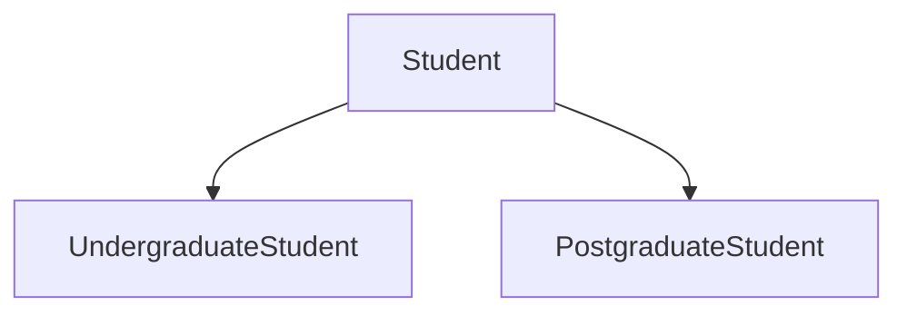
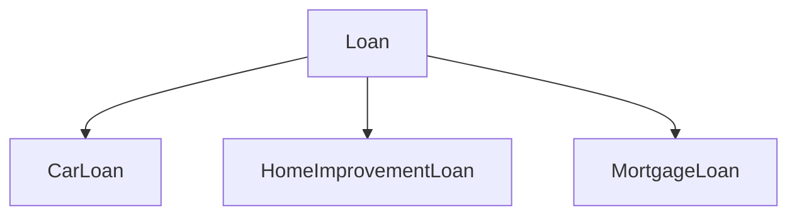
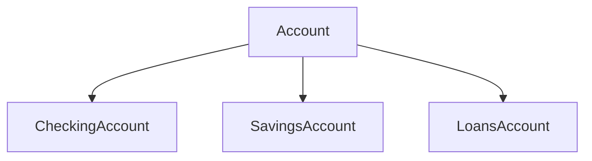
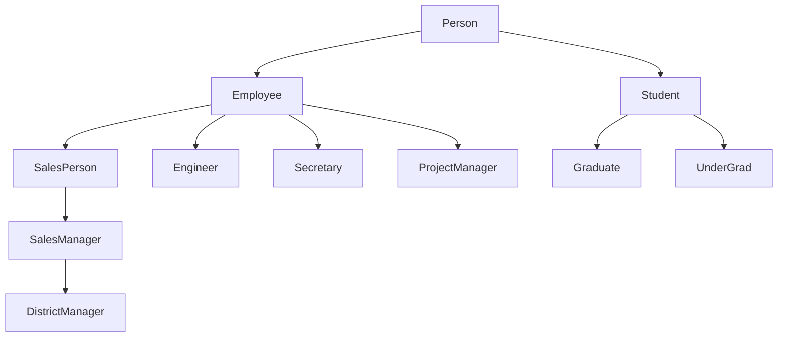
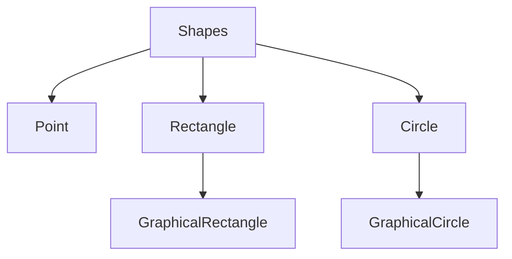
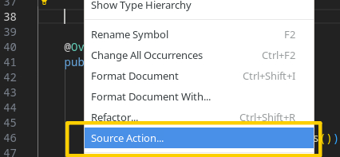
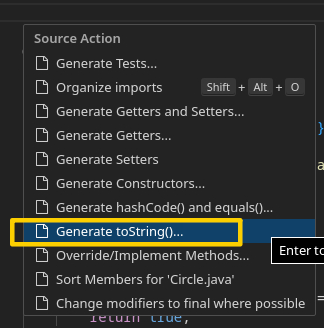
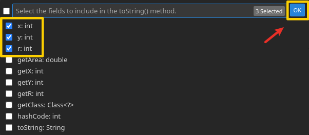

<p>
<HButton type='Menu' title="Week 1 Tuesday"/>
<HButton type='Menu' title="Week 1 Thursday"/>
</p>

## Week 1 Tuesday

# Course Introduction

<HGlobalLink md5="f562990e7f46d878ef51c262987e25ff"/>

### Our Team

**Lecturer-in-charge:** 
- Dr Ashesh Mahidadia [a.mahidadia@unsw.edu.au](mailto:a.mahidadia@unsw.edu.au)

**Course Admin Team:**
- Alvin Cherk
- Sai Nair
- Carl Buchanan
- Amanda Lu

**Tutors:** 
- 24 passionate tutors!

**Course Account Email:** [cs2511@cse.unsw.edu.au](mailto:cs2511@cse.unsw.edu.au)
_(Unless you specifically require to contact a member of the admin team, please use the **above email** for any queries related to the course.)_

[Class Web](http://webcms3.cse.unsw.edu.au/COMP2511/24T2/)

### Course Context

#### The Story So Far: Course Context

- COMP1511: Solving problems with computers, the wonder and joy of programming
- COMP1521: Getting right down into the silicon
- COMP1531: Solving problems in a team; programming in the large
- COMP2521: Solving problems at scale using data structures and algorithms
- **COMP2511: ???**

---

### COMP2511
- We can write code, but how do we write good code?
- **Designing elegant and beautiful software.**
- Shades of Grey - things aren't clear cut; writing good software is an art.
- From programmers to designers.

::: details COMP 2511 Major Themes

- Develop an appreciation for elegantly written software, and how to create and maintain well-designed systems;
- Apply principles and patterns to effectively design flexible, maintainable, and reusable systems
- Understand different design paradigms and methodologies, their background and application:
  - Object-Oriented Paradigm
  - Functional Paradigm
  - Concurrent Paradigm (introduction)

- Understand and apply the principles of Object-Oriented Design to solve problems;
- Be able to follow a systematic OO Design process
- Be able to interpret and use tools for OO Design
- Understand the role of and apply widely used Design Patterns to create extensible designs:
  - Behavioural patterns
  - Structural patterns
  - Creational patterns
  - Programming patterns (exceptions, generic programming)
  - Testing patterns

- Develop skills in both creating medium-scale systems from scratch, and working on existing systems as part of the Software Development Life Cycle;
- Be able to analyse, refactor and work with code started by someone else
- Create medium-scale systems using Java
- Work with an enterprise programming language and IDE:
  - Java language
  - VSCode IDE
  :::
---

#### Credit Teaching Material

- No textbook, the lecture slides cover the required topics.
- However, you are strongly encouraged to read additional material and the reference books.
- In the lecture notes, some content and ideas are drawn from:
  - _**Head First Design Patterns**_, by Elisabeth Freeman and Kathy Sierra, The State University of New Jersey
  - _**Refactoring: Improving the design of existing code**_, by Martin Fowler
  - Material from many popular websites.
---
### How do we obtain our educational objectives?

#### Lectures
- 4 hour lectures (9 weeks)

#### Tutorials
- A 1-hour tutorial session per week, which is scheduled before the lab.
- Online Tutorials/Labs will be run via MS Teams.
- Tutorials are understanding-driven - interactive examples to illustrate concepts discussed in lectures.
- Solutions and recording to tutorials posted at the end of each week.

#### Labs
- 2 hours each week, straight after tutorial
- Similar to most CSE core courses
- Lab retros posted after due date on Confluence
- Online Run via MS Teams

*The above are subject to change, if required.*

---

### Assessments

::: details Coursework (15%)
- Your coursework mark is made up of marks associated with the lab exercises.
- There are seven labs, each worth ten marks.
- We will cap total coursework marks at 60 (which will translate to 15%), leaving one lab as a buffer.
- If you attend all seven labs, we will add all seven lab marks and cap the total coursework marks to 60.
- The specific marking criteria for each lab will be outlined in the respective specifications.
- The table below offers as a general guide for the criteria that your tutor/lab assistant will use to assess you.
:::

::: details Assignment I (15%)
- The marking criteria for the assignment will be outlined in the specification which will be released Tuesday of Week 2.
- Due Friday 5pm Week 5.
- Completed individually.
:::
::: details Assignment II (20%)
- The marking criteria for the project will be outlined in the specification which will be released Thursday Week 5.
- Pairs formed within your tutorial.
- Groups formed by end of Week 3.
- Due Friday 5pm week 9
- Measures in place for difficult partners (Keep your tutor informed)
:::
::: details Assignment III (8% Bonus)
- A more challenging real-world problem that incorporates Design Principles and Patterns discussed in the course.
- For students that wish to extend themselves and score highly in the course.
- Can be completed in a pair or individually.
- Assignment spec released Tuesday week 8.
- Due Sunday 5pm of week 10.
:::
::: details Final Exam (50%)
- In 24T2 the COMP2511 exam will be held in person in the CSE Labs, and invigilated.
- All the students are required to take the final exam in person, even if they have enrolled in online classes. In 24T2, there will be no online exams.
- **Hurdle: From Term 3 2023, in order to pass the course, it is required for the student to achieve a minimum of 40% (20 out of 50) marks in the final examination.**
::: warning Students are eligible for a Supplementary Exam if and only if:
  - Students cannot attend the final exam due to illness or misadventure. Students must formally apply for a special consideration, and it must be approved by the respective authority.
:::

---

#### Assumed Knowledge

- Confident programmers
  - Familiar with C and Python programming concepts
- Able to work in a team
  - Git
  - Working with others
- Understand basic testing principles
- Understand basic software engineering design principles (DRY, KISS)

#### What we don't assume:
- Knowledge of Java
- Understanding of Object-Oriented Programming

::: caution
*This is not a Java course*
:::
---

#### Course Philosophy
- A step up from first-year courses
- Challenging but achievable
- Develop skills in time management, teamwork as well as critical thinking
- Highly rewarding

---

#### Support

- Supporting you is our job :)
- Help Sessions
  - Lots of them with fantastic tutors
  - Feedback on work, help with problems, clarifying ideas
  - You are expected to have done your own research and debugging before arriving

#### Course Forum (Ed)
- Ask questions and everyone can see the answers!
- Make private posts for sharing code
- Response time

#### Course Account - [cs2511@cse.unsw.edu.au](mailto:cs2511@cse.unsw.edu.au)
- Sensitive/personal information

#### During the project - your tutor

---

### Support
- Go to help sessions for help on concepts
- Post on the forum if you need more immediate lab feedback
- There are no late extensions on labs unless in extenuating circumstances - email [cs2511@cse.unsw.edu.au](mailto:cs2511@cse.unsw.edu.au)

::: details

#### Support - UNSW
- Special Consideration - [https://student.unsw.edu.au/special-consideration](https://student.unsw.edu.au/special-consideration)
- Equitable Learning Services - [https://student.unsw.edu.au/els](https://student.unsw.edu.au/els)

---

#### Mental Health & Wellbeing
- UNSW Psychology & Wellness - [https://student.unsw.edu.au/mhc](https://student.unsw.edu.au/mhc)
- UNSW Student Advisors - [https://student.unsw.edu.au/advisors](https://student.unsw.edu.au/advisors)
- Reach out to us at [cs2511@cse.unsw.edu.au](mailto:cs2511@cse.unsw.edu.au)
- Check in with each other
- Talk to someone

[https://student.unsw.edu.au/mhc](https://student.unsw.edu.au/mhc)
[https://student.unsw.edu.au/advisors](https://student.unsw.edu.au/advisors)

:::
---

#### Technology Stack
- Java Version – JDK 17
- VSCode
- Gradle 8.5
- Gitlab (+ CI pipelines)

---

#### Feedback

- We love feedback :)
- Changes made to the course this term based on constructive student feedback.
- We always want to continuously improve:
  - In response to the previous term's feedback, we introduced a sample exam in the Week 10 lab and developed a framework to promote greater engagement during tutorials and laboratories.
- Feedback form
- Course account

---

#### Respect

- Yourselves, each other, course staff

It's time to lift off for 24T2!!!!

---

# Object Oriented Programming (OOP) in Java

<HGlobalLink md5="f5e7cd4f44d6dc6cbba41a36fdd685c2"/>

### OOP in Java

- Object Oriented Programming (OOP)
- Inheritance in OOP
- Introduction to Classes and Objects
- Subclasses and Inheritance
- Abstract Classes
- Single Inheritance versus Multiple Inheritance
- Interfaces
- Method Forwarding (Has-a relationship)
- Method Overriding (Polymorphism)
- Method Overloading
- Constructors

::: details Object Oriented Programming (OOP)

In procedural programming languages (like 'C'), programming tends to be action-oriented, whereas in Java, programming is object-oriented.

In procedural programming:
- Groups of actions that perform some task are formed into functions and functions are grouped to form programs.

In OOP:
- Programmers concentrate on creating their own user-defined types called classes.
- Each class contains data as well as the set of methods (procedures) that manipulate the data.
- An instance of a user-defined type (i.e., a class) is called an object.
- OOP encapsulates data (attributes) and methods (behaviors) into objects; the data and methods of an object are intimately tied together.
- Objects have the property of information hiding.

#### Inheritance in Object Oriented Programming (OOP)

- Inheritance is a form of software reusability in which new classes are created from the existing classes by absorbing their attributes and behaviors.
- Instead of defining completely separate new class, the programmer can designate that the new class is to inherit attributes and behaviors of the existing class (called superclass). The new class is referred to as subclass.
- Programmer can add more attributes and behaviors to the subclass, hence, normally subclasses have more features than their superclasses.

---

Inheritance relationships form tree-like hierarchical structures. For example,

- Student Hierarchy



- Loan Hierarchy



- Account Hierarchy



- Person Hierarchy



- Shapes Hierarchy



:::

---

### "Is-a" - Inheritance relationship

- In an "is-a" relationship, an object of a subclass may also be treated as an object of the superclass.
- For example, UndergraduateStudent can be treated as Student too.
- You should use inheritance to model "is-a" relationship.

::: warning Very Important:

- Don’t use inheritance unless all or most inherited attributes and methods make sense.
- For example, mathematically a circle is-a(an) oval, however you should not inherit a class circle from a class oval. A class oval can have one method to set width and another to set height.
:::

### "Has-a" - Association relationship

- In a "has-a" relationship, a class object has an object of another class to store its state or do its work, i.e., it "has-a" reference to that other object.
- For example, a Rectangle Is-NOT-a Line. However, we may use a Line to draw a Rectangle.
- The "has-a" relationship is quite different from an "is-a" relationship.
- "Has-a" relationships are examples of creating new classes by composition of existing classes (as opposed to extending classes).

::: warning Very Important:

- Getting "Is-a" versus "Has-a" relationships correct is both subtle and potentially critical. You should consider all possible future usages of the classes before finalizing the hierarchy.
- It is possible that obvious solutions may not work for some applications.
:::

---
### Designing a Class

- Think carefully about the functionality (methods) a class should offer.
- Always try to keep data private (local).
- Consider different ways an object may be created.
- Creating an object may require different actions such as initializations.
- Always initialize data.
- If the object is no longer in use, free up all the associated resources.
- Break up classes with too many responsibilities.
- In OO, classes are often closely related. "Factor out" common attributes and behaviors and place these in a class. Then use suitable relationships between classes (for example, "is-a" or "has-a").

::: tip Introduction to Classes and Objects

- A class is a collection of data and methods (procedures) that operate on that data.
- For example:<br>_a circle can be described by the x, y position of its centre and by its radius._
- We can define some useful methods (procedures) for circles, compute circumference, compute area, check whether points are inside the circle, etc.
- By defining the Circle class (as below), we can create a new data type.

:::

::: details <strong>The class: Circle</strong>

For simplicity, the methods for getter and setters are not shown in the code.

```java
public class Circle {

    protected static final double pi = 3.14159;
    protected int x, y;
    protected int r;

    // Very simple constructor
    public Circle() {
        this.x = 1;
        this.y = 1;
        this.r = 1;
    }

    // Another simple constructor
    public Circle(int x, int y, int r) {
        this.x = x;
        this.y = y;
        this.r = r;
    }

    /**
     * Below, methods that return the circumference
     * area of the circle
     */
    public double circumference() {
        return 2 * pi * r;
    }

    public double area() {
        return pi * r * r;
    }
}
```

:::

---

## Week 1 Thursday


::: details Circle.java
```java
 public class Circle extends Object {

    private static final double PI = 3.14159;

    public int x = 0, y = 0;
    private int r = 6;

    static int no_circles = 0;

    public Circle() {
        super();
        no_circles++;
    }

    public Circle(int x, int y, int r) {
        this();
        this.x = x;
        this.y = y;
        this.r = r;
  
    }


    public Circle(int x, int y) {
        this(x, y, 5);
    }

    public double getArea() {
        return PI * r * r;
    }

    @Override
    public String toString() {
        String msg = "[" + x + ", " + y + " sdfsf sdfdsfds ]";
        return msg;
    }

    @Override
    public boolean equals(Object obj) {
   
        if(obj == null) { return false; }
        if(obj == this) { return true; }

        if(this.getClass() != obj.getClass()){
            return false;
        }

        // both are of type Circle..

        Circle other = (Circle) obj;
        if(this.x == other.x && this.y == other.y && this.r == other.r){
            return true;
        }
        else {
            return false;
        }
         
    }
    
    // Getter and Setter below ..
    public int getX() {
        return x;
    }

    public void setX(int x) {
        this.x = x;
    }

    public int getY() {
        return y;
    }

    public void setY(int y) {
        this.y = y;
    }

    public int getR() {
        return r;
    }

    public void setR(int r) {
        if ( r > 0 ) {
            this.r = r;
        }

    }


}
```
:::

### Class

First of all, I can say the class, which is a keyword and the name of the class, which is `Circle`.

```java
public class Circle { // [!code focus]
    private static final double PI = 3.14159;
    // ...
}
```
So what is public before that? That's called access modifier. Meaning that we say like this class is available to everybody. Everybody means all other java files in this package or other packages.

#### So what is the package?

So package is like a collection of Java files together, so you can have a package for maths library. Basically, as you can expect that it will have few classes defined, which may give me some different functionality.

---

So here is a circle very simple example. circle has the centre, which is `x` and `y` value, and it has got a radius `r`. I can store information about a circle. You may want to have many more variables. You want to have array, whatever all these you can.

- `x` is of type integer assignment exactly what you're saying in C.

```java
public class Circle {

    private static final double PI = 3.14159;

    int x = 0;  // [!code focus:3]
    int y = 0;
    private int r = 6;

    static int no_circles = 0;
    // ...
}
```

::: warning Public, private and default kind of should be OK.
- `Default` also is available to everybody to other classes.
- Also `public` as is also every other class.
- `Private` is only available in this class and therefore deliberately.

We'll talk about that because it makes sense when we talk about packages because otherwise it's right now it's OK. To public and private is fine now.

:::

::: tip <code>private int r</code>
I'm only putting one variable R as a private. And so you will see that it is not accessible outside this class just to show you that. 

**Ideally, all of them would be private**
:::

So, for example, there is a variable `r` here, it is private. It's not even available outside this class so nobody can access this `r`. The matters inside this class can only access `r`.

So generally speaking, for every variable we put it like this:

```java
 public class Circle {
    
    // ...

    // Getter and Setter below ..
    public int getX() { // [!code focus:7]
        return x;
    }

    public void setX(int x) {
        this.x = x;
    }

    // ...

 }
```

- `getX()` give me the value of `x` and `setX()` set the value of `x`.

So `x` is private. But these methods are public.

---
### final

Now what is first line here?

```java
 public class Circle {  // [!code word:final]

    private static final double PI = 3.14159;// [!code focus]

    // ...
 }
```

The way to define a constant in Java is basically I say `static`.

Early `final` means final, you can't change it. `final` is a constant.

---

### Instance variables

```java
public class Circle {

    private static final double PI = 3.14159; 

    public int x = 0, y = 0;    // <- Instance variables
    private int r = 6;  // <- Instance variables
    // ...
}
```

These variables are so called **instance variables**. 

So they are associated with every instance. So I've got 100 circles Each instance have associated `x`, `y` and `r`. So they are instance variables.

But I don't need to store `PI` value 100 times. It's just the one constant. So then I say it is static, meaning it is associated with the class, Not with instance.

::: tip So there are two kind of variables:
- `Instance variables` which are unique for every instance. (class variable)
- `Class variable` which is unique for that class. (class constant)
:::

So in this case, this value `PI` is associated with this class.
And there is only one assigned value for that.

---

### static

Now, in this case, I'm saying there is a variable of type integer number of circle. I initialise that to zero, and that is a `static`, means a class variable:

```java
public class Circle {   

    private static final double PI = 3.14159;

    public int x = 0, y = 0;
    private int r = 6;
    // [!code word:static]
    static int no_circles = 0;  // [!code focus]

    // ...
}

```

It's only one copy, and that's useful because what we will do down the track, we count how many times circle instances were created.

So every time we are going to create an instance, we are going to just increase that value. So we know at the end how many times circle instances were created.

---

### Object

There is one class which is already defined as a  part of Java, and for some funny reason, the name of that class is `Object`.

OK, so that's the top most class in Java now. What does it do intuitively in a simple language? So it says that when I want to create a new instance of any class, you need to do some basic work.

::: note For example 

Find out the bytes required for that request to whatever operating system, keep track of the reference.
All these basic stuff you need to carry out now. We don't want to do that. I don't even know how it happens on Linux versus Apple os versus windows and so on and so forth. So that object class carries out all these basic operation.  Any time I create a new instance or a new object, do you understand that?
:::

And so when we write any class in Java, it becomes a subclass of the object class. Whether you say it or not, say it doesn't matter.

So technically, conceptually, what we are doing is that now subclass, you can say circle is a subclass of object here, object for funny reason. They name it as object. Object is actually a class.

```java
// [!code word:Object]
public class Circle extends Object { // [!code focus]

    // ...

}
```

I can write it but I don't need to write it. It will work, so I'll just go to it. Normally we don't write it.

```java
public class Circle {
    // ...
}
```

---

### Constructor

Now this one is the same name as the name of my class, and it's exactly the same. We call `constructor`.

```java
// [!code word:Circle]
public class Circle {    // [!code highlight]

    // ...

    public Circle() {   // [!code highlight]
        // ...
    }

    // ...

}
```

Construct or create an instance of circle an object of circle so we can decide different ways to construct. So they are called constructors.


::: details super()

The first call in any constructor should be to
construct the super class, so construct super class first, then add the value variables for this class.

Technically, we could have done like this.
`super()` is a keyword This so it says, Go to the Super Class in this case, object and create instance of an object.

So that's what Java technically wants to do.

```java
// [!code word:super]
public class Circle {

    // ...

    public Circle() {   // [!code focus:5]
        super();    
    }

    // ...

}
```

So that's what Java technically wants to do.

And therefore, for Java, First you create an object of the super class. In this case, Super class is an object class, which is the default class. If you don't write it, Java will insert it automatically.

> [!NOTE]
> In simple language what happens:
>
> That it needs to go and seek memory allocation from the operating system, and it's somewhere in the memory it is going to store `x`, `y` and `r`. 
>
>That's all it does **Remember**.

And again, we don't need to think that low level in Java. It just creates an instance in which I store something that instance is associated with circle. So when I go to that instance and call a
method, it will call the corresponding method.

:::

Let me give some additional functionality or benefit different ways My client can create circle so the client can also tell us the origin and the radius.

```java
public class Circle {

    private static final double PI = 3.14159;

    public int x = 0, y = 0;
    private int r = 6;

    static int no_circles = 0;

    // Circle c1 = new Circle()
    public Circle() {
        super();
        no_circles++;
    }
    // [!code focus:9]
    // Circle c2 = new Circle(3, 1, 8) 
    public Circle(int x, int y, int r) {    
        this();
        this.x = x;
        this.y = y;
        this.r = r;
  
    }

    // ...
}
```
Accordingly, we create circle, so client can When they say new, so client can say new circle and they say `x` is `3`, `y` is `1` and radius `r` is `8`, so it will match to here.

So now these values are coming from user, the client with other method which is creating instance of `Circle`.

```java
public class Circle {

    // ...

    public int x = 0, y = 0;    // <- instance variable  // [!code highlight]
    private int r = 6;          // <- instance variable  // [!code highlight]

    // ...

    // [!code word:x]
    // Circle c2 = new Circle(3, 1, 8)
    public Circle(int x, int y, int r) {    // [!code highlight]
        this();     // <- super class constructor
        this.x = x;
        this.y = y;
        this.r = r;
  
    }

    // ...
}
```
There are two different `x`. So if you want to make it simple, you can just give a different name: `a`, `b`, `c`.

So there's no confusion, but generally we put the same name because semantically they are the same. So therefore these values then shouldn't be copied to this instance variable.

- `this.x` means this is the instance variable `x`.
- `x` only is coming from the client.

If we use `this.x = x`, it means this instance variable `x` is equal to `x` which is coming from the client.

::: note What is the first line here? (this();) 

Remember, first line of any constructor must be a constructor
of the super class or constructor of the same class.

::: details Why use here?
In Java, the use of `this()` serves several important purposes, particularly within constructors:

1. **Constructor Overloading**: When a class has multiple constructors (constructor overloading), `this()` can be used to call one constructor from another. This helps to reduce code duplication and improve readability and maintainability. For example, in a class `Person`, you might have several constructors:

    ```java
    public class Person {
        private String name;
        private int age;
        
        // Constructor 1
        public Person() {
            this("Unknown", 0); // Calls Constructor 3
        }
        
        // Constructor 2
        public Person(String name) {
            this(name, 0); // Calls Constructor 3
        }
        
        // Constructor 3
        public Person(String name, int age) {
            this.name = name;
            this.age = age;
        }
    }
    ```

    By doing this, Constructors 1 and 2 reuse the logic in Constructor 3, thereby avoiding duplicate code.

2. **Simplify Initialization Logic**: By calling another constructor, you can simplify the initialization logic. In the above example, all constructors eventually call the `Person(String, int)` constructor, ensuring that the initialization logic is centralized in one place, reducing the chances of errors.

3. **Ensure Consistent Initialization**: Using `this()` ensures that the object's initialization process is consistent, avoiding different initialization logic in different constructors and reducing the risk of errors and inconsistencies.

It’s important to note:
- The `this()` call must be the first statement in a constructor. If it's not, the compiler will throw an error.
- You cannot use both `this()` and `super()` in the same constructor because both must be the first statement.

In summary, `this()` in Java is primarily used to simplify constructor overloading, reduce code duplication, and ensure consistent object initialization.
:::

Now you can only give me the origin and I'll use the default value of `r = 5`. So you can provide many constructors depending on your requirement.

```java
// ...

    public Circle() {
        super();
        no_circles++;
    }

    public Circle(int x, int y, int r) { // <- will call this
        this();
        this.x = x;
        this.y = y;
        this.r = r;
  
    }

    public Circle(int x, int y) {   // [!code focus:3]
        this(x, y, 5);              
    }                               

// ...
```

That's how Java works.

---

### Method

What are the methods for this class? So now I am simply declaring a very simple method to get the area:

```java
 public class Circle {
    // ...

    public double getArea() {   // [!code focus:3]
        return PI * r * r;
    }

    // ...
 }
```

Because there is no argument here, the value of `r` is coming from the instance variable and we don't need use `this.r`.

---

### @Override

```java
// ...
    @Override   // [!code highlight]
    public String toString() {
        String msg = "[" + x + ", " + y + " sdfsf sdfdsfds ]";
        return msg;
    }

// ...
```

In Java, `@Override` is an annotation used to indicate that a method in a subclass is intended to override a method in its superclass or an interface. 

::: details Its primary purposes are:

1. **Compile-Time Checking**: The `@Override` annotation helps the compiler ensure that a method is indeed overriding a method from a superclass or implementing a method from an interface. If the method signature (including the method name, parameter types, and return type) does not match exactly, the compiler will produce an error.

2. **Code Readability**: Using `@Override` improves code readability by making it clear which methods are overridden. This helps developers understand the structure of the code and maintain it more easily.

#### Example Usage

```java
class Parent {
    void display() {
        System.out.println("Parent display");
    }
}

class Child extends Parent {
    @Override
    void display() {
        System.out.println("Child display");
    }
}
```

In this example, the `Child` class overrides the `display` method from the `Parent` class. The `@Override` annotation indicates that the method in the `Child` class is intended to override the method in the `Parent` class. If there were a mistake in overriding, such as a spelling error or parameter mismatch, the compiler would generate an error.

#### Common Error Scenarios

1. **Method Name Mismatch**:

```java
class Parent {
    void display() {
        System.out.println("Parent display");
    }
}

class Child extends Parent {
    @Override
    void displayy() {  // Incorrect method name
        System.out.println("Child display");
    }
}
```

The compiler will produce an error because the method name in the `Child` class does not match the method name in the `Parent` class.

2. **Parameter List Mismatch**:

```java
class Parent {
    void display() {
        System.out.println("Parent display");
    }
}

class Child extends Parent {
    @Override
    void display(String msg) {  // Parameter list mismatch
        System.out.println("Child display: " + msg);
    }
}
```

Here, the compiler will also produce an error because the parameter list of the method in the `Child` class does not match that of the method in the `Parent` class.

Overall, the `@Override` annotation is a useful tool that helps developers avoid errors and enhances the readability and maintainability of the code.

:::

::: details Sourse Action in VSCode

If we want to override `toString()` in VSCode, we can using `Source Action`:







then we can get the code:

```java
    @Override
    public String toString() {
        return "Circle [x=" + x + ", y=" + y + ", r=" + r + "]";
    }
```
:::

#### equals

`equal` is a method in Java that is used to compare two objects. The `equals()` method compares two objects for equality and returns `true` if they are equal and `false` otherwise.

In this case, we are comparing two objects of the same class `Circle`. So we are comparing the `x`, `y` and `r` values of two objects, but they are stored in different memory locations.

```java
// ...
    @Override   // [!code word:obj]
    public boolean equals(Object obj) {
   
        if(obj == null) { return false; }
        if(obj == this) { return true; }

        if(this.getClass() != obj.getClass()){
            return false;
        }

        // both are of type Circle..

        Circle other = (Circle) obj;
        if(this.x == other.x && this.y == other.y && this.r == other.r){
            return true;
        }
        else {
            return false;
        }
         
    }
// ...
```

If we want to `@Override` the method, we must use the same arguments as the superclass.

```java:no-line-numbers
    @Override                              // [!code error]
    public boolean equals(Circle obj) {  ❌ // [!code error]

    @Override                              
    public boolean equals(Object obj) {  ✅
```

First, we check if the object is `null` or not. If it is `null`, we return `false`. If the object is the same as the current object, we return `true`:

```java
    if(obj == null) { return false; }
    if(obj == this) { return true; }
```

But in `obj`, there not only `Circle` objects but also other objects. So we need to check if the class of the object is the same as the class of the current object. If it is not the same, we return `false`.

```java
    if(this.getClass() != obj.getClass()){
        return false;
    }
```

::: tip
We can use `super.equals(obj)` to compare the superclass of the current object and the object passed as an argument.

```java
    if(super.equals(obj) == false) { return false;} 
```
`super.equals(obj)` can replace all of code before. 

::: details For example

```java
    @Override
    public boolean equals(Object obj) {
        if(super.equals(obj) == false) { return false;} 
        Circle other = (Circle) obj;
        if(this.x == other.x && this.y == other.y && this.r == other.r){
            return true;
        }
        else {
            return false;
        }
    }
```
:::

Finally, we compare the `x`, `y` and `r` values of the current object and the object passed as an argument. If they are all equal, we return `true`. Otherwise, we return `false`.

```java
    Circle other = (Circle) obj;
    if(this.x == other.x && this.y == other.y && this.r == other.r){
        return true;
    }
    else {
        return false;
    }
```

---

### Create a Class

```java 
public class Test1 {
    
    public static void main(String[] args) {
        
        Circle c1 = new Circle();

        System.out.println( "c1 area: "+ c1.getArea() );

        Circle c2 = new Circle(2, 5, 8);
        System.out.println( c2.getArea() );

        System.out.println( Circle.no_circles );

        System.out.println( c2 );

        Circle c3 = new Circle(2, 5, 8);

        c1 = c2;
        System.out.println("revised, c1 area: "+ c1.getArea() );

        System.out.println( c2 == c3 ); 
        System.out.println( c2.equals(c3) ); 
    }
}
```

When we run this code, it just like a C program. It will start from the main method. 

::: tip 

If we want to know the variable `no_circles`, we can use `Circle.no_circles` to get the value:

```java
    System.out.println( Circle.no_circles ); 
```
:::

::: caution
`c2` and `c3` are two different objects. They are stored in different memory locations. So `c2 == c3` will return `false`. But if we compare the values of `c2` and `c3`, they are the same. So `c2.equals(c3)` will return `true`.

```java
    System.out.println( c2 == c3 );         // false
    System.out.println( c2.equals(c3) );    // true
```

- `==` is used to compare the memory location of two objects.
- `equals()` is used to compare the values of two objects.
:::

---

### Subclasses and Inheritance

We want to implement GraphicalCircle.

This can be achieved in at least 3 different ways.

#### First Approach

```java
// The class of graphical circles
public class GraphicalCircle {
    int x, y;
    int r;
    Color outline, fill;

    public double circumference() {
        return 2 * 3.14159 * r;
    }

    public double area() {
        return 3.14159 * r * r;
    }

    public void draw(Graphics g) {
        g.setColor(outline);
        g.drawOval(x - r, y - r, 2 * r, 2 * r);
        g.setColor(fill);
        g.fillOval(x - r, y - r, 2 * r, 2 * r);
    }
}
```

- In this approach we are creating the new separate class for GraphicalCircle and re-writing the code already available in the class Circle.
- For example, we re-write the methods area and circumference.
- Hence, this approach is NOT elegant, in fact, it's the worst possible solution.

::: warning
Note again, it's the worst possible solution!
:::

#### Second Approach

```java
public class GraphicalCircle2 {     // [!code word:Circle]
    // here's the math circle
    Circle c;
    // The new graphics variables go here
    Color outline, fill;

    // Very simple constructor
    public GraphicalCircle2() {
        c = new Circle();
        this.outline = Color.black;
        this.fill = Color.white;
    }

    // Another simple constructor
    public GraphicalCircle2(int x, int y, int r, Color o, Color f) {
        c = new Circle(x, y, r);
        this.outline = o;
        this.fill = f;
    }

    // draw method, using object 'c'
    public void draw(Graphics g) {
        g.setColor(outline);
        g.drawOval(c.x - c.r, c.y - c.r, 2 * c.r, 2 * c.r);
        g.setColor(fill);
        g.fillOval(c.x - c.r, c.y - c.r, 2 * c.r, 2 * c.r);
    }
}
```

- We want to implement GraphicalCircle so that it can make use of the code in the class Circle.
- This approach uses "has-a" relationship.
- That means, a GraphicalCircle has a (mathematical) Circle.
- It uses methods from the class Circle (area and circumference) to define some of the new methods.
- This technique is also known as method forwarding.

#### Third Approach - Extending a Class

```java
import java.awt.Color;
import java.awt.Graphics;

public class GraphicalCircle extends Circle {
    Color outline, fill;

    public GraphicalCircle() {
        super();
        this.outline = Color.black;
        this.fill = Color.white;
    }

    // Another simple constructor
    public GraphicalCircle(int x, int y, int r, Color o, Color f) {
        super(x, y, r);
        this.outline = o;
        this.fill = f;
    }

    public void draw(Graphics g) {
        g.setColor(outline);
        g.drawOval(x - r, y - r, 2 * r, 2 * r);
        g.setColor(fill);
        g.fillOval(x - r, y - r, 2 * r, 2 * r);
    }
}
```

- We can say that GraphicalCircle is-a Circle.
- Hence, we can define GraphicalCircle as an extension, or subclass of Circle.
- The subclass GraphicalCircle inherits all the variables and methods of its superclass Circle.

---

### Abstract Classes

Using abstract classes:
- we can declare classes that define only part of an implementation, leaving extended classes to provide specific implementation of some or all the methods.

The benefit of an abstract class:
- is that methods may be declared such that the programmer knows the interface definition of an object,
- however, methods can be implemented differently in different subclasses of the abstract class.

When we writing a class, we should writing the comments just before the method:

```java
/**     // [!code focus:10]
	 * 5 arg constructor for GraphicalCircle
	 * 
	 * @param x x axis
	 * @param y y axis
	 * @param r radius
	 * @param o outline color
	 * @param f fill color
	 */
	public GraphicalCircle(int x, int y, int r, Color o, Color f) {
		super(x, y, r); // call 3-arg constructor from Circle
		this.outline = o;
		this.fill = f;
	}
```

we also can use Java doc via Java.com to automatically generate the documentation.

::: details Some Rules

- An abstract class is a class that is declared abstract.
- If a class includes abstract methods, then the class itself must be declared abstract.
- An abstract class cannot be instantiated.
- A subclass of an abstract class can be instantiated if it overrides each of the abstract methods of its superclass and provides an implementation for all of them.
- If a subclass of an abstract class does not implement all the abstract methods it inherits, that subclass is itself abstract.
:::
