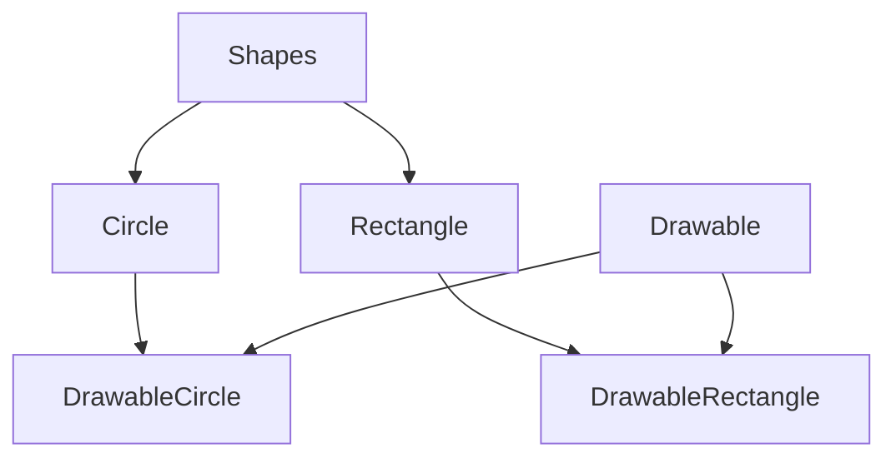
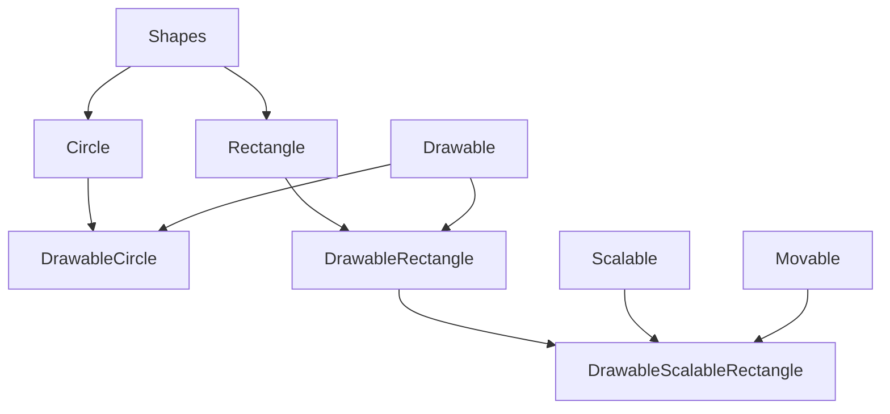
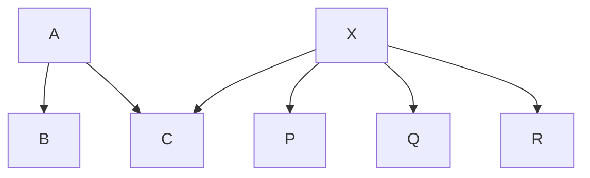

<p>
<HButton type='Menu' title="Week 2 Tuesday"/>
<HButton type='Menu' title="Week 2 Thursday"/>
</p>

## Week 2 Tuesday

<HGlobalLink md5="0085b7713df60281bc464ce4c15cf9fd" />

### Interfaces in Java

- Interfaces are like **abstract classes**, but with a few **important differences**.
- All the methods defined within an interface are **implicitly abstract**. (We don’t need to use the abstract keyword, however, to improve clarity one can use the abstract keyword).
- **Variables** declared in an interface must be **static and final**, that means, they must be **constants**.
- Just like a class **extends** its superclass, it also can optionally **implement** an interface.
- In order to implement an interface, a class must first declare the interface in an **implements** clause, and then it must provide an implementation for all of the abstract methods of the interface.
- A class can **"implement"** more than one **interface**.
- More discussions on **"interfaces"** later in the course.

```java
public interface Drawable {     // define interface     // [!code highlight:5]
    public void setColor(Color c);
    public void setPosition(double x, double y);
    public void draw(Graphics g);
}

public class DrawableRectangle
                extends Rectangle
                implements Drawable {   // [!code highlight]
                    
    private Color c;
    private double x, y;

    // Here are implementations of the methods in Drawable
    // we also inherit all public methods of Rectangle

    public void setColor(Color c) {
        this.c = c;
    }

    public void setPosition(double x, double y) {
        this.x = x;
        this.y = y;
    }

    public void draw(Graphics g) {
        g.drawRect(x, y, w, h, c);
    }
}
```




#### Implementing Multiple Interfaces

A class can implement more than one interface. For example,

```java
public class DrawableScalableRectangle
    extends DrawableRectangle
    implements Movable, Scalable {

    // methods go here ....

}
```



#### Extending Interfaces

- Interfaces can have **sub-interfaces**, just like classes can have subclasses.
- A sub-interface **inherits all** the abstract methods and constants of its super-interface, and may define new abstract methods and constants.
- Interfaces **can extend** more than one interface at a time. For example,

```java
public interface Transformable 
    extends Scalable, Rotable, Reflectable {}   // [!code highlight]

public interface DrawingObject
    extends Drawable, Transformable {}  // [!code highlight]

public class Shape implements DrawingObject {
    // ...
}
```
---
### Method Forwarding



- Suppose class C extends class A, and also implements interface X.
- As all the methods defined in interface X are abstract, class C needs to implement all these methods.
- However, there are three implementations of X (in P, Q, R).
- In class C, we may want to use one of these implementations, that means, we may want to use some or all methods implemented in P, Q or R.
- Say, we want to use methods implemented in P. We can do this by creating an object of type class P in class C, and through this object access all the methods implemented in P.
- Note that, in class C, we do need to provide required stubs for all the methods in the interface X. In the body of the methods, we may simply call methods of class P via the object of class P.
- This approach is also known as method forwarding.

### Methods Overriding (Polymorphism)

- When a class defines a method using the same name, return type, and by the number, type, and position of its arguments as a method in its superclass, the method in the class overrides the method in the superclass.
- If a method is invoked for an object of the class, it’s the new definition of the method that is called, and not the superclass’s old definition.

::: tip Polymorphism

- An object’s ability to decide what method to apply to itself, depending on where it is in the inheritance hierarchy, is usually called polymorphism.
:::

::: details Example
In the example below,
```java
class A {
    int i = 1;
    int f() { return i; }
}

class B extends A {
    int i;                      // shadows i from A
    int f() {                   // overrides f() from A
        i = super.i + 1;        // retrieves i from A
        return super.f() + i;   // invokes f() from A
    }
}
```
- If `p` is an instance of class B, `p.f()` refers to `f()` in class B.
- However, if `p` is an instance of class A, `p.f()` refers to `f()` in class A.

The example also shows how to refer to the overridden method using `super` keyword.

---

Suppose class C is a subclass of class B, and class B is a subclass of class A.

Class A and class C both define method `f()`.

From class C, we can refer to the overridden method by,

```java
super.f();
```

This is because class B inherits method `f()` from class A.

However,

- If all the three classes define `f()`, then calling `super.f()` in class C invokes class B’s definition of the method.
- Importantly, in this case, there is no way to invoke `A.f()` from within class C.

::: warning
Note that `super.super.f()` is NOT legal Java syntax.
:::

Defining methods with the **same name** and **different argument** or return types is called **_method overloading_**.

In Java,

- A method is distinguished by its **method signature** - its name, return type, and by the number, type, and position of its arguments.

For example,

```java
double add(int, int)
double add(int, double)
double add(float, int)
double add(int, int, int)
double add(int, double, int)
```
---

### Data Hiding and Encapsulation

We can hide the data within the class and make it available only through the methods.

This can help in maintaining the consistency of the data for an object, that means the state of an object.

### Visibility Modifiers

Java provides five access modifiers (for variables/methods/classes):

- `public` - visible to the world
- `private` - visible to the class only
- `protected` - visible to the package and all subclasses
- No modifier (default) - visible to the package

---

### Constructors

- Good practice to define the required constructors for all classes.
- If a constructor is not defined in a class,

  - No-argument constructor is implicitly inserted.
  - This no-argument constructor invokes the superclass’s no-argument constructor.
  - If the parent class (superclass) doesn’t have a visible constructor with no-argument, it results in a compilation error.

- If the first statement in a constructor is not a call to `super()` or `this()`, a call to `super()` is implicitly inserted.
- If a constructor is defined with one or more arguments, no-argument constructor is not inserted in that class.
- A class can have multiple constructors, with different signatures.
- The word `this` can be used to call another constructor in the same class.

---

## Week 2 Thursday

Hello everyone. Today, we need to cover several important topics. Firstly, I urge you all to thoroughly review the examples in the week two codebase that we discussed last lecture. It’s crucial that you interact with these examples—modify and experiment with them—to solidify your understanding of object-oriented programming in Java. Remember, this course builds on the foundational knowledge you’ve gained from previous courses, focusing on key features of Java programming.

During our last session, we discussed several Java-specific features, like string handling and the use of ‘instanceof’ and class structures. We also explored how interfaces work in Java, using ‘shape’ as an example of an interface with a default method and how a ‘circle’ might implement this.

Please ensure you are comfortable with these concepts, as they are fundamental to our discussions moving forward. If you have any questions, now is the time to ask me or your tutor.

Looking ahead, today’s session will introduce domain modeling and touch on assignment one. Time permitting, we will begin discussing ‘design by contract’ as well. It’s important to note that while we are moving beyond basic programming, we will revisit topics such as generic types in future classes.

# Domain Modelling using UML

<HGlobalLink title="Domain Modelling" md5="00f60665c017d8ae29c90c473b8abbbd" />

In this part of the lecture, the focus shifts from basic programming concepts to applying an object-oriented framework to software design, which is essential for creating robust, reusable, and flexible systems. The emphasis here is on modeling software using principles of object-oriented design such as inheritance (is-a relationships) and composition (has-a relationships), and deciding the appropriate use of access modifiers like public and private to manage data access.

The upcoming assignment, Assignment One, challenges students to demonstrate their ability to interpret requirements and design an object-oriented system. This skill is vital as most real-world systems utilize an object-oriented approach, regardless of the programming language used. The principles learned here are universal and not confined to Java but applicable to any software design context.

This course is unique in its singular focus on the intricate details of designing high-quality software, as opposed to simply coding. It's about understanding and applying design principles that ensure software is not only functional but also maintainable and scalable.

The lecture also makes it clear that while prior courses may have introduced programming in languages like C or JavaScript and covered various computing topics like databases, operating systems, AI, and machine learning, this course concentrates exclusively on the principles of software design. This knowledge is critical across all domains of software development, making it highly valued in the industry.

Students are encouraged to actively engage with the material and ask questions, especially as the course introduces the use of UML (Unified Modeling Language) diagrams to visually represent and plan the architecture of software systems, simplifying the complexities of domain modeling in a way that is accessible and practical.

---

### Domain Models

- Domain Models are used to visually represent important domain concepts and relationships between them.
- Domain Models help clarify and communicate important domain-specific concepts and are used during the requirements gathering and designing phase.
- Domain modeling is the activity of expressing related domain concepts into a domain model.
- Domain models are also often referred to as conceptual models or domain object models.
- We will use Unified Modeling Language (UML) class diagrams to represent domain models.
- There are many different modeling frameworks, like UML, Entity-Relationship, Mind maps, Context maps, Concept diagrams, etc.

Domain models are essentially representations used to illustrate important concepts and their relationships within a specific domain, facilitating communication between experts from different fields. For instance, a computer scientist might not be familiar with the intricacies of a chemical plant, just as a chemical engineer might not understand software design. Domain models help bridge this gap, enabling effective collaboration by providing a visual and often more precise language than natural speech.

When creating software for a specific field, it is crucial for software designers to document the requirements thoroughly and confirm these with the client to prevent future misunderstandings. Natural language, while accessible, can lead to ambiguities; thus, visual tools like domain models become valuable. They not only clarify requirements but also highlight interactions and potential issues early in the development process.

Moreover, domain models, while detailed to an extent, avoid excessive complexity by focusing on key elements relevant to the problem at hand. They are not meant to capture every detail but provide enough clarity to guide the development process. They are also used in various contexts, including database systems where entity-relationship diagrams, which are similar to domain models, are common.

In essence, domain modeling is an activity where related concepts are visually mapped out to aid understanding and communication between different stakeholders, particularly when dealing with complex systems that require interdisciplinary knowledge.

---

### Requirements Analysis vs Domain Modelling

- Requirements analysis determines external behavior: "What are the features of the system-to-be and who requires these features (actors)"
- Domain modeling determines (internal behavior): "how elements of system-to-be interact to produce the external behavior"
- Requirements analysis and domain modeling are mutually dependent - domain modeling supports clarification of requirements, whereas requirements help build up the model.

Requirement analysis essentially outlines the expectations provided to us. It determines the external behavior, indicating the intended functions of the system and how effectively we design it. This is contrasted by the domain model, which determines the internal behavior. It involves deciding how to achieve these functions, what types of entities or classes will be created, and how they will interact within the system.

The domain model focuses on how to address the problem and design the software, whereas the requirements are provided beforehand. These elements are mutually dependent, as the model should implement the requirements.

Regarding what a domain represents, it’s essentially the field of expertise. For instance, for medical doctors, their domain is medicine. Similarly, for an engineer, it is engineering, and for a cake maker, it pertains to their specific area of expertise in baking.

---

::: caution
**Week 2 Thursday will update in the future**
:::