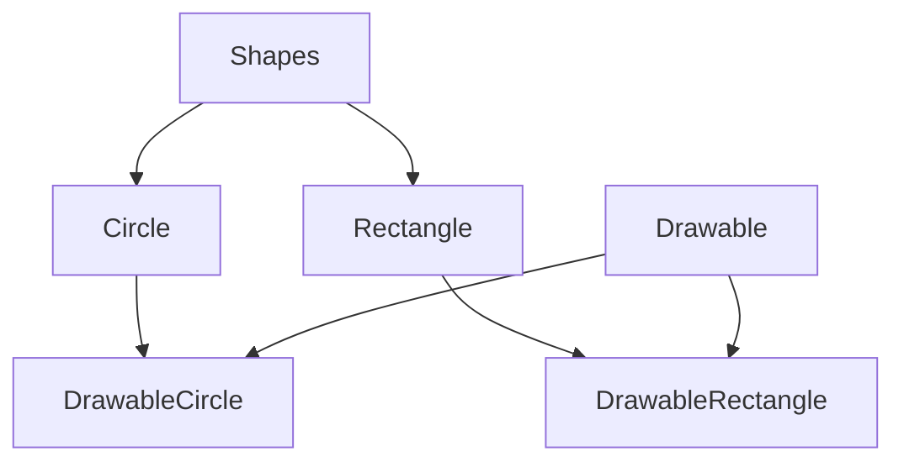
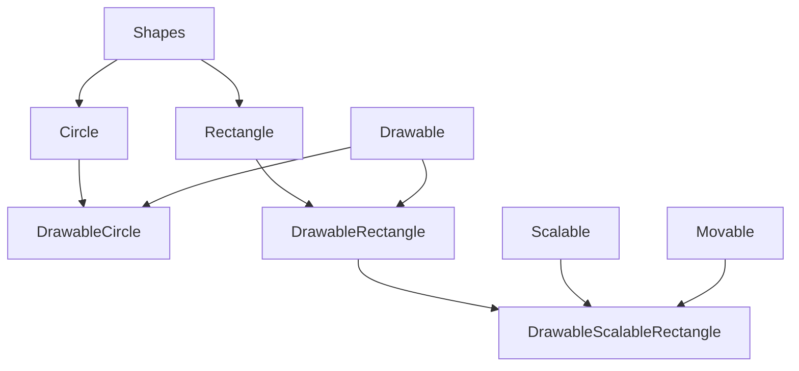
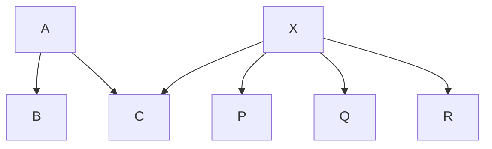

## Week 2 Tuesday

::: details 
PDF: [Inheritance & Interfaces](/COMP2511/OOP_inJava_SubClass_AbstractClass_Interface_Poly_etc.pdf)
:::

### Interfaces in Java

- Interfaces are like **abstract classes**, but with a few **important differences**.
- All the methods defined within an interface are **implicitly abstract**. (We don’t need to use the abstract keyword, however, to improve clarity one can use the abstract keyword).
- **Variables** declared in an interface must be **static and final**, that means, they must be **constants**.
- Just like a class **extends** its superclass, it also can optionally **implement** an interface.
- In order to implement an interface, a class must first declare the interface in an **implements** clause, and then it must provide an implementation for all of the abstract methods of the interface.
- A class can **"implement"** more than one **interface**.
- More discussions on **"interfaces"** later in the course.

```java
public interface Drawable {     // define interface     // [!code highlight:5]
    public void setColor(Color c);
    public void setPosition(double x, double y);
    public void draw(Graphics g);
}

public class DrawableRectangle
                extends Rectangle
                implements Drawable {   // [!code highlight]
                    
    private Color c;
    private double x, y;

    // Here are implementations of the methods in Drawable
    // we also inherit all public methods of Rectangle

    public void setColor(Color c) {
        this.c = c;
    }

    public void setPosition(double x, double y) {
        this.x = x;
        this.y = y;
    }

    public void draw(Graphics g) {
        g.drawRect(x, y, w, h, c);
    }
}
```




#### Implementing Multiple Interfaces

A class can implement more than one interface. For example,

```java
public class DrawableScalableRectangle
    extends DrawableRectangle
    implements Movable, Scalable {

    // methods go here ....

}
```



#### Extending Interfaces

- Interfaces can have **sub-interfaces**, just like classes can have subclasses.
- A sub-interface **inherits all** the abstract methods and constants of its super-interface, and may define new abstract methods and constants.
- Interfaces **can extend** more than one interface at a time. For example,

```java
public interface Transformable 
    extends Scalable, Rotable, Reflectable {}   // [!code highlight]

public interface DrawingObject
    extends Drawable, Transformable {}  // [!code highlight]

public class Shape implements DrawingObject {
    // ...
}
```
---
### Method Forwarding



- Suppose class C extends class A, and also implements interface X.
- As all the methods defined in interface X are abstract, class C needs to implement all these methods.
- However, there are three implementations of X (in P, Q, R).
- In class C, we may want to use one of these implementations, that means, we may want to use some or all methods implemented in P, Q or R.
- Say, we want to use methods implemented in P. We can do this by creating an object of type class P in class C, and through this object access all the methods implemented in P.
- Note that, in class C, we do need to provide required stubs for all the methods in the interface X. In the body of the methods, we may simply call methods of class P via the object of class P.
- This approach is also known as method forwarding.

### Methods Overriding (Polymorphism)

- When a class defines a method using the same name, return type, and by the number, type, and position of its arguments as a method in its superclass, the method in the class overrides the method in the superclass.
- If a method is invoked for an object of the class, it’s the new definition of the method that is called, and not the superclass’s old definition.

::: tip Polymorphism

- An object’s ability to decide what method to apply to itself, depending on where it is in the inheritance hierarchy, is usually called polymorphism.
:::

::: details Example
In the example below,
```java
class A {
    int i = 1;
    int f() { return i; }
}

class B extends A {
    int i;                      // shadows i from A
    int f() {                   // overrides f() from A
        i = super.i + 1;        // retrieves i from A
        return super.f() + i;   // invokes f() from A
    }
}
```
- If `p` is an instance of class B, `p.f()` refers to `f()` in class B.
- However, if `p` is an instance of class A, `p.f()` refers to `f()` in class A.

The example also shows how to refer to the overridden method using `super` keyword.

---

Suppose class C is a subclass of class B, and class B is a subclass of class A.

Class A and class C both define method `f()`.

From class C, we can refer to the overridden method by,

```java
super.f();
```

This is because class B inherits method `f()` from class A.

However,

- If all the three classes define `f()`, then calling `super.f()` in class C invokes class B’s definition of the method.
- Importantly, in this case, there is no way to invoke `A.f()` from within class C.

::: warning
Note that `super.super.f()` is NOT legal Java syntax.
:::

Defining methods with the **same name** and **different argument** or return types is called **_method overloading_**.

In Java,

- A method is distinguished by its **method signature** - its name, return type, and by the number, type, and position of its arguments.

For example,

```java
double add(int, int)
double add(int, double)
double add(float, int)
double add(int, int, int)
double add(int, double, int)
```
---

### Data Hiding and Encapsulation

We can hide the data within the class and make it available only through the methods.

This can help in maintaining the consistency of the data for an object, that means the state of an object.

### Visibility Modifiers

Java provides five access modifiers (for variables/methods/classes):

- `public` - visible to the world
- `private` - visible to the class only
- `protected` - visible to the package and all subclasses
- No modifier (default) - visible to the package

---

### Constructors

- Good practice to define the required constructors for all classes.
- If a constructor is not defined in a class,

  - No-argument constructor is implicitly inserted.
  - This no-argument constructor invokes the superclass’s no-argument constructor.
  - If the parent class (superclass) doesn’t have a visible constructor with no-argument, it results in a compilation error.

- If the first statement in a constructor is not a call to `super()` or `this()`, a call to `super()` is implicitly inserted.
- If a constructor is defined with one or more arguments, no-argument constructor is not inserted in that class.
- A class can have multiple constructors, with different signatures.
- The word `this` can be used to call another constructor in the same class.

