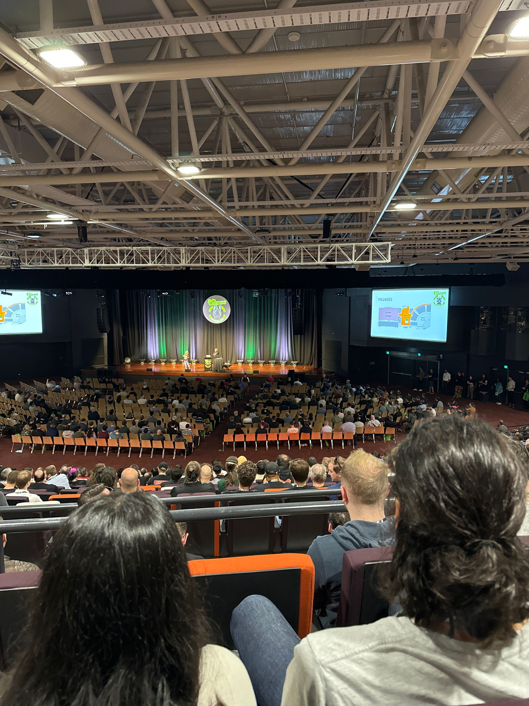
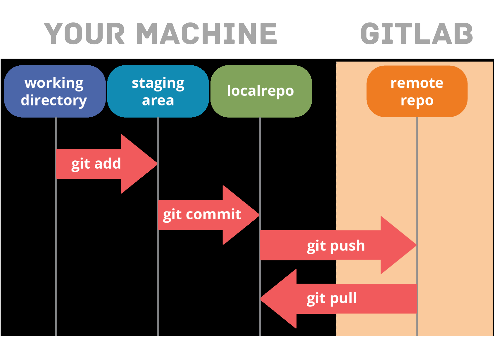
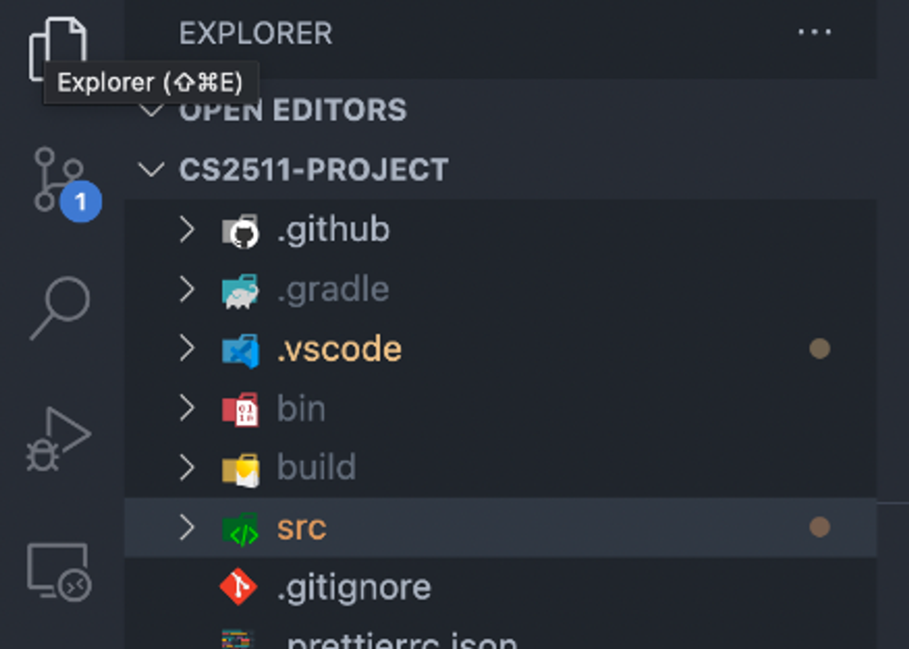
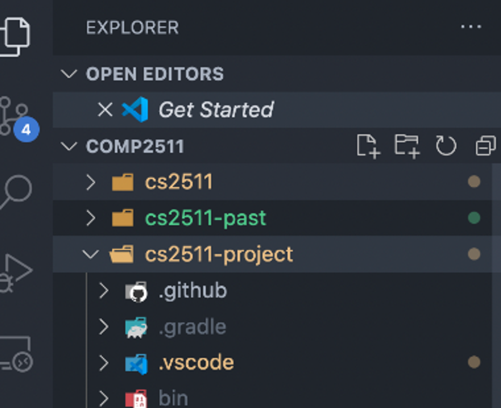
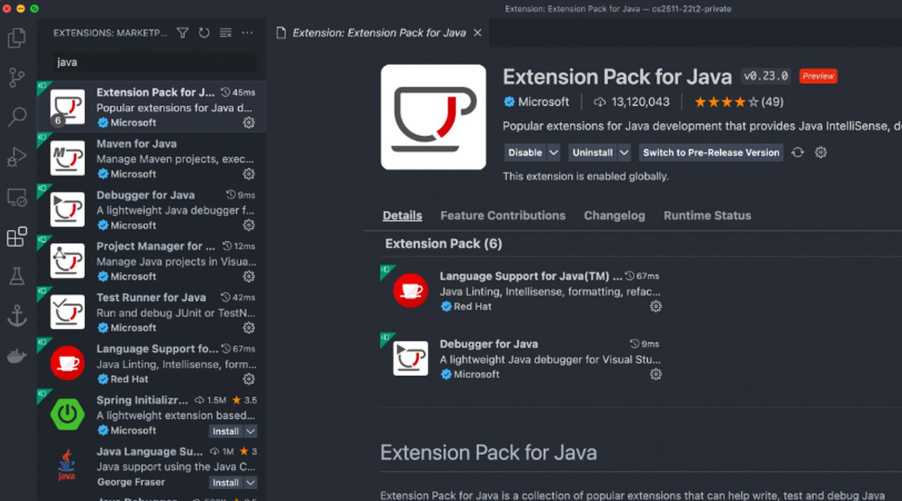
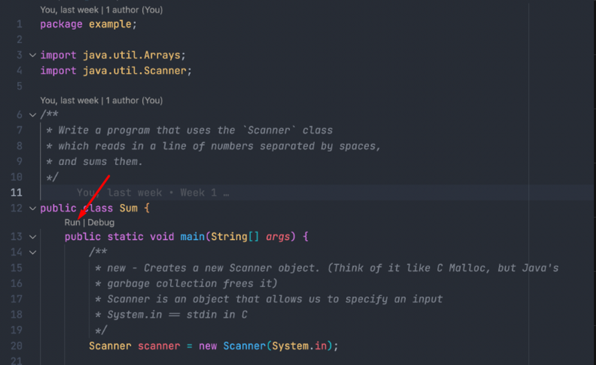

## 📚 Course Overview

**Course website**

Please have a read through the course outline and know how to navigate through the website to find relevant information to you.

[Home |  COMP2511 24T2 | WebCMS3](https://webcms3.cse.unsw.edu.au/COMP2511/24T2/)

**Ed forum**

Login is your zID email (i.e. `z1234567@unsw.edu.au`) and your zID password.

[Ed Discussion](https://edstem.org/au/courses/16610/discussion/)

## 👥 Class Introduction

🍄 **Name:** Jayden Leung

**Year + degree:** Compsci Graduate

**Hobbies:** 🚗 Cars, 🏋️ Gym, 🎮 Gaming, 🕵️ Hacking, ✈ Travelling





🐻 **Your turn…**

Introduce the **person next to you (introduce each other)**: name, year + degree, hobbies.

## ☎ Contact Me

Email: `jayden.leung@unsw.edu.au`

Please specify course + tutorial you’re in

If I don't respond within 48 hours, please bump it.

## 📧 Contact the Course Admins

Course email: [`cs2511@cse.unsw.edu.au`](mailto:cs2511@cse.unsw.edu.au) Don't like how something is handled? You're welcome to escalate it to course admins.

## 👷‍♂️How will it work?

### 🏛️ Class Structure

- **Tutorial (1 hour)**: We will go over recent lecture topics through tutorial questions.
- **Lab (2 hours)**: During lab sessions, we will conduct lab exercises and marking. This will also be the time for general help and assignment check-ins/marking later in the course.

### 📅 Assessment Timeline

| Assessment Item  | Topic                              | Due         | Core | Bonus |
| ---------------- | ---------------------------------- | ----------- | ---- | ----- |
| Assignment I 🛰️   | Object-Oriented Design             | Week 5      | 15%  | N/A   |
| Assignment II 💀  | Refactoring & Design Patterns      | Week 9      | 20%  | N/A   |
| Assignment III 🌊 | Event-Driven & Asynchronous Design | Week 10     | 0%   | 8%    |
| Coursework 🖋️     | All                                | All Weeks   | 15%  | N/A   |
| Final Exam 🎳     | All                                | Exam Period | 50%  | N/A   |

::: warning The final exam has a hurdle of 40% to pass the course.

:::

There are seven labs, each worth ten marks. We will cap total coursework marks at 60 (which will translate to 15%), leaving one lab as a buffer. If you attend all seven labs, we will add all seven lab marks and cap the total coursework marks to 60.

::: details 🔑  Secrets to doing well in this course

**🤝 Collaboration**

Get to know your tutorial peers! Making friends is not only fun but also beneficial for your studies. You'll be working in a pair for assignments 2 and 3 (although assignment 3 is optional).

**🗓️ Time Management**

Plan your term wisely. Bear in mind that COMP2511 is not a light workload course, so proper scheduling is crucial.

:::

## **📁Recap on `git`**

Here's a concise explanation of essential git commands:

- `git add`: Stages files for the next commit.
- `git commit`: Takes a snapshot of staged files.
- `git push`: Sends new commits to an online repository.
- `git status`: Shows the state of current repository and branch.
- `git log`: Displays the history of the current branch.



<https://nw-syd-gitlab.cseunsw.tech/COMP2511/24T2/content/-/blob/main/setup/docs/Git.md>

## **🔀 Differences between Java, C, Python, JS/TS**

### 📝 Syntax:

- C, Java, JS/TS use `{` and `}` to describe code blocks (also scopes)
- Python uses whitespaces (tabs/indentations)

### 🔨 Compilation:

- C compiles into machine code
- Java and Python compiles into byte code, which is interpreted
- TypeScript transpiles to JavaScript which is then interpreted

### 🧠 Memory:

- C allows you to manually allocate memory
- Java, Python, JS/TS have automatic memory management

### 🔤 Types:

- Java, C and TypeScript are statically typed
- Python and JavaScript are dynamically typed

### 🎓 Classes:

- Java, Python, JS/TS support Object Oriented programming (OOP)
- Supports classes and inheritance
- C does not support classes. Closest things are pure 'data classes' called structs
- All code within Java needs to exist within a class
- JS/TS and Python can have runnable code outside classes

## ⚙ VSCode Config Tips


- Correct way to open your repository. 1 repository per folder.

- Wrong way to open repository. There are multiple repositories in your folder. 

- Have the correct Java extensions installed 

- Use the “Run” button to run your code 

## **👨‍💻Code Demo**

- Write a simple Java program that prints “Hello World” in the `HelloWorld` class
    ```java
    package example;
    
    /**
    * Prints "Hello World" to the console.
    */
    public class HelloWorld {
        public static void main(String[] args) {
            // Does it need a \n?
            // No, .println appends a \n to your string when it prints
            System.out.println("Hello World");
        }
    }
    ```

- Inside a new file called `Sum.java`, write a program that uses the `Scanner` class which reads in a line of numbers separated by spaces, and sums them.
    ```java
    package example;
    
    import java.util.Arrays;
    import java.util.Scanner;
    
    /**
     * Write a program that uses the `Scanner` class
     * which reads in a line of numbers separated by spaces,
     * and sums them.
     */
    public class Sum {
        public static void main(String[] args) {
            /**
             * new - Creates a new Scanner object. (Think of it like C Malloc, but Java's
             * garbage collection frees it)
             * Scanner is an object that allows us to specify an input
             * System.in == stdin in C
             */
            Scanner scanner = new Scanner(System.in);
    
            /**
             * Keeps reading input until it sees a \n
             *
             * Splits each string into an array of strings
             */
            String[] numbers = scanner.nextLine().split(" ");
    
            int sum = 0;
            for (String number : numbers) {
                sum += Integer.parseInt(number);
            }
            System.out.println("The sum is " + sum);
    
            // Advanced
            // Using streams
            int streamSum = Arrays.asList(numbers).stream().mapToInt(x -> Integer.parseInt(x)).sum();
            System.out.println(String.format("The sum is %d", streamSum));
    
            /**
             * Frees I/O resources
             * Java's garbage collector only manages memory, not other resources
             */
            scanner.close();
        }
    }
    ```

- Inside a new file `Shouter.java`, Write a program that stores a message and has methods for getting the message, updating the message and printing it out in all caps. Write a `main()` method for testing this class.
    ```java
    package example;
    
    public class Shouter {
        private String message;
    
        public Shouter(String message) {
            this.message = message;
        }
    
        public String getMessage() {
            // NOTE: You don't have to use the keyword `this`
            // But I use it because of clarity
            return this.message;
        }
    
        public void setMessage(String newMessage) {
            this.message = newMessage;
        }
    
        public String toString() {
            return String.format("Shouter message = %s", this.message);
        }
    
        public void printMe() {
            System.out.println(this.message);
        }
    
        public void shout() {
            System.out.println(this.message.toUpperCase());
        }
    
        public void printAndShout() {
            // NOTE: You don't have to use the keyword `this`
            // But I use it because of clarity
            this.printMe();
            this.shout();
        }
    
        public static void main(String[] args) {
            Shouter s = new Shouter("This is my message");
            s.printMe();
            s.shout();
            // When printing objects, Java will try and stringify
            // In this case, it calls the .toString() method
            System.out.println(s);
        }
    }
    ```