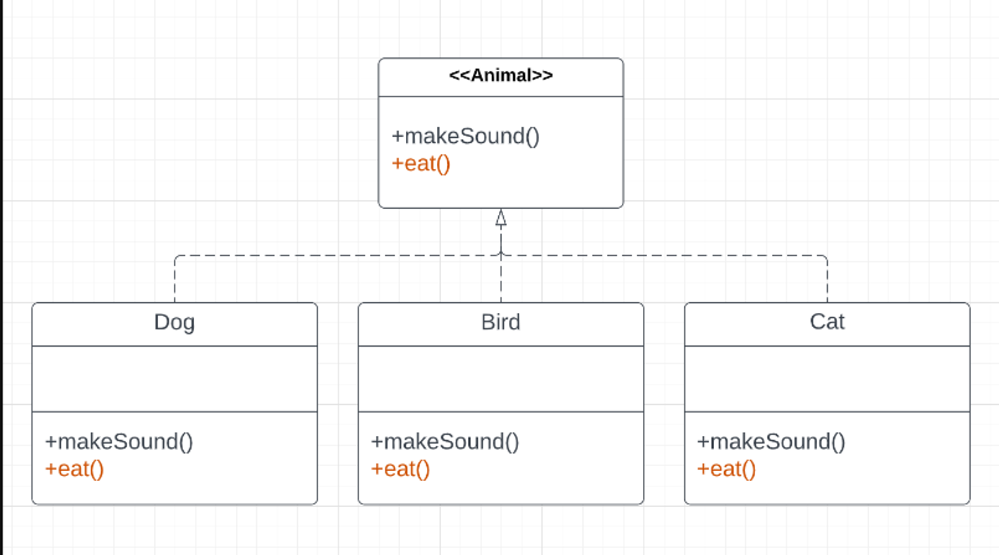
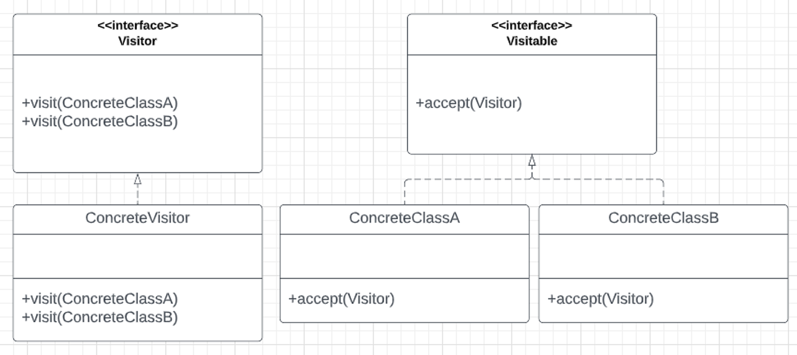

::: warning
- Assignment 3 is due Week 11 Tuesday, 5pm. Same teams as previous assignment unless you have discussed with me.
- Lab10 is a sample exam. No marks but highly recommended to get familiar with exam environment.
- Plz do myExperience 😊 
:::

## 🎨Assignment iii

- If you did assignment-iii, please make sure you submit it following the instructions in the spec.
- No autogenerated UMLs
- No ChatGPT blogs pls
- Include video that is public or unlisted on youtube. We will not be chasing this up since marking will happen during week 11/12

## 🐶Visitor Pattern

Problem: How do I add extra functionalities to subclasses without violating open/closed principle.



Solution: Visitor Pattern

### What is the visitor pattern?

- The visitor is a behavioural design pattern that lets you separate algorithms from the objects on which they operate.
- You can add extra functionality to a class without modifying the original (abides by open-closed principle)
- One class/interface (visitor) defines a computation/operation and another (visitable) is responsible for providing data access



::: details Code Demo

In this scenario we have `Computers`, `Keyboards` and `Mouse` which all are of type `ComputerComponent`. We want to be able to 'visit' different types of Computer components by logging the following messages:

```bash
Looking at computer Corelli with memory 500 GB.
Looking at keyboard Mechanical keyboard which has 36 keys.
Looking at mouse Bluetooth mouse.
```

In particular though, anyone which is visiting a `Computer` must be validated prior to being able to visit. Extend/modify the starter code to use the Visitor Pattern to allow different computer components to be visited.

:::

## 🟣Kahoooooooooooot time!

- Q19 is wrong
- **Q33 Quiz Which code smell is not due to excessive coupling?**
    
    **Feature Envy**
    
    - A method accesses the data of another object more than its own data.
    
    **Message Chains**
    
    - In code you see a series of calls resembling `$a->b()->c()->d()`
    
    **Inappropriate** Intimacy
    
    - One class uses the internal fields and methods of another class.
    
    **✅Divergent Change**
    
    - You find yourself having to change many unrelated methods when you make changes to a class. For example, when adding a new product type you have to change the methods for finding, displaying, and ordering products.

### Resources

[Design Patterns](https://refactoring.guru/design-patterns)