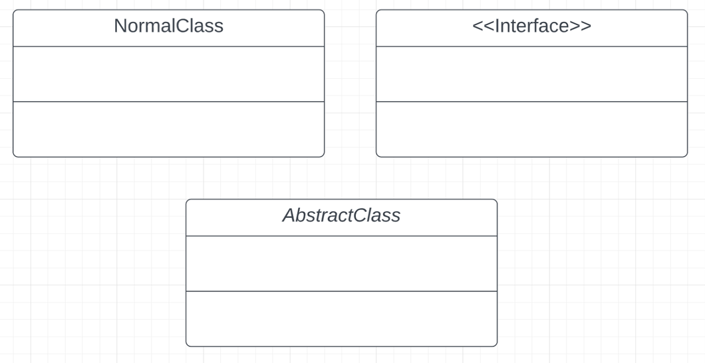
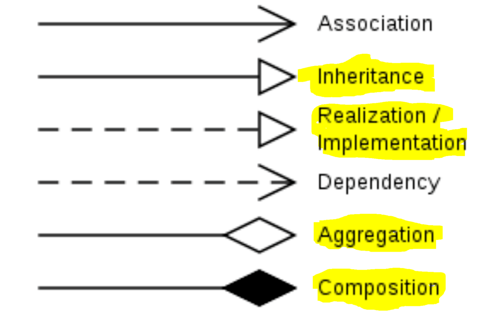
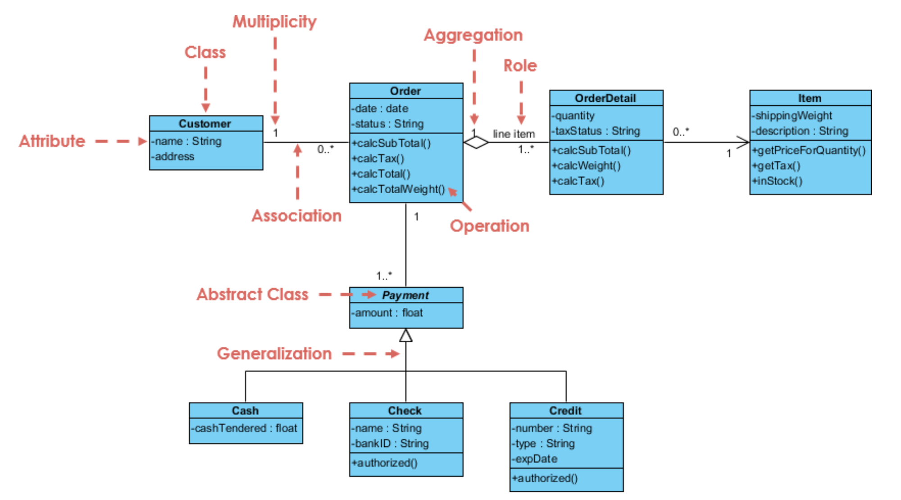
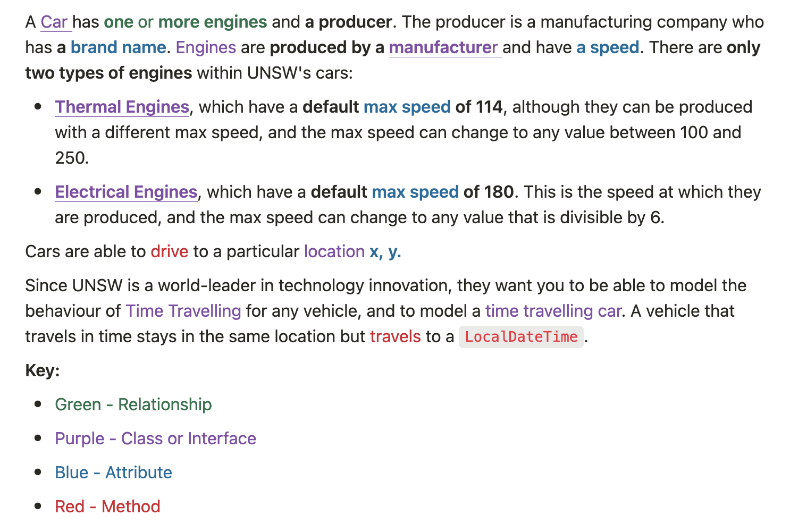
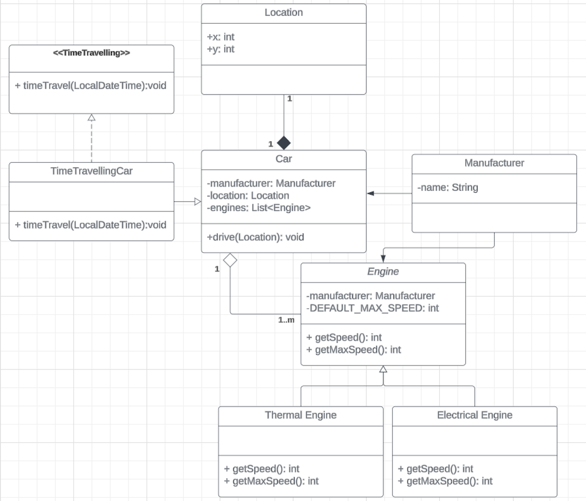

📌 **Important Information**
- Assignment-i has been released! You can run dryrun tests on CSE by using the command `2511 dryrun ass1`
- No auto generated UMLs otherwise you will be penalised
- Assignment-ii groups formation has started. Please find a partner before our **week 4 lab** otherwise you will be auto assigned. Check Microsoft Teams for the form.

## 🔍Code Review

- What is the output by executing `A.f()` in the following?
  
    `quack quack moo quack`

```java
public class A {
    public static void main() {
        C c = new C();
        c.speak(); // quack
        B b = c;
        b.speak(); // quack
        b = new B(); 
        b.speak(); // moo
        c.speak(); // quack
    }
}

public class B {
    public void speak() {
        System.out.println("moo");
    }
}

public class C extends B {
    public void speak() {
        System.out.println("quack");
    }
}
```

## 📚 Domain Modelling (UML)

### What is a UML diagram used for?

A UML diagram is a way to visualize systems and software using Unified Modeling Language (UML). Software engineers create UML diagrams to understand the designs, code architecture, and proposed implementation of complex software systems. 

### 🤗Class Definition

When defining a class it must include a few things:

### 🏷️ Class Name

- The class name. This should be identical to the file name.
- No need to include the `.java` at the end
- Interfaces should be wrapped in `<<` and `>>`
- Abstract classes should be *italicised*



### 📝 Class Attributes (class variables)

- The attribute’s name
- Its access modifier
  - `+` for public
  - `#` for protected
  - `-` for private
- Its type of the attribute

### 🧪 Class Methods

- The method’s name
- Its access modifier
  - `+` for public
  - `#` for protected
  - `-` for private
- Its return type
- Its arguments and their types
- *Abstract methods should be italicised*

## 🔗Relationship between Classes



- **Inheritance**
  
    It's used when one class (the child) "is a type of" another class (the parent). The child class inherits all features of the parent class and can also have its own additional features.
    
- **Realization/Implementation**
  
    It's used when a class implements an interface. The class must then implement the methods defined in the interface.
    
- **Aggregation**
  
    It represents a "has-a" relationship, but the component can exist independently from the aggregate. This arrow much contain cardinality.
    
- **Composition**
  
    It also represents a "has-a" relationship, but the component cannot exist independently from the composite. If the composite is destroyed, the component is also destroyed. This arrow much contain cardinality.
    
- **Association**
  
    It's a relationship between two classes that allows one object instance to cause another to perform an action on its behalf. This relationship is structural, because it specifies that objects of one kind are connected to objects of another and does not represent behaviour.

## 🔢 Cardinality of Relationships

Cardinality is represented in terms of:

- `1..1` One to one
- `1..m` One to many
- `m..m` Many to many


::: warning Only aggregation and compositions relationships require cardinality.
:::



_<https://www.visual-paradigm.com/guide/uml-unified-modeling-language/uml-class-diagram-tutorial/>_

## 🚗Domain Modelling Task

A Car has **one** or **more engines** and **a producer**. The producer is a manufacturing company who has **a brand name**. Engines are **produced by a manufacture**r and have **a speed**. There are **only two types of engines** within UNSW's cars:

- **Thermal Engines**, which have a **default max speed of 114**, although they can be produced with a different max speed, and the max speed can change to any value between 100 and 250.
- **Electrical Engines**, which have a **default max speed of 180**. This is the speed at which they are produced, and the max speed can change to any value that is divisible by 6.

Cars are able to drive to a particular location **x, y.**

Since UNSW is a world-leader in technology innovation, they want you to be able to model the behaviour of Time Travelling for any vehicle, and to model a time travelling car. A vehicle that travels in time stays in the same location but travels to a `LocalDateTime`.

**Key:**

- Green - Relationship
- Purple - Class or Interface
- Blue - Attribute
- Red - Method




Answer:




## 👩‍💻Code Demo - Wonderous

---

The **Wondrous Sequence** is generated by the simple rule:

- If the current term is even, the next term is half the current term.
- If the current term is odd, the next term is three times the current term, plus 1.

For example, the sequence generated by starting with `3` is:

```
3 -> 10 -> 5 -> 16 -> 8 -> 4 -> 2 -> 1
```

**If the starting term is `1`, then an empty list is returned.**

Inside `src/wondrous/Wondrous.java` there is an implementation of this algorithm. Inside `src/wondrous/test/WondrousTest.java` there is a single test for the function. The test currently fails.

### 🧪 Part 1 - IDE Programming

Explore the IDE tools built into `VSCode`:

1. Put a breakpoint on line 13 and run the tests in Debug Mode.
2. Briefly discuss different features of Debug Mode:
    - The variables section
    - The debug console
    - The 'watch' section
    - The call stack
    - Debug control
3. Use the debug tools and the given algorithm to determine why the test is failing, and fix the bug.

- Answer
    ```java
    package wondrous;
    
    import java.util.ArrayList;
    import java.util.List;
    
    public class Wondrous {
    
        private final int MY_MAGIC_NUMBER = 42;
    
        public List<Integer> wondrous(int start) {
            int current = start;
            List<Integer> sequence = new ArrayList<Integer>();
            
            if (start < 1) {
                throw new IllegalArgumentException("Start cannot be less than 1");
            }
    
            if (start == 1) {
                return sequence;
            }
    
            while (true) {
                sequence.add(current);
                if (current == 1) break;
                if (current % 2 == 0) {
                    current /= 2;
                } else {
                    current = (current * 3) + 1;
                }
            }
    
            return sequence;
        }
    
    }
    ```

### 🧪 Part 2 - Writing Tests with JUnit

There is a further bug in the function not caught by the given unit test. Find the other bug, and write a corresponding unit test inside `WondrousTest`.

[You can learn more about JUnit here](https://www.vogella.com/tutorials/JUnit/article.html).

- Answer
    ```java
    package wondrous.test;
    
    import static org.junit.Assert.assertThrows;
    import static org.junit.jupiter.api.Assertions.assertEquals;
    
    import java.util.ArrayList;
    import java.util.Arrays;
    import java.util.List;
    
    import org.junit.jupiter.api.Test;
    
    import wondrous.Wondrous;
    
    public class WondrousTest {
        @Test
        public void testBasic() {
            Wondrous w = new Wondrous();
            List<Integer> expected = new ArrayList<Integer>(Arrays.asList(3, 10, 5, 16, 8, 4, 2, 1));
            
            assertEquals(expected, w.wondrous(3));
        }
    
        @Test
        public void testOne() {
            Wondrous w = new Wondrous();
            List<Integer> expected = new ArrayList<Integer>();
            assertEquals(expected, w.wondrous(1));
        }
    }
    ```

### 🧪 Part 3 - Exceptions 

- What are exceptions?

  An exception is an event, which occurs during the execution of a problem, that disrupts the normal flow of the program's instructions.

  In Java, exceptions are divided into two main categories: checked exceptions and unchecked exceptions.

  - Checked
    - Checked exceptions are exceptions that are checked at compile time by the Java compiler.
    - Any method that might throw a checked exception must declare it in its method signature using the **`throws`** keyword, or handle it using a **`try-catch`** block.
    - Examples of checked exceptions include **`IOException`**, **`SQLException`**, **`FileNotFoundException`**, etc.
    - The main idea behind checked exceptions is to enforce exception handling by forcing the programmer to either catch the exception or declare it in the method signature.
  - Unchecked
    - Unchecked exceptions, also known as runtime exceptions, are not checked at compile time.
    - These exceptions extend **`RuntimeException`** class or its subclasses.
    - Examples of unchecked exceptions include **`NullPointerException`**, **`ArrayIndexOutOfBoundsException`**, **`ArithmeticException`**, etc.
    - Unlike checked exceptions, methods are not required to declare unchecked exceptions in their method signature or handle them explicitly.

Modify the method such that if `start` is less than 1, an `IllegalArgumentException` is thrown. Write a corresponding test for this inside `WondrousTest`.

- Why do we not need to declare `wondrous()` method signature using the `throws` keyword?

  Because `IllegalArgumentException` is an unchecked exception or runtime exception.
- Answer
    ```java
    package wondrous.test;

    import static org.junit.Assert.assertThrows;
    import static org.junit.jupiter.api.Assertions.assertEquals;

    import java.util.ArrayList;
    import java.util.Arrays;
    import java.util.List;

    import org.junit.jupiter.api.Test;

    import wondrous.Wondrous;

    public class WondrousTest {
        @Test
        public void testBasic() {
            Wondrous w = new Wondrous();
            List<Integer> expected = new ArrayList<Integer>(Arrays.asList(3, 10, 5, 16, 8, 4, 2, 1));
            
            assertEquals(expected, w.wondrous(3));
        }

        @Test
        public void testOne() {
            Wondrous w = new Wondrous();
            List<Integer> expected = new ArrayList<Integer>();
            assertEquals(expected, w.wondrous(1));
        }

        @Test
        public void testException() {
            Wondrous w = new Wondrous();
            assertThrows(IllegalArgumentException.class, () -> {
                w.wondrous(-1);
            });
        }

    }
    ```