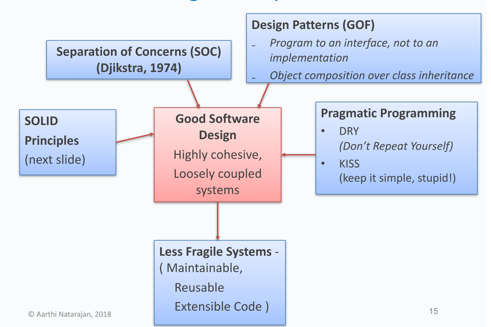
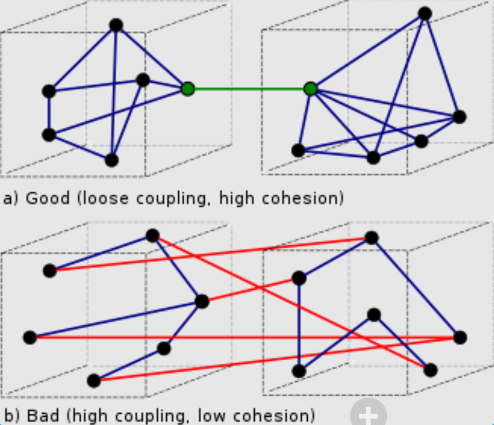
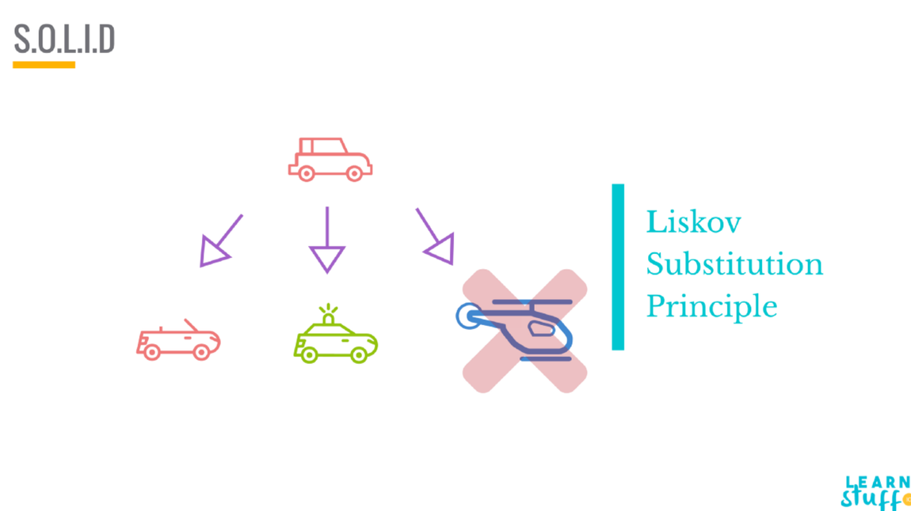

📌 
- Assignment 1 is due this 5pm Friday Week 5 so get started if you haven’t yet
- I can also give some feedback on your UML in the lab if you want 🙂
- Find a buddy for assignment 2 and fill out the form (link can be found on teams)  

## 🎨 Introduction to Design Principles

Design principles are fundamental ideas and rules that guide the design process in order to create a system that is manageable and scalable. They help developers to avoid common pitfalls and create a consistent and efficient design.




## 👤 Single Responsibility Principle

The Single Responsibility Principle states that every class or module in a program should have responsibility over a single functionality. By following this principle, the software becomes more flexible and easier to maintain since changes to one part of the software will have minimal impact on other parts.

## 🔒 Open-Close Principle


The Open-Close Principle states that software entities (classes, modules, method, etc.) should be open for extension, but closed for modification. This means that a class should be easily extensible to incorporate new behavior without needing to be modified. This is often achieved using abstract interfaces, where the implementation can be changed and multiple forms can be created and polymorphically substituted for each other.

## 📖 Law of Demeter (aka Principle of Least Knowledge)


Law of Demeter is a design principle that emphasising that a class should interact with as few classes as possible. Reduce the interactions between classes to only close “friends”. These “friends” are “immediate” objects or “local objects”

This means that a method within an object is allowed to call methods of:

- The object itself
- An object passed as a parameter to the method
- Objects created within the method

But importantly, it should avoid calling methods of objects returned by another method. i.e `o.get(name).get(thing).remove(node)`



::: info Aim: To achieve loose coupling in code.
:::

**Coupling *❌***

> Coupling is the degree to which one class or module depends on another. High coupling is as bad because changes in one module may require changes in dependent modules, leading to a fragile system that's hard to maintain.
> 

**Cohesion** ✅

> Cohesion refers to how closely the responsibilities of a module or class are related to each other. High cohesion is desirable as it means that a module or class does one thing well and does not have unnecessary dependencies.
>

### 🔍 Code Review

In the `unsw.training` package there is some skeleton code for a training system.

- Every employee must attend a whole day training seminar run by a qualified trainer
- Each trainer is running multiple seminars with no more than 10 attendees per seminar
- In the `TrainingSystem` class, there is a method to book a seminar for an employee given the dates on which they are available. This method violates the principle of least knowledge (Law of Demeter).

```java
public class TrainingSystem {
    private List<Trainer> trainers;

    public LocalDate bookTraining(String employee, List<LocalDate> availability) {
        for (Trainer trainer : trainers) {
            for (Seminar seminar : trainer.getSeminars()) {
                for (LocalDate available : availability) {
                    if (seminar.getStart().equals(available) &&
                            seminar.getAttendees().size() < 10) {
                        seminar.getAttendees().add(employee);
                        seminar.add(employee)
                        return available;
                    }
                }
            }
        }
        return null;
    }
}

/**
 * A trainer that runs in person seminars.
 */
public class Trainer {
    private String name;
    private String room;
    private List<Seminar> seminars;

    public List<Seminar> getSeminars() {
        return seminars;
    }
}
```

```java
/**
 * An in person all day seminar with 
 * a maximum of 10 attendees.
 */
public class Seminar {
    private LocalDate start;
    private List<String> attendees;

    public LocalDate getStart() {
        return start;
    }

    public List<String> getAttendees() {
        return attendees;
    }
    public void add(String s) {
	    attendees.add(s);
    }
}
/**
 * An online seminar is a video that can be 
 * viewed at any time by employees. A record
 * is kept of which employees have watched 
 * the seminar.
 */
public class OnlineSeminar extends Seminar {
    private String videoURL;
    private List<String> watched;
}
```

- What line is Law of Demeter violated on?

  There are several layers of violation in `bookTraining`. The most obvious violation is at `seminar.getAttendees().add(employee)`, but the problem originates from deeper within the code.

  1. In order to call `add()`, we need to call `getAttendees()`.
  2. To call `getAttendees()`, we need to access `seminar`.
  3. To access `seminar`, we need to get it from `trainer`.

  Therefore, we are continually digging deeper into the nested structure to access the desired functionality. This indicates a clear violation of the Law of Demeter as the `bookTraining` method is overly familiar with the structure of other classes.

- What other properties of this design are not desirable?

  - The design is needlessly tightly coupled as `TrainingSystem` is dependent on both Trainer and Seminar
  - `TrainingSystem` suffers from low cohesion as any change to the system requires a change to this class.
  - The Seminar class has no control over the number of attendees. It relies on `TrainingSystem` to ensure there are never more than 10. This makes Seminar hard to re-use.

## 🔌 Interface Segregation Principle

The Interface Segregation Principle is beneficial because it promotes decoupling and high cohesion in the system. By having many small interfaces, a class is less likely to implement methods it doesn't use, reducing the unnecessary dependencies. This makes the system easier to refactor, understand, and maintain. It also improves the system's flexibility and adaptability to changes.

## ⬆️ Dependency Inversion Principle

The Dependency Inversion Principle advocates that high-level modules should not depend on low-level modules. Both should depend on abstractions. This principle helps to decouple the software modules, making them more reusable and easier to maintain.

## 👩‍👦 Liskov Substitution Principle (LSP)

Liskov Substitution Principle (LSP) states that objects of a **superclass** should be **replaceable** with objects of its **subclasses** without **breaking the application**.



```java
/**
 * An in person all day seminar with 
 * a maximum of 10 attendees.
 */
public class Seminar {
    private LocalDate start;
    private List<String> attendees;

    public LocalDate getStart() {
        return start;
    }

    public List<String> getAttendees() {
        return attendees;
    }
}
```

```java
/**
 * An online seminar is a video that can
 * be viewed at any time by employees. 
 * A record is kept of which employees
 * have watched the seminar.
 */
public class OnlineSeminar {
    private String videoURL;
    private List<String> watched;
}
```

- Why does `OnlineSeminar` violate Liskov Substitution Principle (LSP)
    - `OnlineSeminar` does not have a list of attendees.
    - `OnlineSeminar` does not have a start date because an online seminar can be watched anytime. It can be pre recorded

## 🧮 Streams and Lambdas

Streams abstract away the details of data structures and allows you to access all the values in the data structure through a common interface. Common uses of streams include:

- The `forEach` is a method that applies a given function to each element of a collection such as a list or a map. Cannot modify list while iterating.
    ```java
    List<String> strings = new ArrayList<String>(Arrays.asList(new String[] {"1", "2", "3", "4", "5"}));
    for (String string : strings) {
    System.out.println(string);
    }
    // How to use forEach 
    strings.stream().forEach(x -> System.out.println(x));
    
    // How to use forEach to iterate though a hash map
    Map<String, Integer> map = new HashMap<>();
    map.put("One", 1);
    map.put("Two", 2);
    map.put("Three", 3);
    map.entrySet().stream().forEach(x -> System.out.printf("%s, %s\n", x.getKey(), x.getValue()));
    ```

- The `filter` method is used to create a new stream that includes elements of the original stream that match a given condition.
    ```java
    List<Integer> numbers = Arrays.asList(1, 2, 3, 4, 5, 6, 7, 8, 9, 10);
    List<Integer> evenNumbers = numbers.stream().filter(n -> n % 2 == 0).collect(Collectors.toList());
    
    // This will output [2, 4, 6, 8, 10]
    System.out.println(evenNumbers);
    ```

- The `map` method is used to transform each element of a stream by applying a function to it. The result is a new stream consisting of the transformed elements.
    ```java
    List<Integer> numbers = Arrays.asList(1, 2, 3, 4, 5);
    List<Integer> squares = numbers.stream().map(n -> n * n).collect(Collectors.toList());
    
    // This will output [1, 4, 9, 16, 25]
    System.out.println(squares);
    ```

- The reduce method is used to transform a stream into a single value. It does so by applying a binary operator function (combining function) that is provided as an argument, successively to each element in the stream.
    ```java
    List<Integer> numbers = Arrays.asList(1, 2, 3, 4, 5);
    Optional<Integer> sum = numbers.stream().reduce((a, b) -> a + b);
    
    // This will output the sum of the numbers: 15
    System.out.println(sum.orElse(0));
    ```

- What is `Optional`

  `Optional` in Java is a container object that may or may not contain a non-null value. It's used to represent the result of a method that might not return a value.

- Why does reduce return an `Optional`

  In the case of `reduce`, it returns an `Optional` because the operation might not have a result. For example, if you call `reduce` on an empty stream, there's no value to return, hence an `Optional` is used to represent the possibility of absence. By returning an `Optional`, it forces the developer to think about the case where there might not be any value, reducing the chances of a `NullPointerException`.

## 📝 Design by Contract

At the design time, **responsibilities** are **clearly assigned** to different software elements, clearly documented and enforced during the development using unit testing and/or language support.

- Clear distinction of responsibilities helps **prevent redundant checks**, resulting in simpler code and easier maintenance.
- Crashes if the required conditions are not satisfied! May **not be suitable for high availability applications**.

Every software element should define a specification (or a contract) that govern its transaction with the rest of the software components. A contract should address the following 3 conditions:

1. **Pre-condition** (Input) - what does the contract expect?
2. **Post-condition** (Output) - what does that contract guarantee?
3. **Invariant** (Throughout) - What does the contract maintain?

- Code Example
    ```java
    import java.util.HashMap;
    import java.util.Map;

    public class Library {
        private Map<String, Integer> books;
        
        public Library() {
            this.books = new HashMap<>();
        }

        /**
         * Adds a non-null book to the library with a positive number of copies.
         * 
         * @preconditions book != null && copies > 0
         * @invariant books != null && book counts should never be negative
         * @postconditions books.containsKey(book) && books.get(book) >= old_copies + copies
         */
        public void addBook(String book, int copies) {
                if (book == null) {
                throw new IllegalArgumentException("Precondition violated: book title must not be null");
            }
            if (copies <= 0) {
                throw new IllegalArgumentException("Precondition violated: number of copies must be greater than zero");
            }
            books.put(book, oldCopies + copies);
        }
    }
    ```