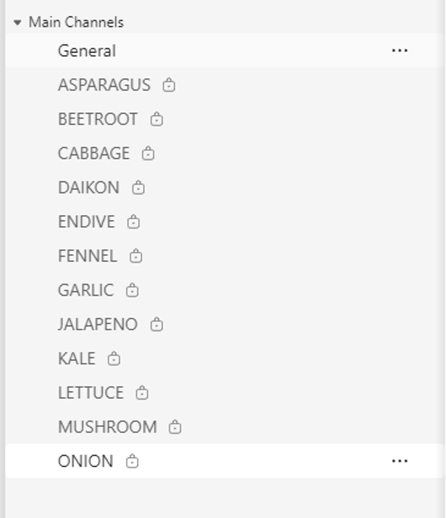
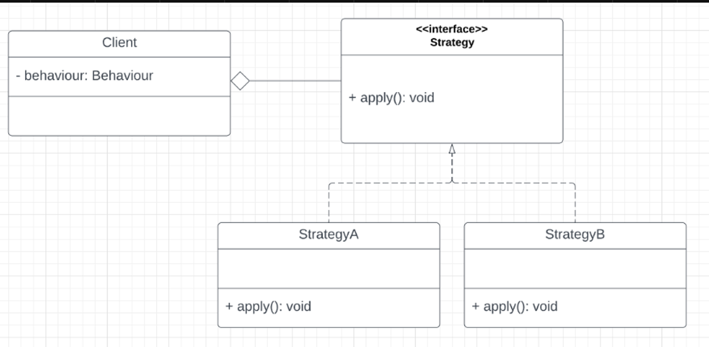
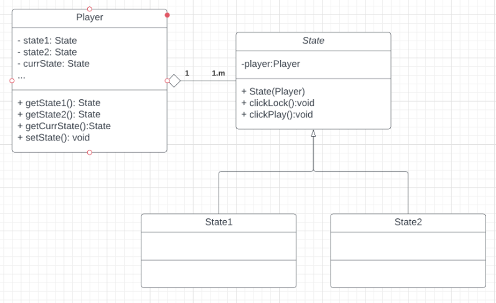
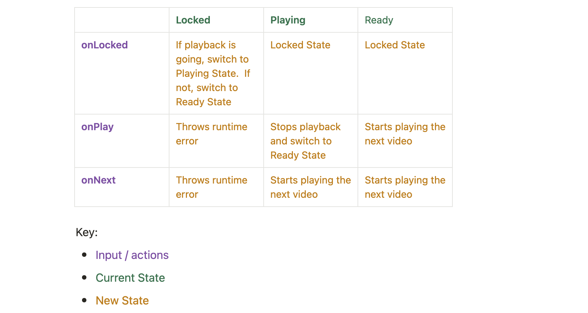

::: info
- Assignment 1 is due this 5pm Friday Week 5

- I can also give some feedback on your UML in the lab if you want 🙂

- Assignment 2 pairing have been finalised. I have created teams chat for your group. 

:::

## ❌Common pitfalls for *assignment-i*

### Equating strings wrong

Use `.equals()` not `==` for `String` comparisons

```java
public class EqualsExample {
    public static void main(String[] args) {
        String s1 = "Hello"; // string literal
        String s2 = new String("Hello"); // string class
        System.out.println(s1 == s2); // false, as its comparing the addresses of s1 and s2
        System.out.println(s1.equals(s2)); // true, compares the values at the addresses
        //                    ^ do this
    }
}
```

### 🔮 Use of Magic Numbers

Avoid using arbitrary numbers, known as 'magic numbers'. Always define and use constants for better clarity and understanding.

**Bad**

```java
public class MagicNumbers {
    List<String> files = new ArrayList<>();

    public void doSomething() {
        if (files.size() == 5) { // 5 here is a magic number
                                 // What does it mean?
        }
    }
}
```

**Good**

```java
public class MagicNumbers {
    List<String> files = new ArrayList<>();
    private final static int MAX_FILES = 5; 
    // declare constant with good name ^
    public void doSomething() {
        if (files.size() == MagicNumbers.MAX_FILES) {};
        double angle = 750; // ^ use constant here
        angle = angle % 360; // This is more OK, since theres context
    }
}
```

### 🔍 Type checking using `getClass()`

It's highly discouraged to use `getClass()` for type checking as it infringes upon the Open-Closed Principle. Preferably, utilise `instanceof` for comparing types.

```java
public abstract class Shape {
    public abstract String getType();
}

public class Circle extends Shape {
    public double area() { } // calculate the area of a circle 
    public String getType() { return "Circle" }
}

public class Rectangle extends Shape {
		public double area() { } // calculate the area of a rectable
    public String getType() { return "Rectangle" }
    
    public void doSomething(List<Shape> shapes) {
        for (Shape s : shapes) {
            if (s.getType().equals("Circle")) { // v1: very bad
               (Circle)s.area();
            }
            if (s.getClass().equals(Rectangle.class)) { // v2: bad
               (Rectangle)s.area();
            }
            
            if (s instanceof Rectangle) { // v3: okay
                (Rectangle)s.area();
            }
        }
    }
}

public class Square extends Rectangle {}
```

- But doesn’t using `instanceof` still violate the Open-Close Principle?
  
    Yes! This is because using `instanceof` introduces a dependency on specific subclasses, which can lead to code modifications when new subclasses are added. It can make the code less flexible and harder to extend, which is against the principle's goal of being open for extension, but closed for modification.

### 🔍 Type checking using `instanceof`

As mentioned above, using `instanceof` still violates the Open-Close Principle. If possible, use Polymorphism instead.

```java
// Example: What to do
public abstract class Shape {
    public abstract String getType();
    public abstract double area();
    // ^ declare method in superclass
}

public class Circle extends Shape {
    public double area() { } // Calculate the area of circle
}

public class Square extends Shape {
    public double area() { } // Calcules the area of square
    
    public static void main(String[] args) {
        List<Shape> shapes = new ArrayList<>();
        shapes.add(new Rectangle());
        shapes.add(new Square());
        for (Shape s : shapes) {
            s.area(); // no more type checking
        }
    }
}
```

## 📚 Strategy Pattern

The strategy pattern is a **behavioural** design pattern that enables selecting an algorithm at runtime. Instead of implementing a single algorithm directly, code receives run-time instructions as to which in a family of algorithms to use.

### When should you use it?

- When we have **multiple algorithms** to do a specific task
- When the client decides on the actual implementation to be used at **runtime**.



- Code Example
  
    In `src/youtube`, create a model for the following requirements of a Youtube-like video creating and watching service using the Observer Pattern:
    
    - A **Producer** has a **name**, a series of **subscribers** and **videos**
    - When a producer posts a new video, all of the subscribers are notified that a new video was posted
    - A **User** has a **name**, and can **subscribe** to any Producer
    - A **Video** has a **name**, **length** and **producer**

## 🔄 State Pattern

The state pattern is a **behavioural** software design pattern that allows an object to alter its behaviour when its internal state changes. This pattern is close to the concept of finite-state machines. The state pattern can be interpreted as a strategy pattern, which is able to switch a strategy through invocations of methods defined in the pattern's interface.

### When should you use it?

- When objects behave differently depending on the current state.
- When you want to switch strategy during runtime depending on the current strategy.



::: details Exercise
    
This exercise continues on from `src/youtube`.

Extend your solution to accommodate the following requirements:

- Users can view a video, and a viewing has a series of states:
    - Playing state - the video is playing (Upon entering this state, set playback on)
    - Ready state - the video is paused, ready to play (Upon entering this state, set playback off)
    - Locked state - the video is temporarily 'locked' from having its state changed

The actions and state transitions are as follows:

|  | **Locked** | **Playing** | Ready |
| --- | --- | --- | --- |
| **onLocked** | If playback is going, switch to Playing State.  If not, switch to Ready State | Locked State | Locked State |
| **onPlay** | Throws runtime error | Stops playback and switch to Ready State | Starts playing the next video |
| **onNext** | Throws runtime error | Starts playing the next video | Starts playing the next video |

Key:

- Input / actions
- Current State
- New State




Starting Code
```java
package youtube2;

import java.util.ArrayList;
import java.util.List;

import javax.management.RuntimeErrorException;

import youtube2.States.PlayingState;
import youtube2.States.ReadyState;
import youtube2.States.State;

// Please note that this code is incomplete and might not function properly
// The main takeaway for this code is to understand how to implement the State Pattern - how states transition to another state
public class VideoPlayer {
    private String currState = "ReadyState"; 
    private List<Video> playlist = new ArrayList<>();
    private boolean playing = false;
    public int currVideo = 0;

    public VideoPlayer(List<Video> playlist) {
        this.playlist = playlist;
    }

    public void onLocked() {
       if (currState.equals("LockedState")) {
            if (isPlaying()) {
                currState = "PlayingState";
            } else {
                currState = "ReadyState";
            }
       } else if (currState.equals("PlayingState")) {
                currState = "LockedState";
       } else { // ReadyState
            currState = "LockedState";
       }
    }

    public void onPlay() {
        if (currState.equals("LockedState")) {
            throw new RuntimeErrorException(null, "Locked");
        } else if (currState.equals("PlayingState")) {
            setPlaying(false);
            currState = "ReadyState";
        } else { // ReadyState
            setPlaying(true);
            currState = "PlayingState";
        }
    }

    public void onNext() {
        if (currState.equals("LockedState")) {
            throw new RuntimeErrorException(null, "Locked");
        } else if (currState.equals("PlayingState")) {
            goNextVideo();
        } else { // ReadyState
            goNextVideo();
        }
    }

    public boolean isPlaying() {
        return playing;
    }

    public void setPlaying(boolean playing) {
        this.playing = playing;
    }

    public Video goNextVideo() {
        if (currVideo >= playlist.size()) return null;
        currVideo++;
        return playlist.get(currVideo);
    }
    
    public Video getCurrVideo() {
        return playlist.get(currVideo);
    }

    // public State getCurrState() {
    //     return currState;
    // }

    // public void setCurrState(State currState) {
    //     this.currState = currState;
    // }

    public static void main(String[] args) {
        List<Video> playlist = new ArrayList<>();
        Producer mrBeast = new Producer("MrBeast");
        playlist.add(new Video("100m sub video", 10, mrBeast));
        playlist.add(new Video("200m sub video", 10, mrBeast));

        VideoPlayer videoPlayer = new VideoPlayer(playlist);
        videoPlayer.onPlay();
        videoPlayer.onPlay();
    }

}
```

:::