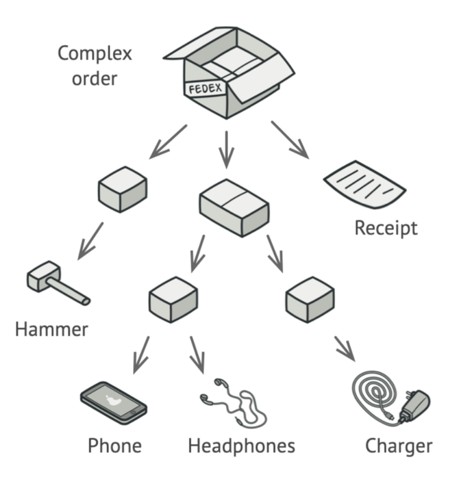
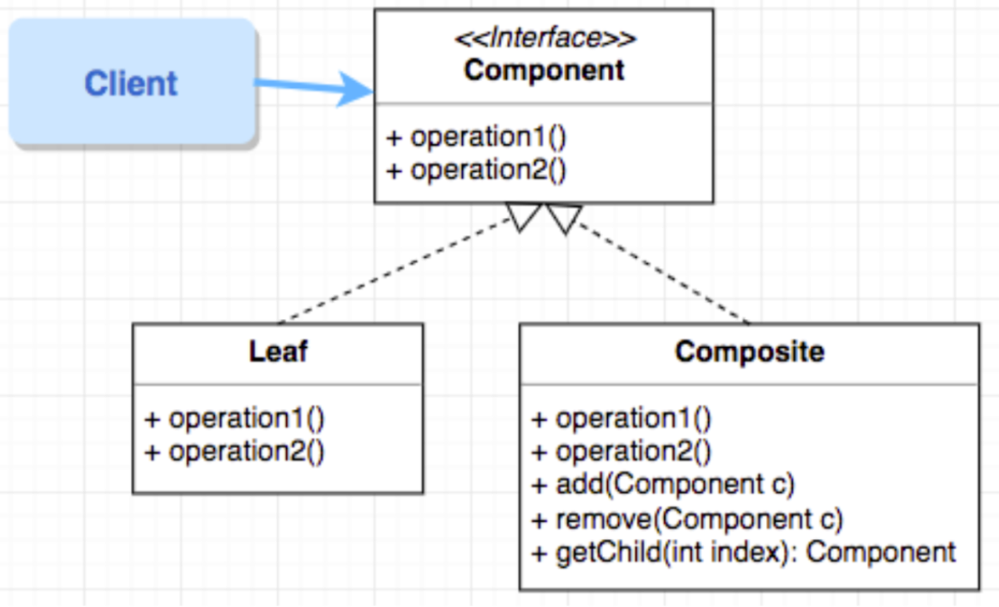
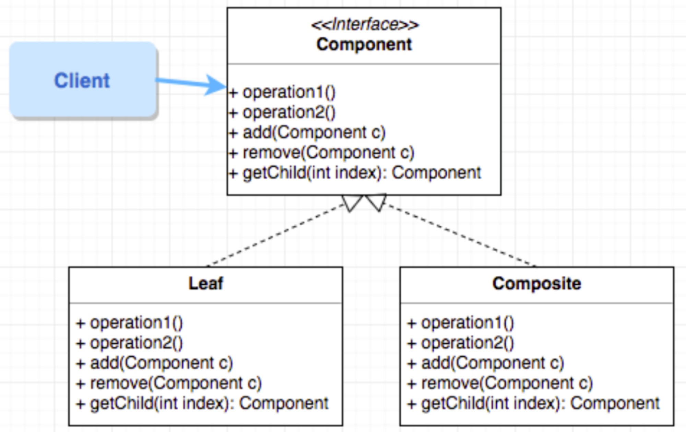
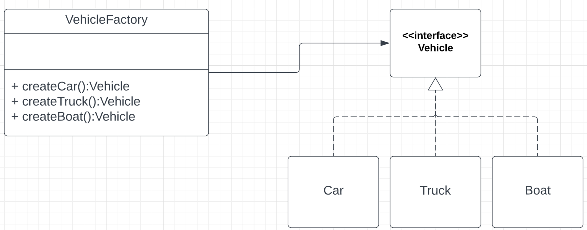

## 🧩 Composite Pattern

Composite is a structural design pattern that lets you compose objects into tree structures and then work with these structures as if they were individual objects.

### **When should we use it?**

When we want to treat a group of objects in similar ways as a single object

## 🔧 Types of Implementations

### 🧮 Calculator Code Demo

Inside `src/calculator`, use the **Composite Pattern** to write a simple calculator that evaluates an expression. Your calculator should be able to:

- Add two expressions
- Subtract two expressions
- Multiply two expressions
- Divide two expressions
- Answer
  
    *See Github for answer*

## 🏭 Factory Pattern

Factory Method is a creational design pattern that provides an interface for creating objects in a superclass but allows subclasses to alter the type of objects that will be created.

### **When should we use it?**

When we want to group the creation of objects together

### 👑 Thrones Code Demo

Inside `src/thrones`, there is some code to model a simple chess-like game. In this game different types of characters move around on a grid fighting each other. When one character moves into the square occupied by another they attack that character and inflict damage based on random chance. 

There are four types of characters:

- A **king** 👑 can move one square in any direction (including diagonally), and always causes `8` points of damage when attacking.
- A **knight** 🐴 can move like a knight in chess (in an L shape), and has a 1 in 2 chance of inflicting 10 points of damage when attacking.
- A **queen** 👸 can move to any square in the same column, row or diagonal as she is currently on, and has a 1 in 3 chance of inflicting 12 points of damage or a 2 out of 3 chance of inflicting 6 points of damage.
- A **troll** 🧟 can only move up, down, left or right, and has a 1 in 6 chance of inflicting 20 points of damage.

We want to refactor the code so that when the characters are created, they are put in a random location in a grid of length 5.

Use the Factory Pattern to create a series of object factories for each of the character types, and change the main method of `Game.java` to use these factories

- Answer
    
    *See Github for answer*

## 🔍 Finding Patterns

As a class, determine a possible pattern that could be used to solve each of the following problems:

- Sorting collections of records in different orders.
    
    The **Strategy Pattern** is ideal for sorting collections in different orders as it allows changing sorting methods at runtime, providing flexibility and efficiency.
    
- Modelling a file system
    
    The **Composite Pattern** is ideal for handling object hierarchies or tree structures. It simplifies the process of adding, removing, or modifying elements in these structures by reducing code duplication and potential errors.
    
- Updating a UI component when the state of a program changes
    
    The **Observer Pattern** is best as it allows an object (the 'subject') to notify other objects (the 'observers') when its state changes. This is ideal for updating UI components in response to changes in program state, ensuring consistent and synchronized display.
    
- Parsing and evaluating arithmetic expressions
    
    The **Composite Pattern** is best when you want to work with a collection of objects and treat them the same way you would an individual object. It allows you to create tree structures and manipulate them easily, which is beneficial when dealing with hierarchies or nested structures.
    
- Adjusting the brightness of a screen based on a light sensitivity
    
    The **Observer Pattern** is best for adjusting screen brightness based on light sensitivity as it allows for dynamic response to changes. The brightness (subject) notifies its observers (e.g., screen settings) when light sensitivity changes, enabling immediate and appropriate adjustment.