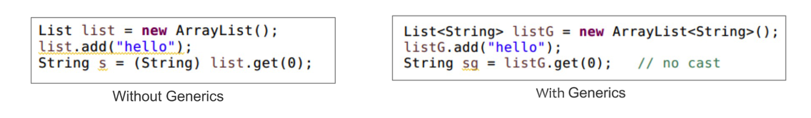
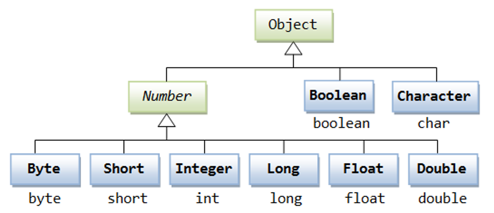
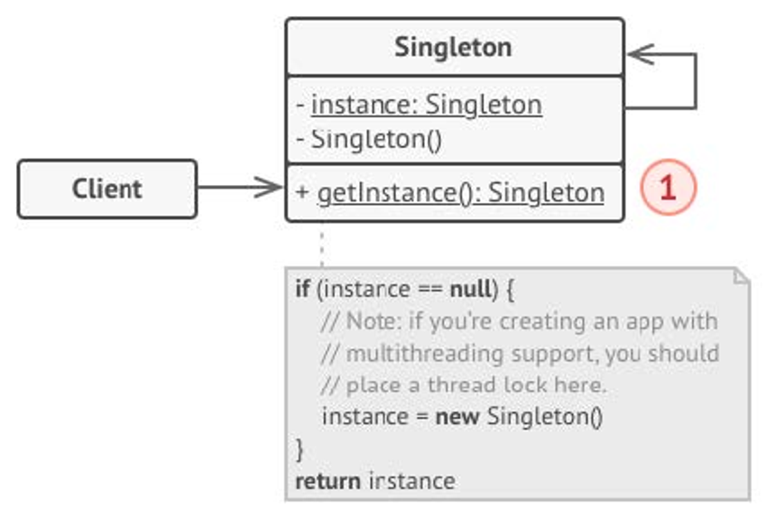
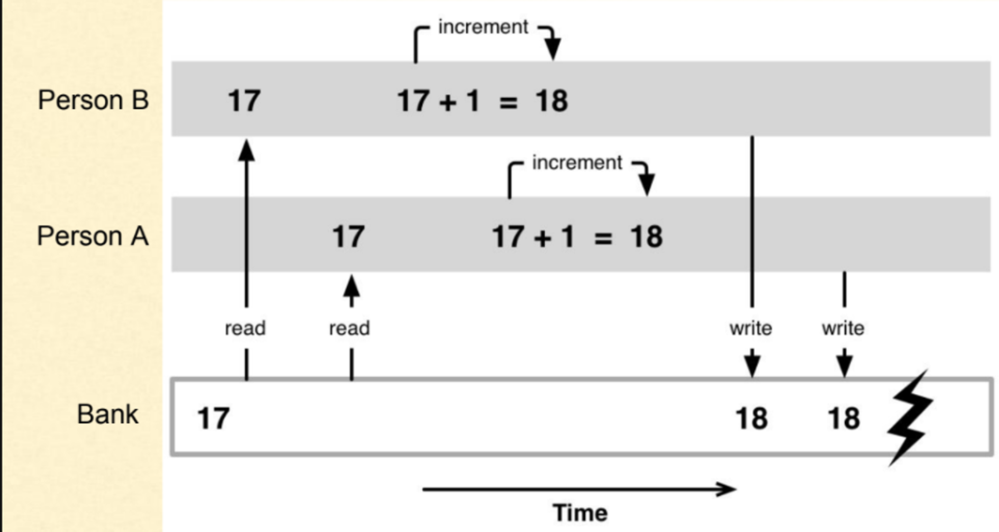

::: info
- Assignment 1 marks have been released! See feedback branch for feedback.
- Issue with automarking?? You can submit a rerun but there is a 20% automark penalty
- Assignment 2 is due soon (Week 9 Friday)
- No lab work in week 10! Instead there is an in-person sample exam using the exam environment. So all lab marking must be marked before week 9 (inclusive).
- If you would like to assignment 3 solo, reply to the post in teams. Deadline week 9 lab
:::

## 👽Generics

Generics enable types to be passed when defining classes, interfaces or methods

**Benefits**

- Remove casting and offer stronger type checks at compile time
- Allow implementations of generic algorithms, that work on a collection of different types
- Adds stability to code by making more of your bugs detectable at run-time



- For each scope, how many different type are there?

```java
public class ConfusingClass<T> {
		// a) How many generic types can be accessed here?
    private T t1;

    public <T> T t2(T t) {
		    // b) How many generic types can be accessed here?
        return null;
    }
  
    public static <T> T t3(T t) {
		    // c) How many generic types can be accessed here?
        return null;
    }

    public static void main(String[] args) {
        ConfusingClass<String> cc = new ConfusingClass<String>();
        cc.t2(3);
    }
}
```

::: details Answer
```java
class ConfusingClass<J> { // Answer: 1. This method has one type T1 defined at the class level.
    private T1 t1;

    public <T2> T2 t2(T2 t) { 
    // Answer: 2. This method has two types, T1 (from the class level) and T2 (locally defined for this method).
        T1 t1;
        T2 t2;
        return null;
    }

    // ConfusingClass.t3(...)
    public static <T3> T3 t3(T3 t) { 
    // Answer 1. This static method defines one type locally, T3.
        T3 t3;
        return null;
    }
}
```
:::

### Generics with two parameter

```java
public class Box<T, S> {
    private T value1; 
    private S value2; 
    
    public Box(T value1, S value2) {
        this.value1 = value1;
        this.value2 = value2;
    }
    
    public void setValue(T value1, S value2) {
        this.value1 = value1;
        this.value2 = value2;
    }
    
    public T getValue1() {
        return value1;
    }
    
    public S getValue2() {
        return value2;
    }
    
    public static void main() {
		    Box b = new Box<Integer, String>();
    }
}
```

### Code Demo

Inside **`src/stack`**, there are a series of stubs code for a **`Stack`** class which takes in a generic type. There are a series of tests inside **`StackTest.java`** which currently fail.

Implement the methods so that the tests pass, using an **`ArrayList`** to store the internal data structure. Answer the following questions:

- What is `E`?
  
    A generic type
    
- What is the **`Iterable`** interface? Why does it have an `E` as well? What methods does it force us to implement?
    - Iterable: Something that can be iterated over
    - Forces us to implement the **`.iterator()`** method
- When completing **`toArrayList`**, why do we need to make a copy rather than just returning our internal **`ArrayList`**?
  
    So we don't return a pointer and don't break encapsulation
    
- What does the **`.iterator()`** method allow us to do? Look at **`StackTest.java`**
  
    Allows us to loop through it like a normal collection in a standardized way
    
- Generic type bounds
    ```java
    public static Integer sumStack(Stack<? extends Integer> stack);
    ```



## 🥇Singleton Pattern

The Singleton pattern is a design creational pattern that restricts the instantiation of a class to a single instance. This is useful when exactly one object is needed to coordinate actions across the system.



Consider the Bank Account class from Lab 04. What if multiple people try to access the bank account at the same time? 

Inside `src/unsw/heist` are three classes:

- `BankAccount`- Same as Lab 04.
- `BankAccountAccessor`- Objects of this type are an instance of an access to a bank account to withdraw money a given number of times by given amounts.
- `BankAccountThreadedAccessor`, which extends `Thread`, and overrides the method run to create a new instance of `BankAccountAccessor` and access the bank.

Currently, when you run the code, you will find that each thread accesses the bank at the same time (which doesn't make sense). In some cases some strange behaviour is produced by this race condition:



```bash
Denver is accessing the bank.
Tokyo is accessing the bank.
The final balance is: $100
Rio is accessing the bank.
Rio successfully withdrew $20
Tokyo successfully withdrew $6
Denver successfully withdrew $49
Tokyo successfully withdrew $6
Denver failed to withdraw $49.
Rio successfully withdrew $20
Rio failed to withdraw $20.
Denver is leaving the bank, the balance is -1
Tokyo failed to withdraw $6.
Rio failed to withdraw $20.
Tokyo failed to withdraw $6.
Rio failed to withdraw $20.
Tokyo failed to withdraw $6.
Tokyo failed to withdraw $6.
Rio is leaving the bank, the balance is -1
Tokyo is leaving the bank, the balance is -1
```

Use the Singleton Pattern to ensure that only one person can access the bank at a time. You can assume for simplicity's sake that only one access to any bank account can ever be made at a given time.