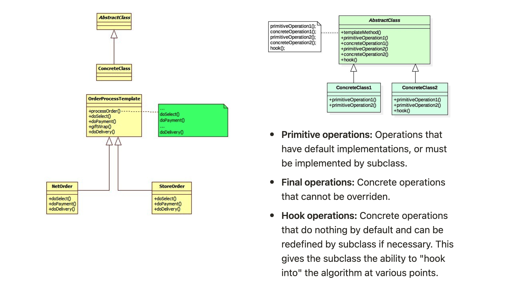
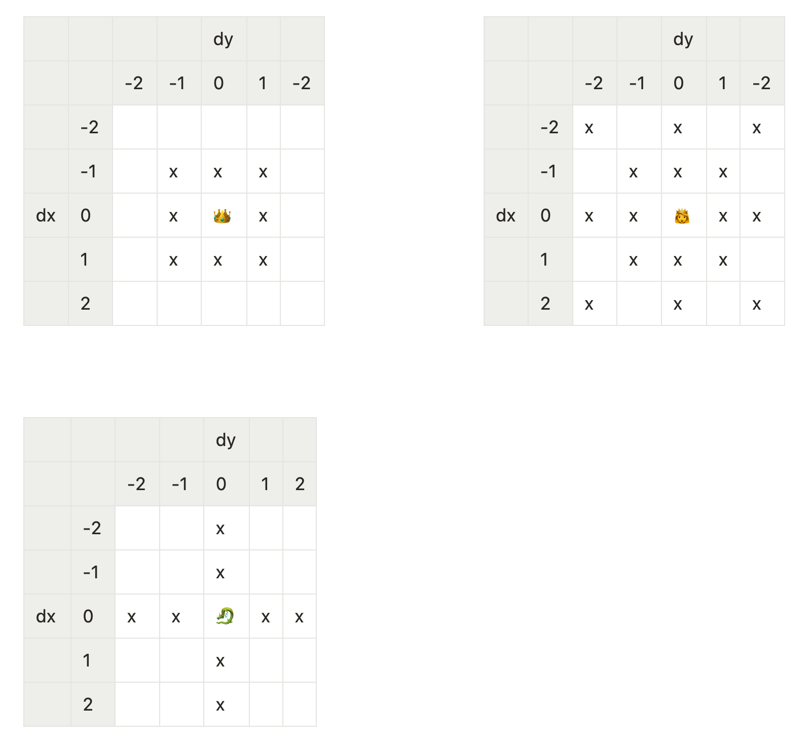
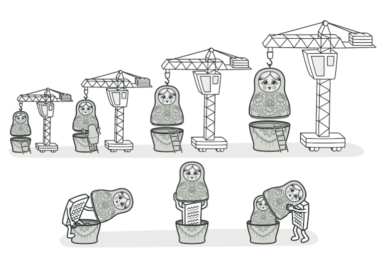
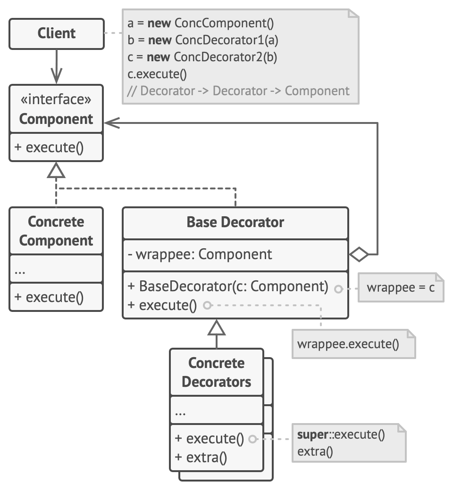

::: info 
- Assignment 3 has been released and is due Friday Week 10 5pm. Same teams as previous assignment unless you have discussed with me
- Assignment 2 is due this Friday 5pm
- Lab10 is a sample exam. No marks but highly recommended to get familiar with exam environment
:::

## 📝 Template Pattern

The template Method is a **behavioural design** **pattern** that defines the skeleton of an algorithm in the superclass but lets subclasses override specific steps of the algorithm without changing its structure.

- When should we use this?
  
    When you want to let subclasses extend only particular steps of an algorithm, but not the whole algorithm or its structure.
    
- How does this compare to the strategy pattern?
    - Template method is based on inheritance: Alter parts of the algorithm by extending those parts in subclasses
    - Strategy is based on composition: You alter parts of the object's behaviour by supplying it with a different strategy
    - Strategy can change their behaviour after creation (supply with new behaviour), templates cannot change behaviour after construction

::: warning
You might violate the *Liskov Substitution Principle* by suppressing a default step implementation via a subclass.
:::

### Implementation

- **Primitive operations:** Operations that have default implementations, or must be implemented by subclass.
- **Final operations:** Concrete operations that cannot be overriden.
- **Hook operations:** Concrete operations that do nothing by default and can be redefined by subclass if necessary. This gives the subclass the ability to "hook into" the algorithm at various points.

::: details Code Demo

In a simple game, different types of characters move around on a grid fighting each other. When one character moves into the square occupied by another they attack that character and inflict damage based on random chance (e.g. a dice roll).

- A king 👑 can move one square in any direction (including diagonally), and always causes 8 points of damage when attacking.
- A queen 👸 can move to any square in the same column, row or diagonal as she is currently on, and has a 1 in 3 chance of inflicting 12 points of damage or a 2 out of 3 chance of inflicting 6 points of damage.
- A dragon 🐉 can only move up, down, left or right, and has a 1 in 6 chance of inflicting 20 points of damage.

Use a Template pattern to model a solution to this problem. The code has been started for you inside the `Character` class.

|      |      |      |      | dy   |      |      |
| ---- | ---- | ---- | ---- | ---- | ---- | ---- |
|      |      | -2   | -1   | 0    | 1    | -2   |
|      | -2   |      |      |      |      |      |
|      | -1   |      | x    | x    | x    |      |
| dx   | 0    |      | x    | 👑    | x    |      |
|      | 1    |      | x    | x    | x    |      |
|      | 2    |      |      |      |      |      |

|      |      |      | dy   |      |      |      |
| ---- | ---- | ---- | ---- | ---- | ---- | ---- |
|      |      | -2   | -1   | 0    | 1    | -2   |
|      | -2   | x    |      | x    |      | x    |
|      | -1   |      | x    | x    | x    |      |
| dx   | 0    | x    | x    | 👸    | x    | x    |
|      | 1    |      | x    | x    | x    |      |
|      | 2    | x    |      | x    |      | x    |

|      |      |      |      |      |      |      |
| ---- | ---- | ---- | ---- | ---- | ---- | ---- |
|      |      |      | dy   |      |      |      |
|      |      | -2   | -1   | 0    | 1    | 2    |
|      | -2   |      |      | x    |      |      |
|      | -1   |      |      | x    |      |      |
| dx   | 0    | x    | x    | 🐉    | x    | x    |
|      | 1    |      |      | x    |      |      |
|      | 2    |      |      | x    |      |      |

:::

## 🪆Decorator Pattern

Decorator is a **structural design** pattern that lets you attach new behaviors to objects by placing these objects inside special wrapper objects that contain the behaviors.

- Adds functionality to a class at run-time. Used when sub classing would result in an exponential rise in new classes
- Attaches additional responsibilities to an object dynamically
- Avoids implementing all possible functionality in one complex class
- Prefers composition over inheritance

### Implementation

::: details Code Demo

This exercise continues on from Exercise A.

Suppose a requirements change was introduce that necessitated support for different sorts of armour.

- A helmet reduces the amount of damage inflicted upon a character by 1 point.
- Chain mail reduces the amount of damage by half (rounded down).
- A chest plate caps the amount of damage to 7, but also slows the character down. If the character is otherwise capable of moving more than one square at a time then this armour restricts each move to distances of 3 squares or less (by manhattan distance).

There are no restrictions on the number of pieces of armour a character can wear and that the "order" in which armour is worn affects how it works. You may need to make a small change to the existing code.
:::

