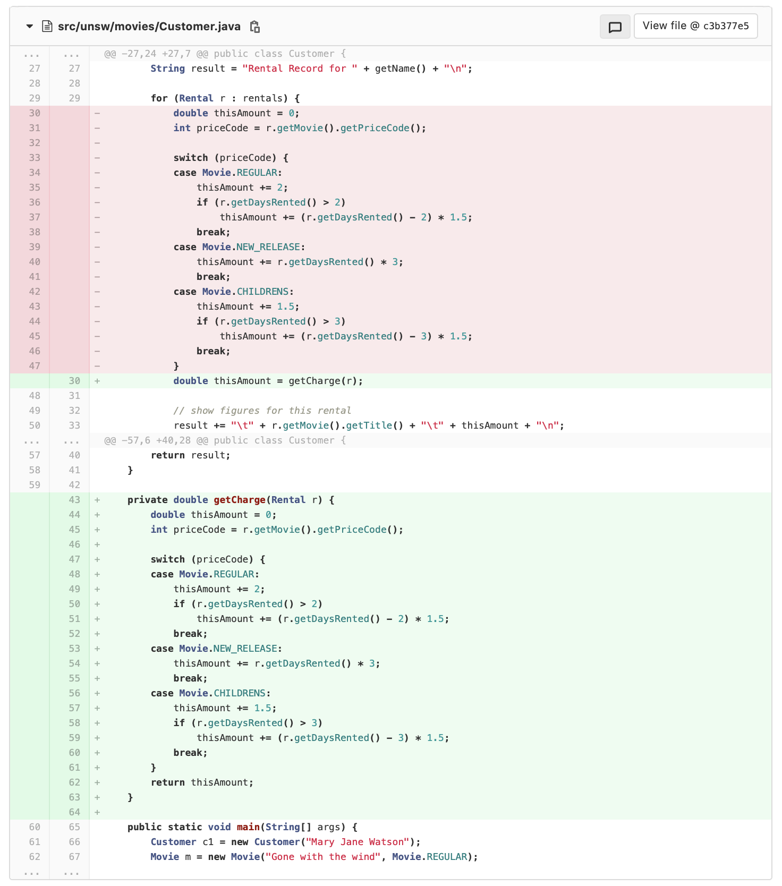
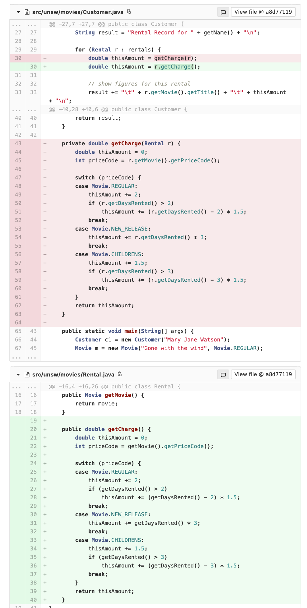
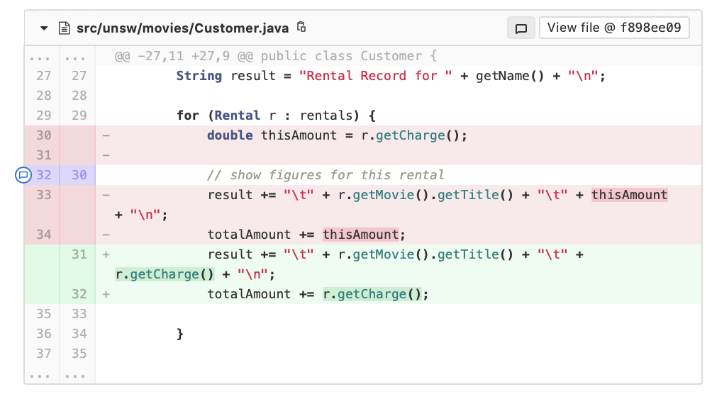
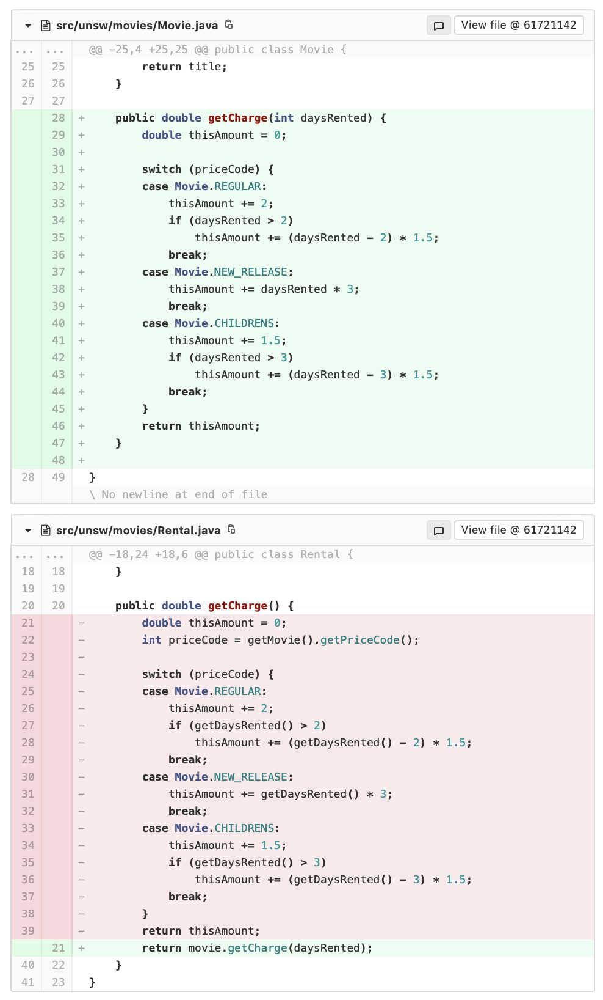
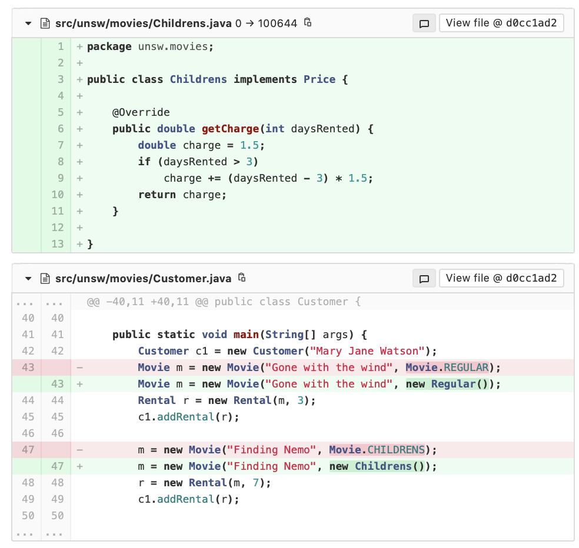
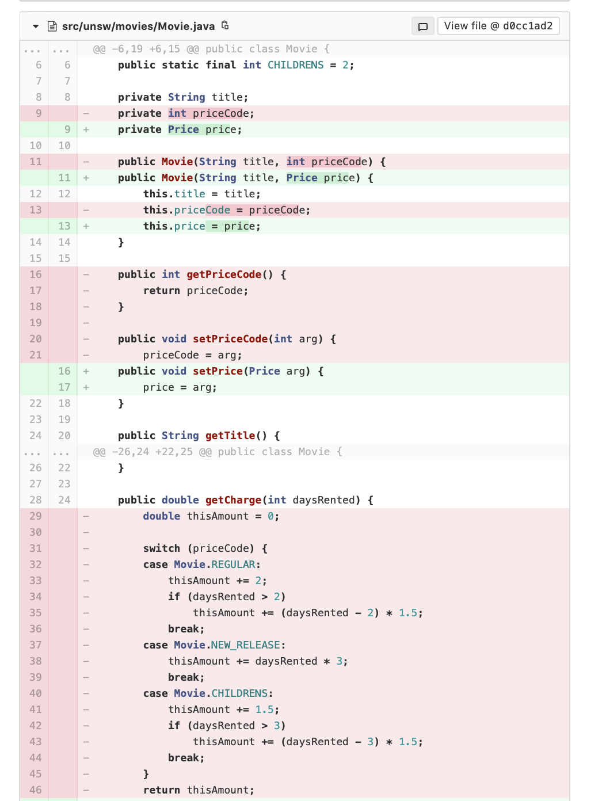
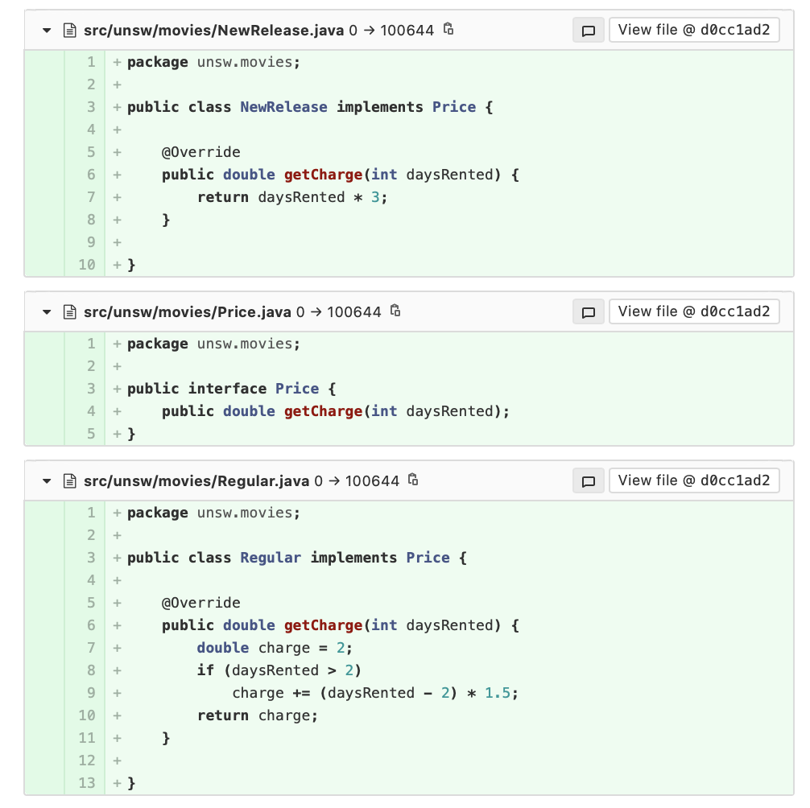

::: details Images









:::


::: details Src/calculator

::: tabs 

@tab Calculator.java
```java
package calculator;

public class Calculator {
    
    public static Double add(Double a, Double b) {
        return a + b;
    }

    public static Double subtract(Double a, Double b) {
        return a - b;
    }

    public static Double multiply(Double a, Double b) {
        return a * b;
    }

    public static Double divide(Double a, Double b) {
        return a / b;
    }

    public static Double sin(Double angle) {
        return Math.sin(angle);
    }

    public static Double cos(Double angle) {
        return Math.cos(angle);
    }

    public static Double tan(Double angle) {
        return Math.tan(angle);
    }

}
```
:::

::: details Src/stream

::: tabs 

@tab App.java
```java
package stream;

import java.util.ArrayList;
import java.util.Arrays;
import java.util.List;
import java.util.stream.Collectors;

public class App {
    public static void main(String[] args) {
        List<String> strings = new ArrayList<String>(Arrays.asList(new String[] {"1", "2", "3", "4", "5"}));
        for (String string : strings) {
            System.out.println(string);
        }

        List<String> strings2 = new ArrayList<String>(Arrays.asList(new String[] {"1", "2", "3", "4", "5"}));
        List<Integer> ints = new ArrayList<Integer>();
        for (String string : strings2) {
            ints.add(Integer.parseInt(string));
        }
        System.out.println(ints);
    }


}
```
:::

::: details Src/unsw/training

::: tabs 

@tab Wondrous.java
```java
package unsw.training;

import java.util.List;

/**
 * An online seminar is a video that can be viewed at any time by employees. A
 * record is kept of which employees have watched the seminar.
 * @author Robert Clifton-Everest
 *
 */
public class OnlineSeminar extends Seminar {
    private String videoURL;

    private List<String> watched;
}

```

@tab Seminar.java
```java
package unsw.training;

import java.time.LocalDate;
import java.util.List;

/**
 * An in person all day seminar with a maximum of 10 attendees.
 * @author Robert Clifton-Everest
 *
 */
public class Seminar {
    private LocalDate start;

    private List<String> attendees;

    public LocalDate getStart() {
        return start;
    }

    public List<String> getAttendees() {
        return attendees;
    }
}

```

@tab Trainer.java
```java
package unsw.training;

import java.util.List;

/**
 * A trainer that runs in person seminars.
 *
 * @author Robert Clifton-Everest
 *
 */
public class Trainer {

    private String name;
    private String room;

    private List<Seminar> seminars;

    public List<Seminar> getSeminars() {
        return seminars;
    }
}

```

@tab TrainingSystem.java
```java
package unsw.training;

import java.time.LocalDate;
import java.util.List;

public class TrainingSystem {

    private List<Trainer> trainers;

    public LocalDate bookTraining(String employee, List<LocalDate> availability) {
        for (Trainer trainer : trainers) {
            for (Seminar seminar : trainer.getSeminars()) {
                for (LocalDate available : availability) {
                    if (seminar.getStart().equals(available) &&
                            seminar.getAttendees().size() < 10) {
                        seminar.getAttendees().add(employee);
                        return available;
                    }
                }
            }
        }
        return null;
    }
}

```
:::


## A. Design Principles

### Part 1: Law of Demeter

In the `unsw.training` package there is some skeleton code for a training system.

* Every employee must attend a whole day training seminar run by a qualified trainer
* Each trainer is running multiple seminars with no more than 10 attendees per seminar

In the `TrainingSystem` class there is a method to book a seminar for an employee given the dates on which they are available. This method violates the principle of least knowledge (Law of Demeter).

1. How and why does it violate this principle?
2. In violating this principle, what other properties of this design are not desirable?
3. Refactor the code so that the principle is no longer violated. How has this affected other properties of the design?
4. More generally, are getters essentially a means of violating the principle of least knowledge? Does this make using getters bad design?

### Part 2: Liskov Substitution Principle

Look at the `OnlineSeminar` class. How does this violate the Liskov Substitution Principle?

## B. Streams and Lambdas

1. Inside `src/stream/App.java`, rewrite the following code using the `.forEach()` method and a lambda:
```java
List<String> strings = new ArrayList<String>(Arrays.asList(new String[] {"1", "2", "3", "4", "5"}));
for (String string : strings) {
   System.out.println(string);
}
```
2. In the above example, discuss two different ways to write lambda expressions.
3. What is a stream? Rewrite the following code to use a stream and the `map` function.
```java
List<String> strings2 = new ArrayList<String>(Arrays.asList(new String[] {"1", "2", "3", "4", "5"}));
List<Integer> ints = new ArrayList<Integer>();
for (String string : strings2) {
    ints.add(Integer.parseInt(string));
}
```
4. Modify your answer to (3) to use a scope operator instead of a normal lambda.

## C. Design by Contract

1. What is Design by Contract?
2. Discuss briefly as a class how you have used Design by Contract already in previous courses.
3. Discuss how Design By Contract was applied in the Blackout assignment.
4. In the `Calculator` code, specify a contract for each of the functions. Hint: for the trig functions, look at the interface of the `Math` functions in the Java documentation. Key edge cases to consider:
    * Dividing by zero
    * `tan(Math.PI / 2)`
5. Will you need to write unit tests for something that doesn't meet the preconditions? Explain why.
6. We will now make our code more defensive by throwing an exception on the two edge cases listed above. Define your own custom exception called `CalculatorException`, and change the code so that these edge cases cause this exception to be thrown. Modify your contract accordingly. If you have time, add tests for these conditions as well.