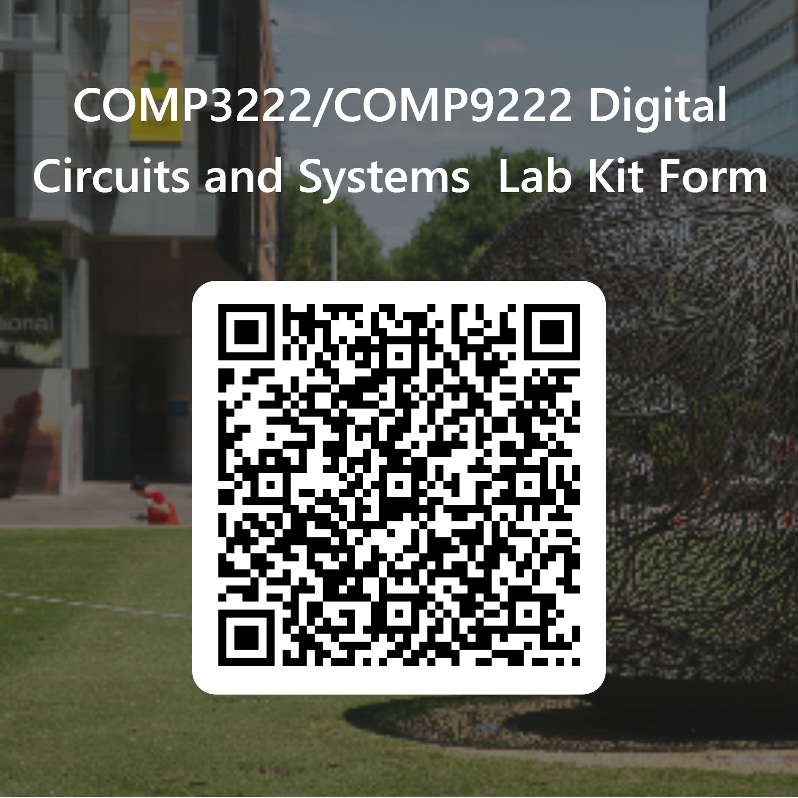

## Getting started with COMP3222 labs

- <HGlobalLink title="Getting Started with Vivado and COMP3222 Labs Guide" md5="cd28bb78f291795212a3436591f4c12c"/>
- <HLink title="Basys 3 Digilent Reference webpage" src="https://digilent.com/reference/programmable-logic/basys-3/start" />

- <HGlobalLink title="Basys 3 reference manual" md5="dfb642728007671e306591bdee2f034b"/>
- <HGlobalLink title="basys3/C.0/board_files" md5="3eea5ad128202e2a82429abe2ff1a037"/>
- <HGlobalLink title="Getting Started with Vivado for Hardware-Only Designs/project_1_vhdl.zip" md5="55c954e7b391febad1ab5f5f268ff020"/>
- <HGlobalLink title="Using the Simulator in Vivado/project_2_vhdl.zip" md5="b64033fc1d0d4e3600bfd58ceed4c880"/>

## References

- <HGlobalLink title="Vivado Design Suite User Guide" md5="134cabdaf0b19d3d8c0b3f8f3c167f27"/>
- <HGlobalLink title="Artix-7 FPGA datasheet" md5="cd333b66c9a95763b203c0bd1fadcf2e"/>
- <HGlobalLink title="Xilinx XAPP199 Writing Efficient Testbenches" md5="e68b53092ae3023c565c1b342866ef18"/>

## Weekly lab exercises

---

### Week 1

::: details Lab kit loan form

[Complete the form available via the QR code below or via this link ](https://forms.office.com/Pages/ResponsePage.aspx?id=pM_2PxXn20i44Qhnufn7o1Bbd3S_R2BKrNnWJ6B2uupUNTRFUEJIOVY4R0lPS0Q3WFNaVjVJWFpOWS4u)to acknowledge receipt of and responsibility for the COMP3222 Basys 3 lab kit.

After filling in the form, collect a lab kit from the CSE School Office in K17-111D from 12 pm - 2 pm Monday - Friday during Week 1.

Please remember to return the lab kit to the CSE School Office when you disenrol from or complete COMP3222/9222. Failure to return the kit can result in a financial block being placed on your student record, which will prevent you from enrolling in courses and graduating.

:::

- <HGlobalLink title="Familiarise yourself with Vivado and the Basys 3 board" md5="cd28bb78f291795212a3436591f4c12c"/>

---

### Week 2

- <HGlobalLink title="Lab 1 exercise sheet - Parts III, IV & V to be marked off (6 marks total)" md5="a2d25eb7a5955051c16b937f995a9b61"/>
- <HGlobalLink title="Lab 1 project files" md5="a8f05269b7cbe70bacacc35a28993a5b"/>

