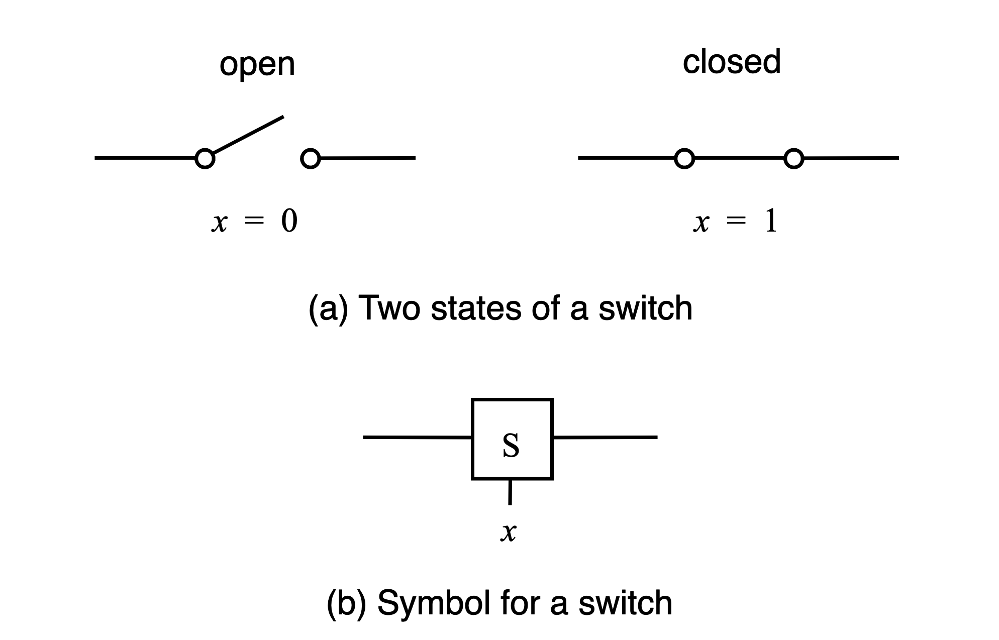
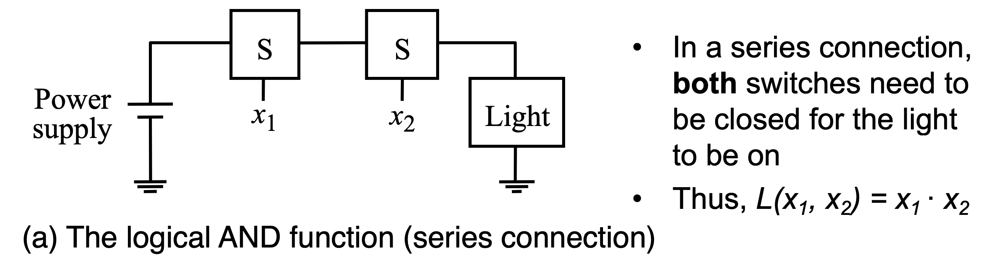
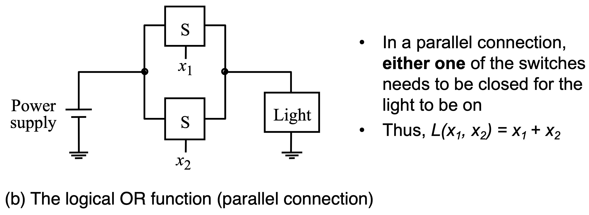
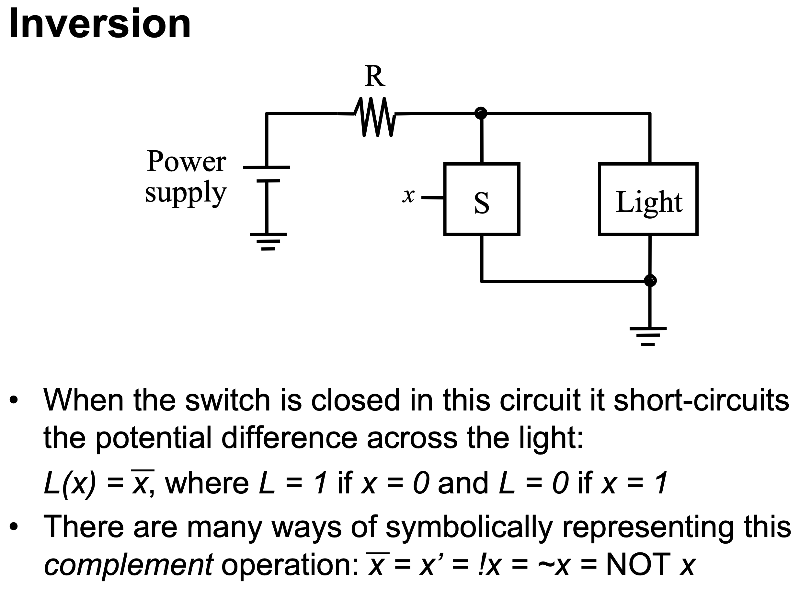
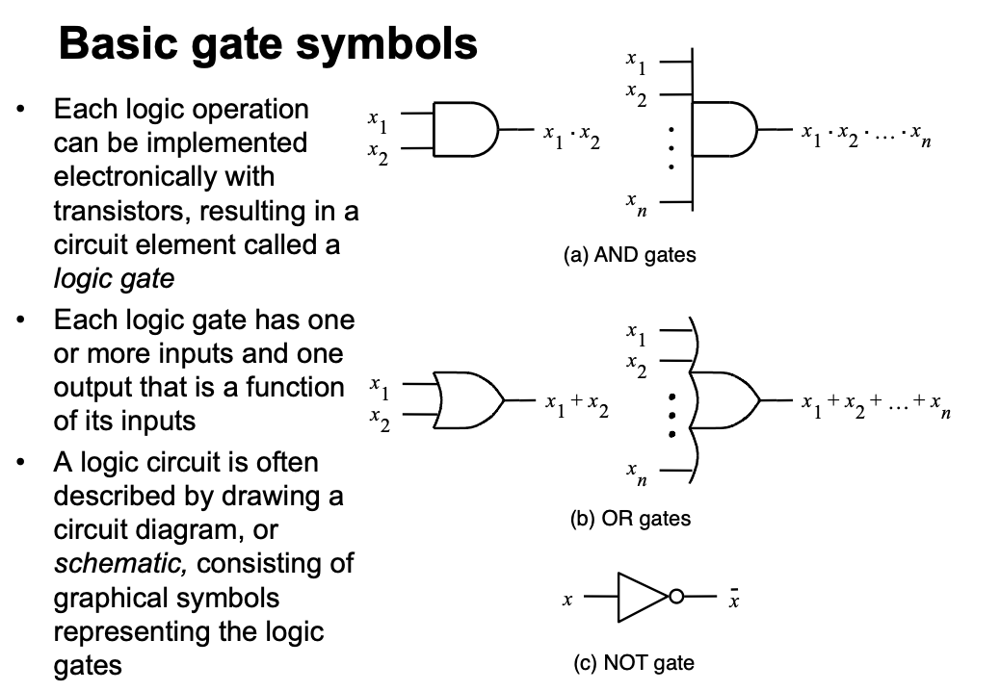
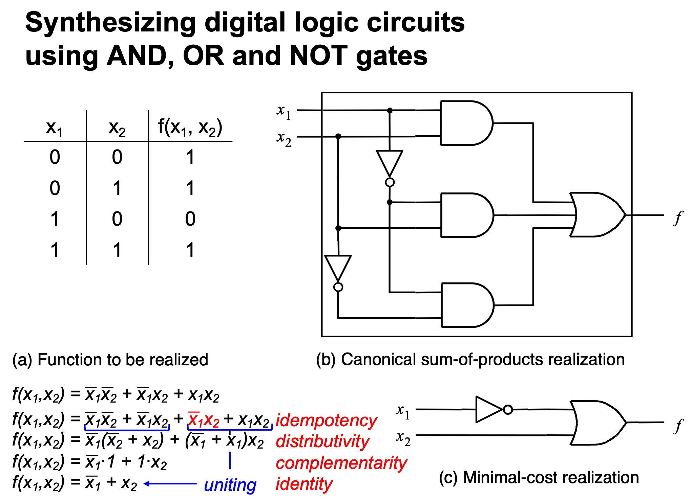
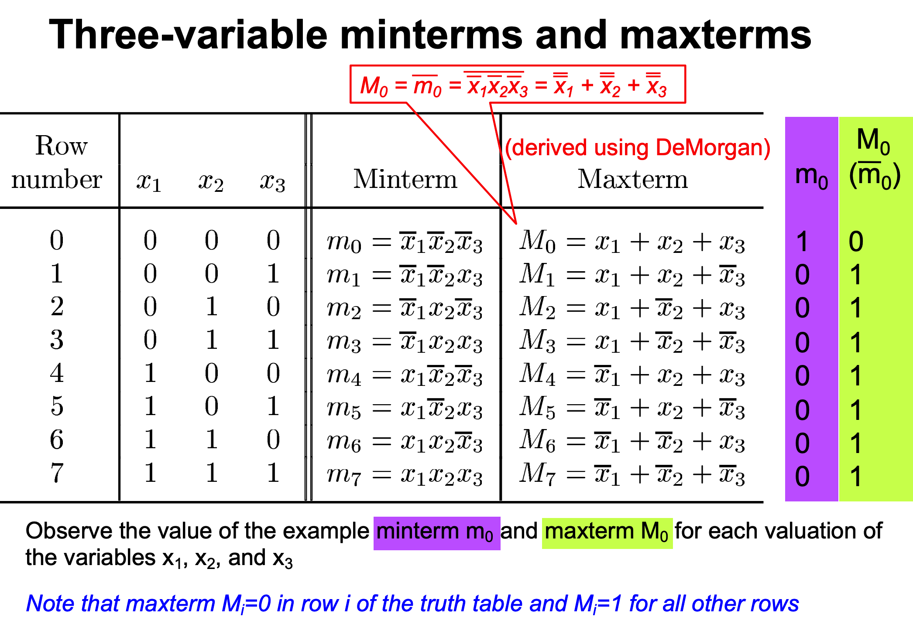

## Logic circuits introduction
- **Binary logic circuits**: Use two values (0 and 1).

- **Basic components**: Switches, AND gates, OR gates, NOT gates.

## Truth tables and gates

| $x_1$ | $x_2$ | $x_1 \cdot x_2$ | $x_1 + x_2$ | $\overline{x_1}$ |
|:-------:|:-------:|:-----------------:|:-------------:|:-----------------:|
| 0       | 0       | 0                 | 0             | 1                 |
| 0       | 1       | 0                 | 1             | 1                 |
| 1       | 0       | 0                 | 1             | 0                 |
| 1       | 1       | 1                 | 1             | 0                 |
|||AND|OR|NOT|

- **AND**, **OR**, and **NOT** gates:
  - AND: All inputs must be 1 for the output to be 1.
  
    
  
  - OR: Any input being 1 causes the output to be 1.
  
    
  
  - NOT: Inverts the input signal.
  
    

## Logic circuit cost

- Circuit cost is a function of the number of gates and the number of gate inputs.

## Synthesis technique for logic circuits
1. Add an AND term for each truth table row where the function value is 1.
2. Form the OR of these terms to produce the function.
3. Simplify the expression using Boolean algebra.

## Minterms and Maxterms
- **Minterms**: Product terms where each variable appears once.
- **Maxterms**: Complements of minterms.

## Canonical representations
- **Sum-of-Products (SOP)**: Represents a function as the sum (OR) of minterms.
- **Product-of-Sums (POS)**: Represents a function as the product (AND) of maxterms.

## VHDL overview
- **Entity declaration**: Defines the interface of a VHDL design.
- **Architecture**: Describes the behavior and structure of a VHDL design.
- **Synthesis**: Describes how hardware components are connected.

## Boolean algebra theorems
- **Identity**: $X + 0 = X → X \cdot 1 = X$
- **Null**: $X + 1 = 1 → X \cdot 0 = 0$
- **Involution**: $(X')' = X$
- **Idempotency**: $X + X = X$
- **Complementarity**: $X + X' = 1$
- **De Morgan’s Law**: $(X + Y + ...)' = X' \cdot Y' \cdot ...$

## Synthesizing digital logic circuits  using AND, OR and NOT gates

## Three-variable minterms and maxterms

