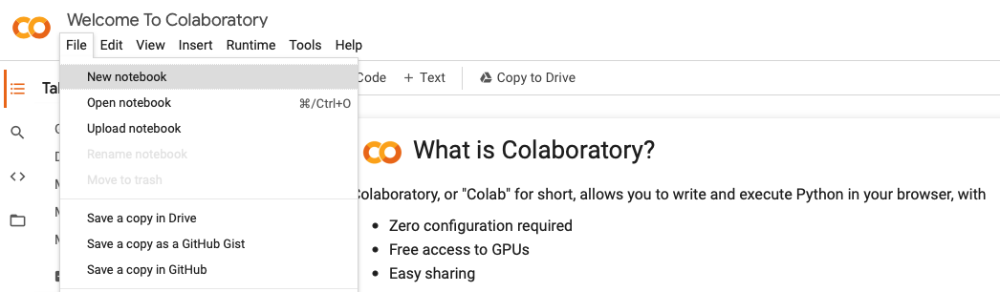
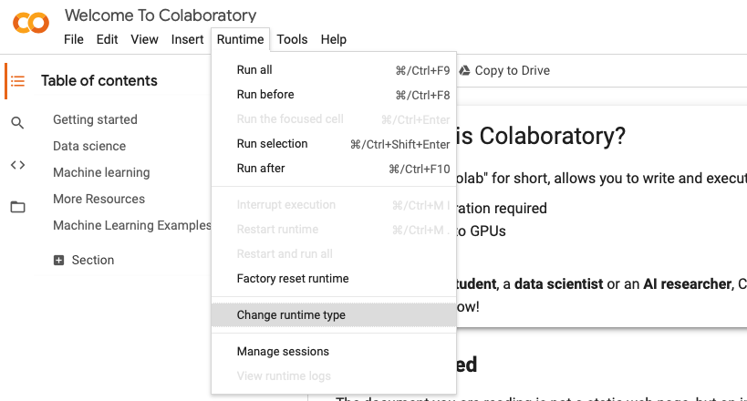
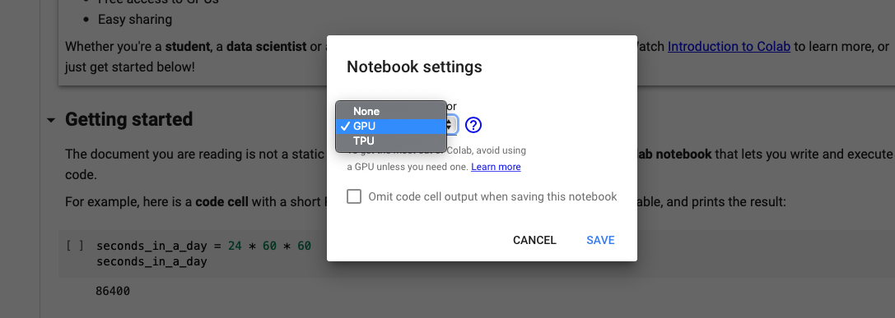

## Getting started with Google Colab

Executing a machine learning or deep learning algorithm on a large dataset usually requires a lot of computing resources. Many students do not have access to sufficient computing resources to efficiently train their deep learning models. To solve this, we introduce Google Colab, an incredible online cloud-based platform that allows you to train your models with GPUs or even TPUs for free.

### Introduction

Colab is a product from Google Research which allows you to write and execute arbitrary python code through the browser, and is especially well suited to machine learning, data analysis and education. In short, Colab is google's flavour of Jupyter notebook which also provides free access to computing resources including **GPUs**. 

### Create a file in Colab

- Go to [Google Colab](https://colab.research.google.com/notebooks/welcome.ipynb)
- Sign in with your Google account
- Create a new notebook via **File -> New notebook**

Since Colab runs entirely in the *cloud* via Google Drive, you can also create/open/share a notebook via [Google Drive](https://drive.google.com/). 

#### GPUs in Colab

Colab gives you 12 hours of execution time which is sufficient to meet our computation needs for this course.
To set up GPUS of your notebook in Colab, just click  **Runtime -> Change runtime type -> Hardware accelerator -> GPU**

