

## Week 1: Overview

In this first week, we will look at the historical background of artificial intelligence and deep learning, biological and artificial neurons, the perceptron learning algorithm, and the training of multi-layer neural networks by gradient descent.

### Weekly learning outcomes

By the end of this module, you will be able to: 

- construct perceptrons by hand
- apply the Perceptron Learning Algorithm
- construct multi-layer perceptrons by hand
- explain how continuous activation functions allow multi-layer neural networks to be trained by gradient descent

## History and Neuroanatomy

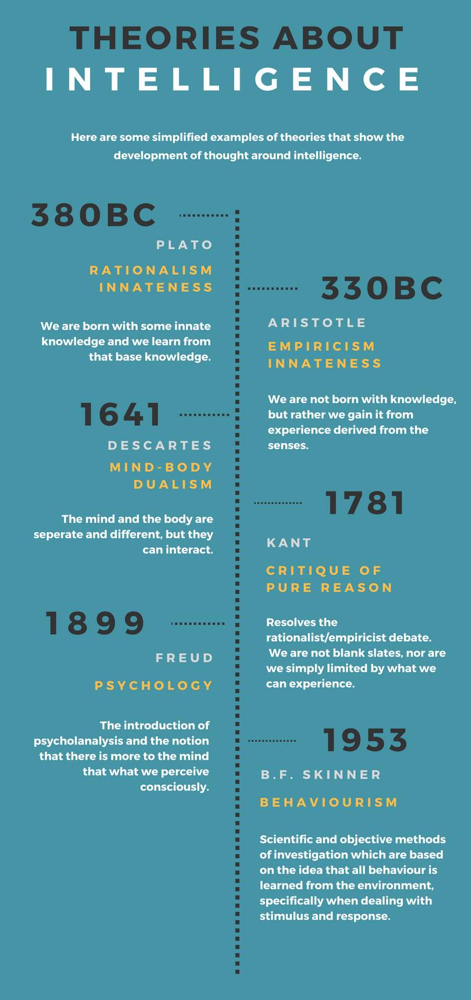

> "For the machine is not a thinking being, but simply an automation which acts according to the laws imposed upon it.''
> −−Ada Lovelace, 1843

The table above summarizes various theories which have been proposed throughout history to explain the workings of the human mind. The idea that human reasoning could be simulated by some kind of mechanical calculator dates back to Blaise Pascal and Gottfried Leibniz in the 1600's, was developed in the 1800's by George Boole, Gottlob Frege, Charles Babbage and Ada Lovelace, and in the early 1900's by Alan Turing.

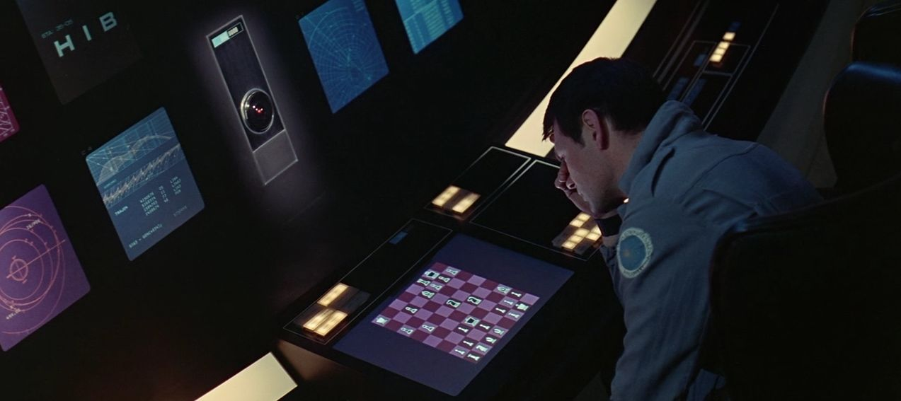

The modern field of Artificial Intelligence (AI) perhaps began in earnest with a workshop at Dartmouth College in the summer of 1956. In the early days of AI, researchers tended to focus on logical reasoning and problem solving. Less attention was paid to perceptual tasks such as vision and language processing, because there was a general expectation that these tasks would be easily solved within a few years. In reality, these seemingly simple tasks turned out to be much more challenging, and were not achieved to any degree of proficiency until the second decade of the 21st Century. The major advances in these areas stem chiefly from a class of models called Deep Neural Networks which are inspired by the structure of the human brain.

### Sub-Symbolic Processing

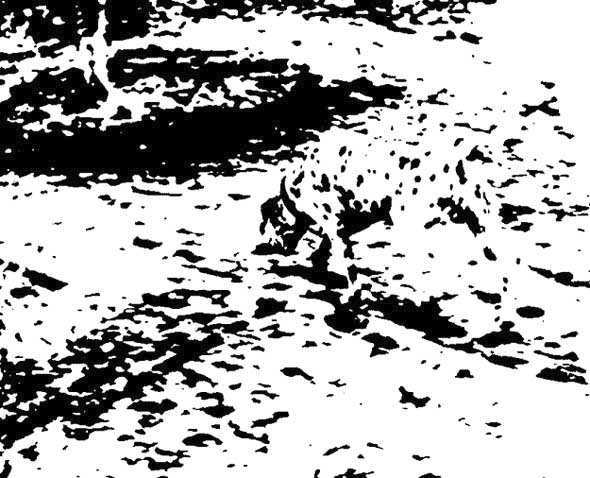

Can you see an animal in this picture? What kind of animal is it? What direction is it facing?

The human brain performs tasks such as object recognition unconsciously and in a highly distributed fashion. Low-level features are recognised in different parts of the image and are hierarchically combined into high level features from which the identity of the object is extracted.

### Basic Neuroanatomy

<iframe src="https://www.youtube.com/embed/owFnH01SD-s?showinfo=0&amp;rel=0&amp;disablekb=1&amp;theme=light" frameborder="0" allow="fullscreen" referrerpolicy="strict-origin-when-cross-origin" class="video-embed"></iframe>

### Cerebral Cortex

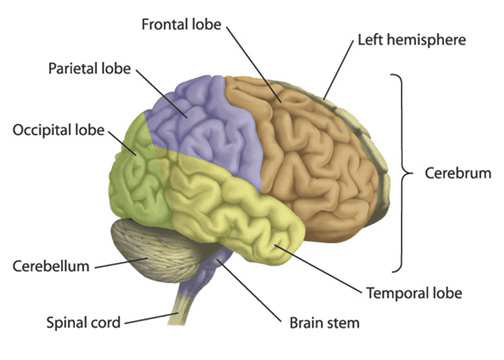

### Brain Functions

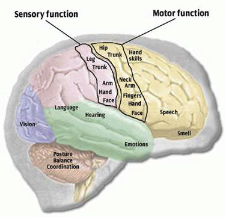

### Neurons

The body is made up of billions of cells. Cells of the nervous system, called neurons, are specialized to carry “messages” through an electrochemical process. The human brain has about 100 billion neurons, and a similar number of support cells called “glia”. Neurons share many functions in common with other cells in the body. For example, they are surrounded by a cell membrane, they have a nucleus containing genes (DNA), and they  carry out basic cellular processes like protein synthesis and energy production.

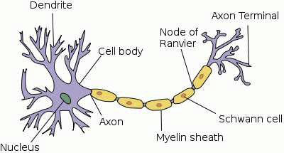

[[image source](https://simple.wikipedia.org/wiki/File:Neuron.svg)]

Neurons also have certain features which distinguish them from other body cells. They have specialized extensions called dendrites and axons. Dendrites bring information to the cell body, while axons take information away from the cell body. The axon of one neuron can connect to the dendrite of another neuron through an electrochemical junction called a synapse.

### Variety of Neuron Types

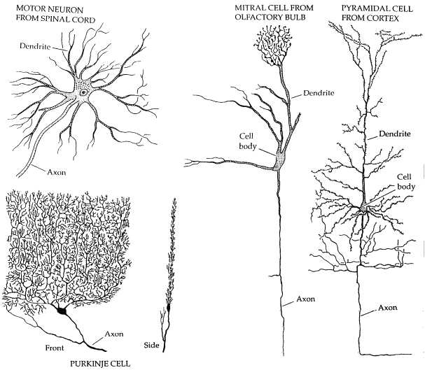

Most neurons have only one axon, but the number of dendrites can vary widely. Unipolar and Bipolar neurons have only one dendrite, but Purkinje neurons in the cerebellum can have up to 100,000 dendrites. Dendrites are typically less than a millimetre in length. Axons can vary in length from less than a millimetre to more than a metre (for motor neurons). Long axons are sometimes surrounded by a myelinated sheath, which prevents the electrical signal from dispersing, and allows it to travel faster (up to 100 m/s).

### Synapses, Neurotransmitter and Ion Channels

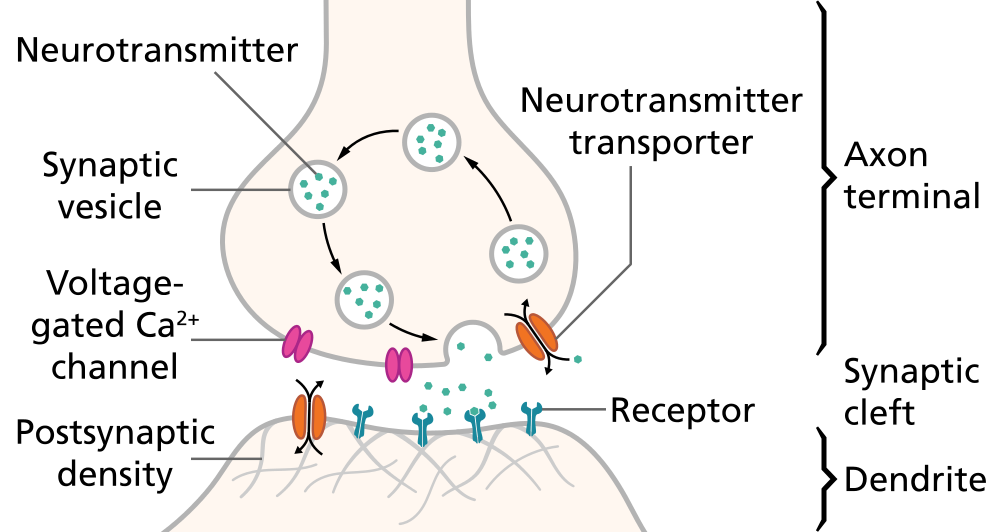

[https://commons.wikimedia.org/wiki/File:SynapseSchematic_en.svg]

An electrical pulse reaches the endbulb and causes the release of neurotransmitter molecules from little packets (vesicles) through the synaptic membrane. The transmitter passes through voltage-gated ion channels and diffuses through the synaptic cleft to the other side.

When the neurotransmitter reaches the post-synaptic membrane, it binds to receptors and causes a change in polarisation of the membrane. The change in potential can be excitatiory (moving the potential towards the threshold) or inhibitory (moving it away from the threshold).

In the next section, we will look at a simple mathematical model of the neuron which excludes most of the complex biological, chemical and physiological details and aims instead to capture the essential features of a neuron necessary for distributed computation.

### Further Reading

For more on the history of Deep Learning, consider these two perspectives: 

- **Viewpoint 1:** Focusing on recent work (after 2012) 
  - <https://www.cs.toronto.edu/~hinton/absps/NatureDeepReview.pdf>
- **Viewpoint 2:** Focusing on earlier work (before 2012) 
  - <http://people.idsia.ch/~juergen/deep-learning-overview.html>

Textbook [Deep Learning](https://www.deeplearningbook.org/) (Goodfellow, Bengio, Courville, 2016):

- [Historical trends in Deep Learning](https://www.deeplearningbook.org/contents/intro.html)

## Biological vs Artificial Neurons

### Biological Neurons

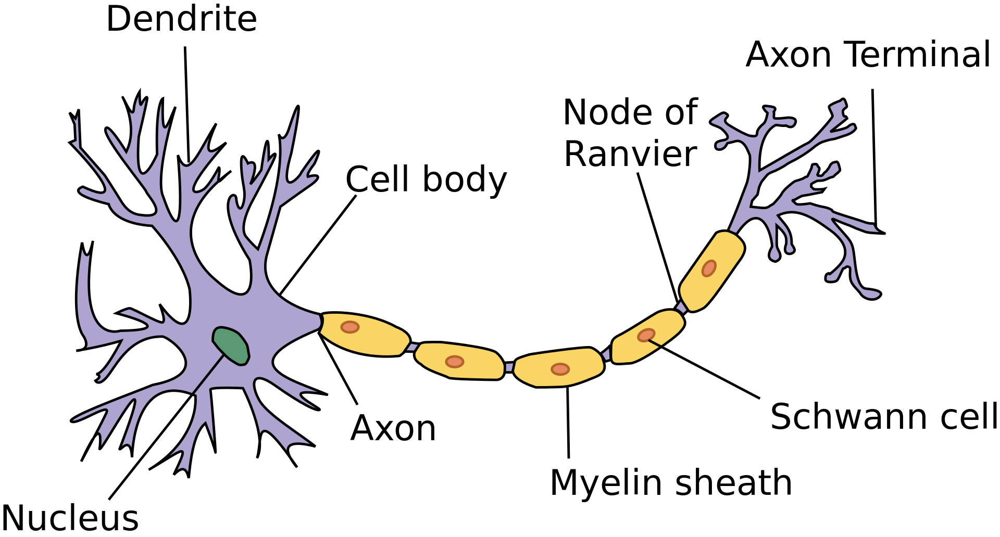

[[image source](https://simple.wikipedia.org/wiki/File:Neuron.svg)]

The brain is made up of neurons (nerve cells) which have:

- a cell body (soma)
- dendrites (inputs)
- an axon (output)
- synapses (connections between cells)

Synapses can be [excitatory or inhibitory,](https://www.youtube.com/watch?v=EVMbro2wblU&ab_channel=HarvardX) and may change over time. When the inputs reach some threshold, an action potential (electrical pulse) is sent along the axon to the output. 

### McCulloch and Pitts Neuron

In 1943, McCulloch and Pitts published a simplified mathematical model of a neuron. Each input $x_i$ is multiplied by a corresponding **weight** $w_i$ and the results are added together. An extra constant $w_0$ called the **bias** is also added.

$$s = w_0 + \sum_i w_i x_i$$

Finally, a non-linear **transfer function** is applied to this linear combination to produce the output of the neuron.

$$z = g(s) = g\left(w_0 + \sum_i w_i x_i\right)$$

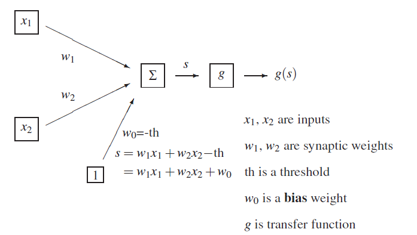

### Transfer function

The original transfer function used by McCulloch and Pitts was a discontinuous step function (also called the Heaviside function).

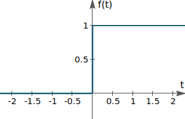

$$g(s) =
\begin{cases} 
      1, & \text{if } s \geq 0 \\
      0, & \text{if } s < 0 
\end{cases}$$

An artificial neuron with this transfer function is called a **Perceptron**.

In the early days, the negative of the bias ($−w_0$)($−w_0$) was thought of as a kind of **threshold**. If the combination $\sum_i w_i x_i$ exceeded this threshold, the neuron would "fire" (its output would be $1$); otherwise, the neuron would not fire (its output would be $0$). The subtracted threshold was changed to an additive bias for mathematical convenience. The higher the bias, the more likely the neuron is to fire.

Later on, alternative transfer functions were introduced which are continuous and (mostly) differentiable.

### Linear separability

The weights and bias of a Perceptron determine a hyperplane which divides the space of inputs into two regions. For inputs on one side of this hyperplane, the output will be 00; for inputs on the other side, the output will be 11.  Functions which can be computed in this way are called **Linearly Separable**.

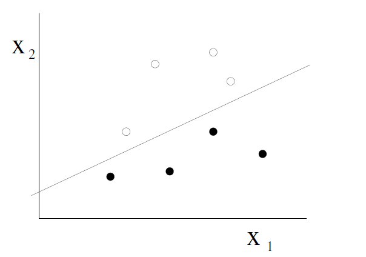

### Rosenblatt Perceptron

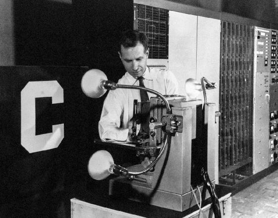

The Perceptron was introduced by Frank Rosenblatt in 1957. One of the tasks he was interested in was taking the pixels from black and white images of characters and using them to classify the images as $0, 1, \ldots, 9$ or $A, B, \ldots, Z.$For this task, we would need 26 different perceptrons: one to classify each character as "A" or "not A", another for "B" or "not B", etc. up to "Z" or "not Z". If the images are, for example, $20 \times 20$, each perceptron would have 400 inputs $x_1, \ldots, x_{400}$.

### Logical Functions

If we adopt the convention that $0 = \text{False}$ and $1 = \text{True}$, many simple logical functions like AND, OR, and NOT become linearly separable. We can use our knowledge of plane geometry to build Perceptrons to compute these functions. This diagram shows the AND and (inclusive) OR functions, which can be computed by Perceptrons, as well as the Exclusive OR (XOR), which cannot be computed by a Perceptron, because it is not linearly separable.

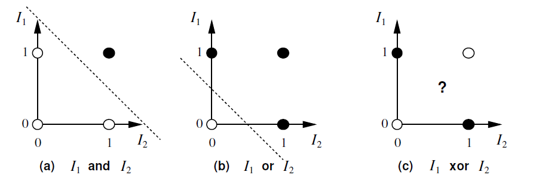

These are the weights for Perceptrons to compute the AND and OR function, and the opposite of OR, sometimes called NOR which stands for "Not OR".

$$\begin{align*}
\text{AND} \quad & w_1 = w_2 = 1.0, \quad w_0 = -1.5 \\
\text{OR} \quad & w_1 = w_2 = 1.0, \quad w_0 = -0.5 \\
\text{NOR} \quad & w_1 = w_2 = -1.0, \quad w_0 = 0.5
\end{align*}$$

## Perceptron Learning Algorithm

## Supervised Learning

We have seen how simple Perceptrons can be constructed by hand to compute logical functions in 2 dimensions. For larger tasks, such as the character recognition task with 400400 inputs extracted from a 20××20 image, the weights clearly cannot be computed by hand. Instead, we seek an automated procedure which, given a set of labeled **data**, will automatically determine the weights and biases of a Perceptron to classify those data.

This is an example of **Supervised Learning**, which will be the focus of this course in Weeks 1-7. Reinforcement Learning will be covered in Weeks 8-9, and Unsupervised Learning in Week 9-10.

For Supervised Learning, we have a training set and a test set, each consisting of a set of items; for each item, a number of input attributes and a target value are specified. The aim is to predict the target value, based on the input attributes. The system is presented with the input and target output for each item in the training set; it must then predict the output for each item in the test set.

## Rosenblatt Perceptron

The Perceptron Learning Algorithm was introduced by Frank Rosenblatt in 1957, and is one of the earliest examples of Supervised Learning.

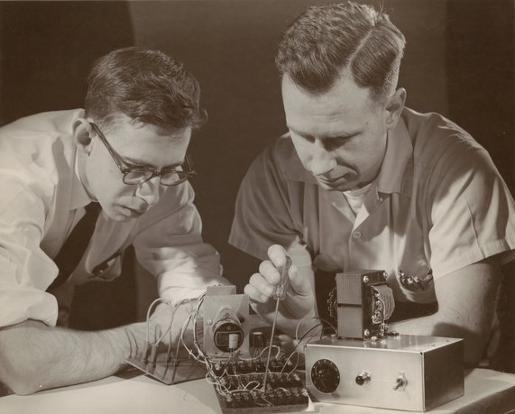

### Perceptron Learning Algorithm

The algorithm works as follows. The bias $w_0$ and weights $\{ w_i \}$ of the Perceptron are at first initialized to (small) random values. Then, the training items are presented one at a time, and appropriate changes are made to $w_0$ and $\{ w_i \}$.

Recall that the output of the Perceptron is $g(s)$ where $s = w_0 + \sum_i w_i x_i$.

Suppose an input $\{ x_i \}$ is presented for which the target output is 1 but the actual output of the Perceptron is 0. In this case, we want to adjust $w_0$ and $\{ w_i \}$ in a way that will make $s$ larger for this particular choice of $\{ x_i \}$. We do this by making these adjustments, where $\eta > 0$ is a constant called the \textit{learning rate}:

$$
\begin{align*}
w_0 &\leftarrow w_0 + \eta \\
w_i &\leftarrow w_i + \eta x_i \\
\text{Consequently,} \quad s &\leftarrow s + \eta \left( 1 + \sum_k x_k^2 \right)
\end{align*}
$$

If the target output is 0 but the actual output is 1, we do the opposite, namely:

$$
\begin{align*}
w_0 &\leftarrow w_0 - \eta \\
w_i &\leftarrow w_i - \eta x_i \\
\text{Consequently,} \quad s &\leftarrow s - \eta \left( 1 + \sum_k x_k^2 \right)
\end{align*}
$$

If the actual output is equal to the target output, no change is made to the weights. We may need to cycle through the data several times but, if we reach a point where all the data are correctly classified, the algorithm terminates.

Rosenblatt proved that this algorithm will always learn to classify the training data successfully, provided the data are linearly separable.

### Perceptron Learning Example: 

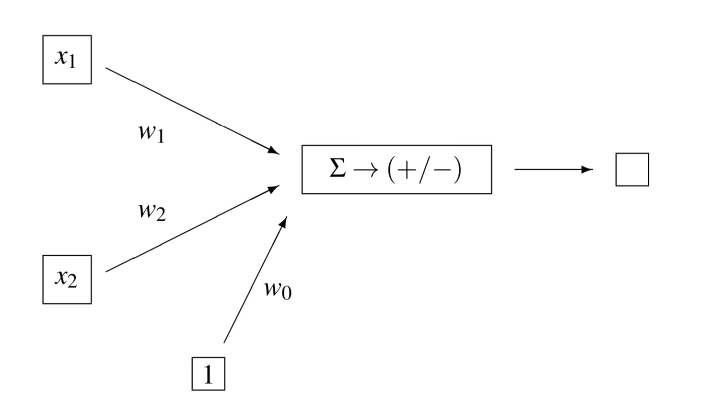

Let's assume a learning rate of $η=0.1$, with these initial weights:

$$
\begin{aligned}
w_0 &= -0.1 \\
w_1 &= 0.2 \\
w_2 &= 0.0
\end{aligned}
$$

Remember that the perceptron will classify as positive those items $(x_1, x_2)$ for which

$$s = w_0 + w_1 x_1 + w_2 x_2 > 0$$

### Training step 1

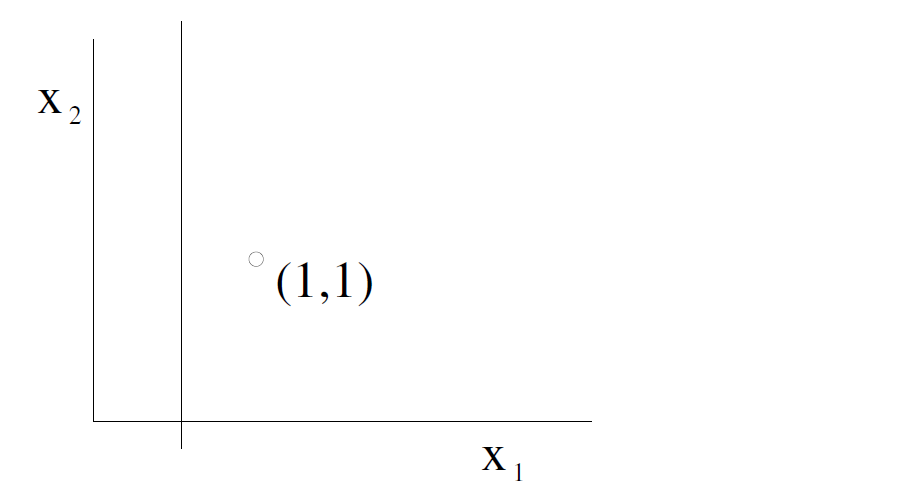

Suppose the first training item is $(1, 1)$ and that it is Negative. We have

$$
\begin{aligned}
s &= w_0 + w_1 x_1 + w_2 x_2 \\
&= -0.1 + 0.2 \times 1 + 0.0 \times 1 = 0.1 > 0 \\
\end{aligned}
$$

So, we need to subtract from the weights, as follows:

$$
\begin{aligned}
w_0 &\leftarrow w_0 - \eta = -0.2 \\
w_1 &\leftarrow w_1 - \eta x_1 = 0.1 \\
w_2 &\leftarrow w_2 - \eta x_2 = -0.1
\end{aligned}
$$

### Final outcome

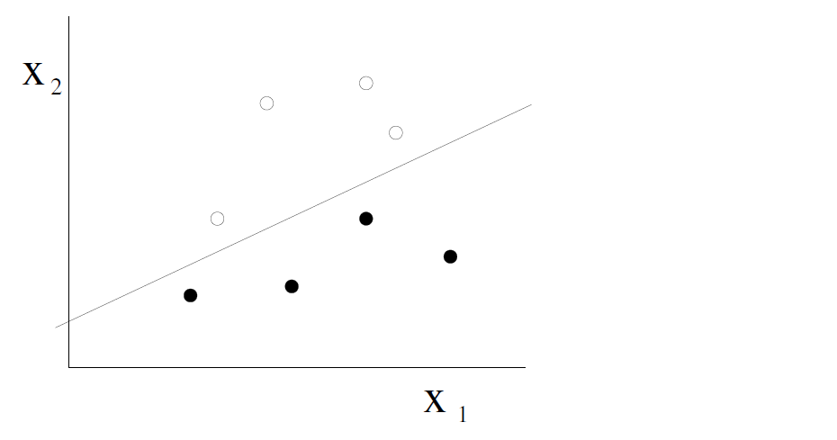

Continuing in this way, we will eventually reach a point where all the data are correctly classified (provided they are linearly separable).

### Further reading

https://news.cornell.edu/stories/2019/09/professors-perceptron-paved-way-ai-60-years-too-soon 

## Perceptron Videos

### Perceptrons by Hand:

<video src="https://6e6ouiploa.execute-api.ap-southeast-2.amazonaws.com/prod/resource/E2058302-CB65-4FE4-BCAA3EC3189F8BF8" controls="controls" class="video-embed"></video>

### Perceptron Learning Algorithm:

<video src="https://d2xnkjysn6lg7q.cloudfront.net/files/unswVideo/transcodes/1621499381418-perceptron_learning/8F81E9F1-B945-11EB-BFC2065331FB59B2/1621499381418-perceptron_learning-portalHigh-YouTube.mp4" controls="controls" class="video-embed"></video>

