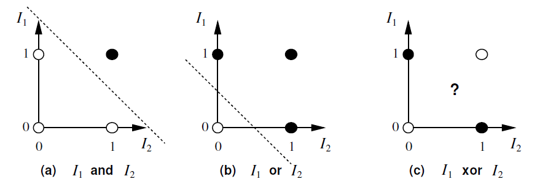
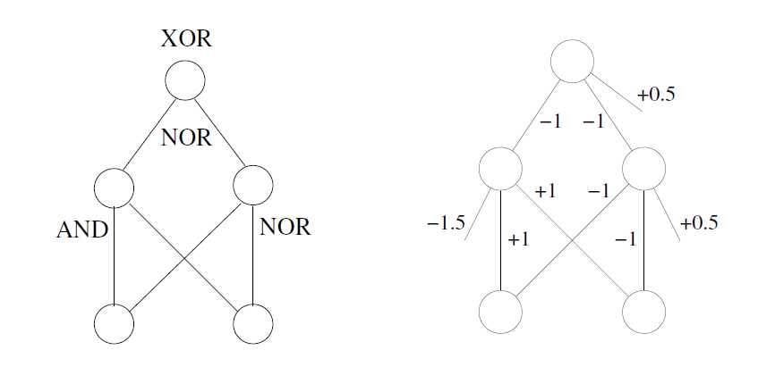
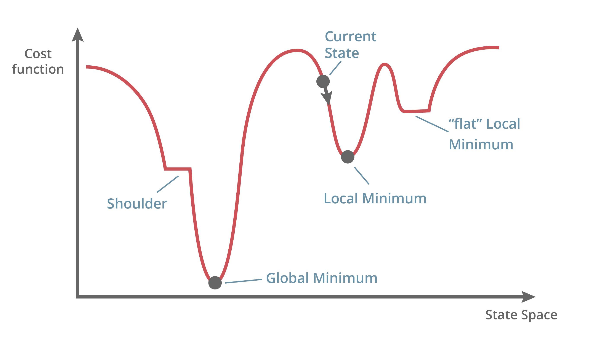
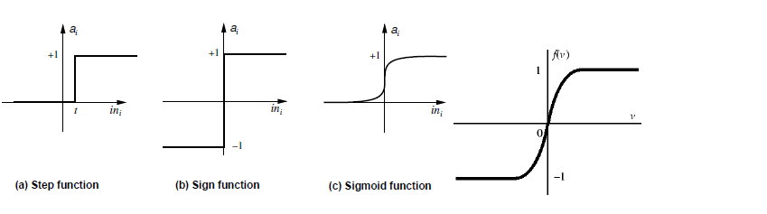
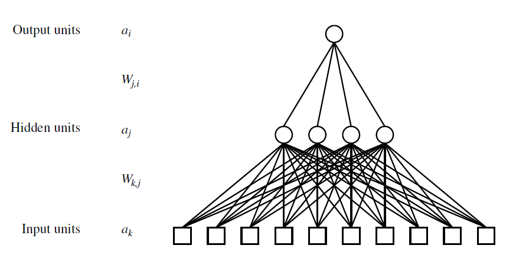
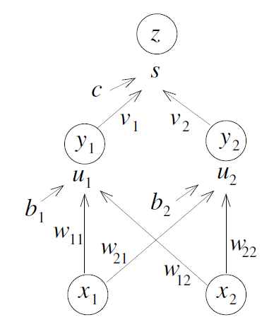
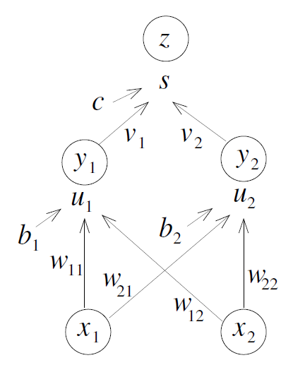

## Multi Layer Perceptrons

### Limitations of Perceptrons

The main problem with Perceptrons is that many useful functions are not linearly separable.

The simplest example of a logical function that is not linearly separable is the Exclusive OR or XOR function. Some languages have distinct words for inclusive and exclusive OR −− for example, Latin has "aut" and "vel". In other languages, like English, this distinction needs to be inferred from the context. Consider these two sentences:

1. "All of his movies are either too long or too silly." [They could be both too long and too silly]
2. "Either you give me the money, or I will punch you in the face." [We understand from the context that one of these things will happen, but not both]

### Multi Layer Perceptrons

One solution to this problem is to rewrite XOR in terms of linearly separable functions like AND, OR, NOR and then arrange several Perceptrons into a network which combines them in the same way. For example,
$x_1$​ XOR $x_2$​ can be written as: ($x_1$​ AND $x_2$​) NOR ($x_1$​ NOR $x_2$​). We can therefore arrange three perceptrons in the following way to compute XOR:

In the Week 2 Tutorial, you will be showing how this method can be used to construct a two-layer neural network to compute any given logical function, once the function has been turned into [Conjunctive Normal Form](https://en.wikipedia.org/wiki/Conjunctive_normal_form).

## Gradient Descent

We saw previously how a Multi Layer Perceptron can be built to implement any logical function. However, normally we need to deal with raw data rather than an explicit logical expression. What we really want is a method, analogous to the perceptron learning algorithm, which can learn the weights of a neural network, based on a set of training items.

As early as the 1960's, engineers understood how to use Gradient Descent to optimize over a family of functions that are continuous and differentiable. The basic idea is this:

We define an error function or **loss** function $E$ to be (half) the sum over all input items of the square of the difference between the actual output and target output:

$$\mathbb{E} = \frac{1}{2} \sum_i (z_i - t_i)^2$$

If we think of $E$ as height, this defines an error landscape on the weight space. The aim is to find a set of weights for which EE is very low.

If the functions involved are smooth, we can use multi-variable calculus to adjust the weights in such a way as to take us in the steepest downhill direction.

$$w \leftarrow w - \eta \frac{\partial E}{\partial w}$$

Parameter $η$ is called the **learning rate**.

### Gradient Descent for Neural Networks

Although Gradient Descent was already a well-established technique in the 1960s, somehow no-one thought to apply it to Neural Networks until many years later. One reason for this was politics. Marvin Minsky and Seymour Papert criticised neural networks in their 1969 book "Perceptrons" and lobbied the US Government to redirect research funding away from neural networks and into symbolic methods such as expert systems. 

The other reason was a technical obstacle. If we use the step function as our transfer function, the landscape will not be smooth but will instead consist almost entirely of flat local regions and "shoulders", with occasional discontinuous jumps. 

For the perceptron this didn't matter, because it only had one layer, but for networks with two or more layers, it becomes a big problem.

In order for gradient descent to be applied successfully, neural networks would need to be redesigned so that the function from input to output becomes smooth and differentiable. This was achieved by Paul Werbos in 1975 and, more famously, in (Rumelhart, 1986).

### Continuous Activation Functions

The key idea is to replace the (discontinuous) step function with a differentiable function, such as the sigmoid:

$$g(s) = \frac{1}{1 + e^{-s}}$$

or hyperbolic tangent:

$$g(s) = \tanh(s) = \frac{e^s - e^{-s}}{e^s + e^{-s}} = 2\left( \frac{1}{1 + e^{-2s}} \right) - 1$$

### Backpropagation

We now describe how the partial derivatives of the loss function with respect to each weight can be computed. We consider the case of a $2$-layer neural network with sigmoid activation at the hidden layers, as shown in this diagram.

For simplicity, we present the case with $2$ inputs, $2$ hidden units and 11 output.

$$
\begin{align*}
u_1 &= b_1 + w_{11} x_1 + w_{12} x_2 \\
y_1 &= g(u_1) \\
s &= c + v_1 y_1 + v_2 y_2 \\
z &= g(s)
\end{align*}
$$

We sometimes use $w$ as a shorthand for any of the trainable weights $c, v_1, v_2, b_1, b_2, w_{11}, w_{21}, w_{12}, w_{22}.$

### Chain Rule (6.5.2)

If $\ y = y(u, v) \ \text{where} \ u = u(x) \ \text{and} \ v = v(x) \ \text{then}$

$$\frac{\partial y}{\partial x} = \frac{\partial y}{\partial u} \frac{\partial u}{\partial x} + \frac{\partial y}{\partial v} \frac{\partial v}{\partial x}$$

This principle can be used to compute the partial derivatives in an efficient and localized manner. Note that the transfer function must be differentiable (usually $sigmoid$ , or $tanh$).

$$\text{Note: if } z(s) = \frac{1}{1 + e^{-s}}, \quad z'(s) = z(1 - z)$$
$$\text{if } z(s) = \tanh(s), \quad z'(s) = 1 - z^2$$

### Forward Pass

$$\begin{align*}
u_1 &= b_1 + w_{11} x_1 + w_{12} x_2 \\
y_1 &= g(u_1) \\
s &= c + v_1 y_1 + v_2 y_2 \\
z &= g(s) \\
E &= \frac{1}{2} \sum (z - t)^2
\end{align*}$$

## Backward Pass

Partial Derivatives

$$\begin{align*}
\frac{\partial E}{\partial z} &= z - t \\
\frac{\partial z}{\partial s} &= g'(s) = z(1 - z) \\
\frac{\partial s}{\partial y_1} &= v_1 \\
\frac{dy_1}{du_1} &= y_1(1 - y_1)
\end{align*}$$

Useful notation

$$\delta_{\text{out}} = \frac{\partial E}{\partial s}, \quad 
\delta_1 = \frac{\partial E}{\partial u_1}, \quad 
\delta_2 = \frac{\partial E}{\partial u_2}$$

Then

$$\begin{align*}
\delta_{\text{out}} &= (z - t) z(1 - z) \\
\frac{\partial E}{\partial v_1} &= \delta_{\text{out}} y_1 \\
\delta_1 &= \delta_{\text{out}} v_1 y_1 (1 - y_1) \\
\frac{\partial E}{\partial w_{11}} &= \delta_1 x_1
\end{align*}$$

Partial derivatives can be calculated efficiently by packpropagating deltas through the network.

### References

Rumelhart, D.E., Hinton, G.E., & Williams, R.J., 1986. [Learning representations by back-propagating errors](https://www.nature.com/articles/323533a0.pdf). N*ature*, *323*(6088), 533-536.

### Further Reading

Textbook [Deep Learning](https://www.deeplearningbook.org/) (Goodfellow, Bengio, Courville, 2016):

- [Continuous Activation Functions (3.10)](https://www.deeplearningbook.org/contents/prob.html)
- [Gradient Descent (4.3)](https://www.deeplearningbook.org/contents/numerical.html)
- [Backpropagation (6.5.2)](https://www.deeplearningbook.org/contents/mlp.html)

