Tooling for analysing and debugging embedded systems largely comes in two main categories. The first of these is in the hardware domain: tools like oscilloscopes, logic analysers, datasheets, and horrifying math equations. These can all work together to help you benchmark your systems and solve issues with your designs. These tools are frequently used.

The second category of tools focuses on *software* debugging, with breakpoints, watch lists, trace analysers, and so forth. These all work together to help you diagnose and understand what your embedded software is doing. Yet, it has been my experience that these formal tools are much less frequently used - even though there is a trend throughout industry to integrate more and more software into our designs. Instead, designers rely on simpler ‘tried-and-true’ approaches such as blinking LEDs or outputting debug messages to UART peripherals. Now, it’s not to say that these techniques don’t work - they do, given time! - but they can often get in your way and be a major barrier to understanding when trying to diagnose why something *is* or *is not* working.

It’s hard to say why the proper tooling for software debugging gets less attention than the proper tooling for hardware debugging. Perhaps it is because there is a lack of awareness of the tools and their capabilities. Perhaps they are not properly taught in our apprenticeships and academic institutions. Perhaps it is because historically these tools have been fiercely difficult to use with high barriers to entry.

At any rate, the state of the art these days for software debugging tools seems to be pretty good, with reasonably well made and accessible tooling available for us to use. STM32CubeIDE seems to be no exception, and in this section, I aim to introduce you to some of the things we can do with its integrated debugger.

*Note: You may need to enable debugging via your CubeMX config. I had it enabled already since it’s included in the default configuration for my development board. If you need to enable it, do this in the CubeMX view:*

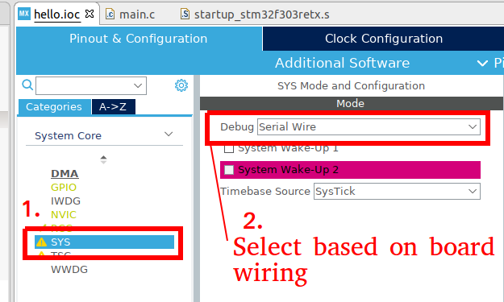

*Save your config using `File>Save` and regenerate the code.*

Let’s have a play by debugging our code! But first, let’s add something *to* debug, since there’s not much going on here. I choose to add a few snippets of code to calculate some prime numbers!

Thus, I’m going to add a few lines of code to a few of those USER code blocks in `main.c`, as detailed here:

```c
// . . .

/* USER CODE BEGIN Includes */
#include <stdbool.h>
/* USER CODE END Includes */

// . . .

/* USER CODE BEGIN PD */
#define PRIMES_LEN 62
/* USER CODE END PD */

// . . . 

/* USER CODE BEGIN PV */
uint16_t primes[PRIMES_LEN] = {0};
/* USER CODE END PV */

// . . . 

/* USER CODE BEGIN 0 */

//check if a number is prime
bool is_prime(uint16_t v) {
  for(uint16_t i=2; i<(v/2 + 1); i++) {
    if(v % i == 0) return false;
  }
  return true;
}
/* USER CODE END 0 */

// . . . (inside int main())

  /* USER CODE BEGIN 2 */

  //calculate a list of primes:
  uint16_t prime_index = 0;

  for(uint16_t i = 2; i < 300; i++) {
    if(is_prime(i)) {
      primes[prime_index] = i;
      prime_index++;
    }
  }

  /* USER CODE END 2 */
```

Okay! If we compile and execute this, we won’t observe any changes (except for maybe the *slightest* of delays before the LED starts blinking the first time). So how do we know if the list of primes is correct?

Well, how about we just ask the debugger? Let’s give it a go!

Let’s first look at the end result, and then look at observing the looping calculation using a breakpoint.

## Intro to Debug mode, resume, suspend, and watch variables

To simply observe the end result, we launch the program using the Debug mode, with the `Debug` button.

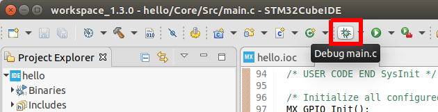

Firstly, you’ll see STM32CubeIDE change into its *debug* perspective. You may get a popup asking you about this.

You’ll notice that the dev kit in front of you has the communication LED blinking continously, but that the user LED isn’t blinking yet. This is because the program is not actually running yet. In order to run the program, we need to press the ‘Resume’ key, which will get us started: (the resume key, as well as the other debug control keys, will have appeared due to the *debug* perspective activating).

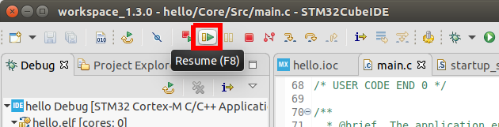

Once you notice the dev board’s LED light is blinking, pause the execution by pressing the suspend key:

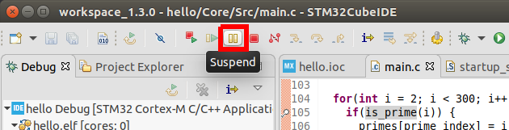

You’ll notice that the IDE immediately throws you somewhere in the C code for your project - almost certainly in somewhere to do with the HAL_Delay function. That’s where your program was when you hit suspend!

We can get back home by going to the left Debug panel and selecting `main()`.

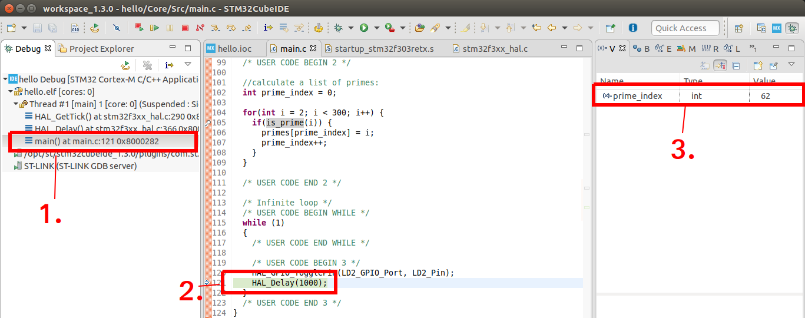

Note that the IDE highlights the function that is currently being executed (2) as well as presents a list of variables in the current scope (3).

We can also examine the contents of our global variable by double clicking it:

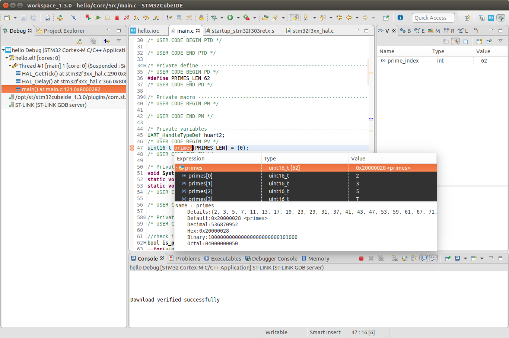

Or in a more convenient manner (since this is a big array) by right clicking on the variable `primes` and selecting `Add Watch Expression` (and then pressing OK)

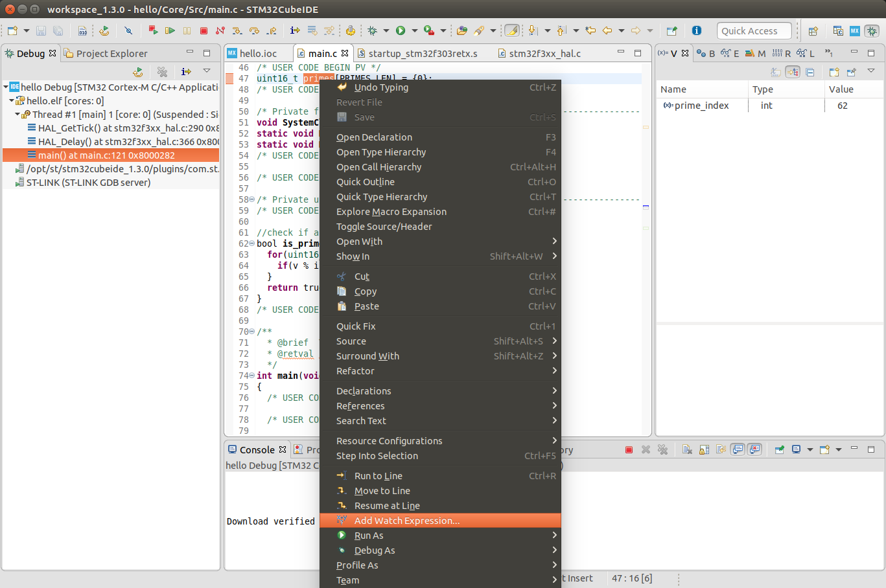

That then adds it to the `Expressions` menu on the right (I’ve expanded it for this screenshot):

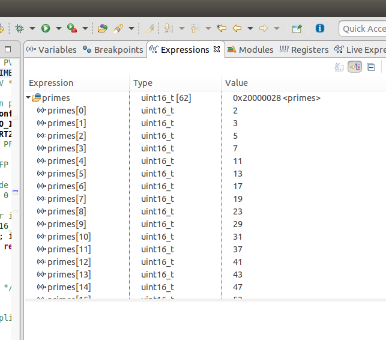

That’s really cool! Press the Red Stop button now in the top menu, and we’ll have a go at watching execution of the prime calculation loop.

## Breakpoints

In addition to running and suspending execution, we can also ask the program to suspend at a point of our choosing. This is known as *creating a breakpoint*.

In STM32CubeIDE you do this by double clicking on the red bar next to the line numbers, which will cause a small blue breakpoint indicator dot to appear.

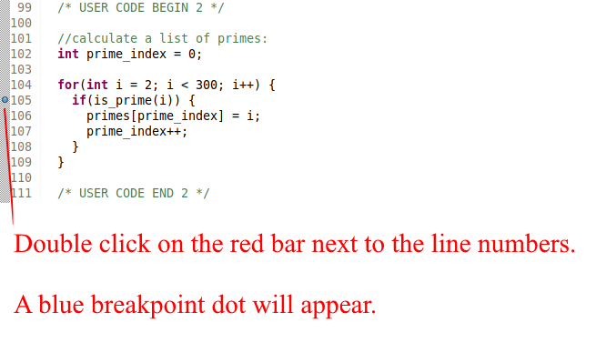

Now, without changing anything else, launch the debug mode again.

This time, when you hit resume, you’ll notice that the program executes *and then automatically halts* when it reaches your breakpoint.

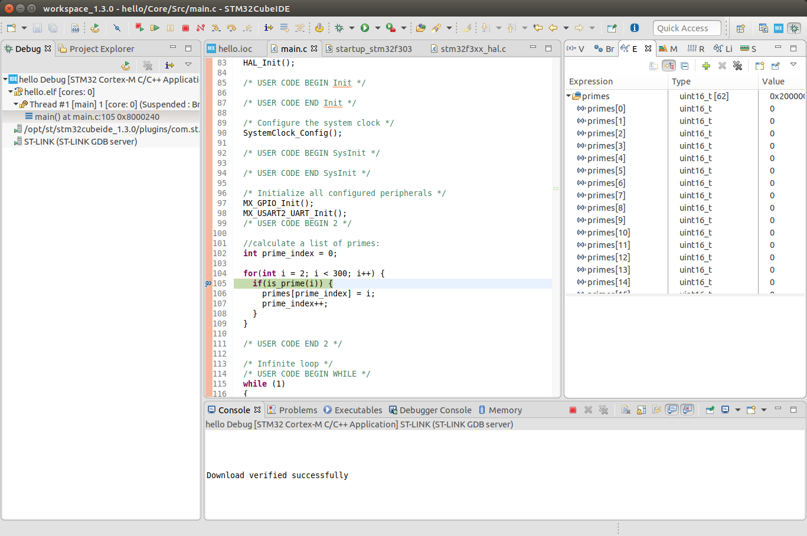

Now if I press suspend again, it will loop and stop at this same function. And, oh, what’s this?

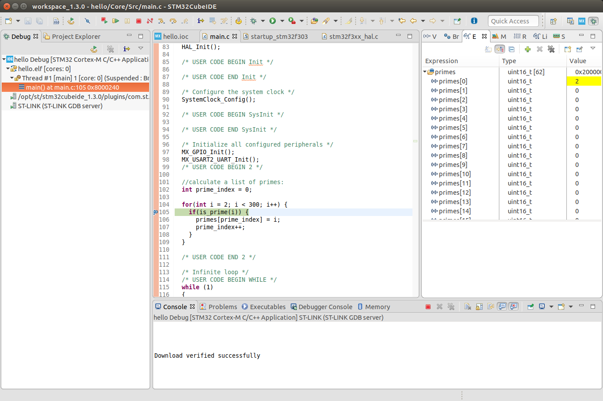

The first index of primes has changed, and it’s highlighted the changed variable!

Let’s hit resume again: 

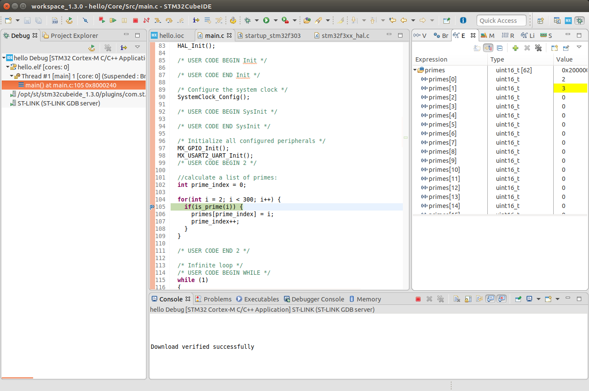

Now the second index of primes has changed, and the changed variable is highlighted once more!

You can keep pressing the resume button and you’ll see it slowly calculate the array.

Let’s now quit the debugger and move on. You can delete the breakpoint again by double clicking the blue dot. Note that if you right click on the red column, you can also toggle and create breakpoints this way. This also brings up advanced breakpoint options, including breakpoint conditions and breakpoint types.

## The debugger SWO

If properly configured, you can output arbitrary strings directly to the debugger via the programmer, rather than sending them via any other peripherals. It’s a bit like a virtual UART that you can send data to.

This is a little involved to set up, *and it can be worth simply using a UART if you must send out strings of characters to help your debugging*, but I’ll step through the basics here using STM32CubeIDE.

First, we must configure the reception clock rate. We do this via the debug configuration menu.

Press this:

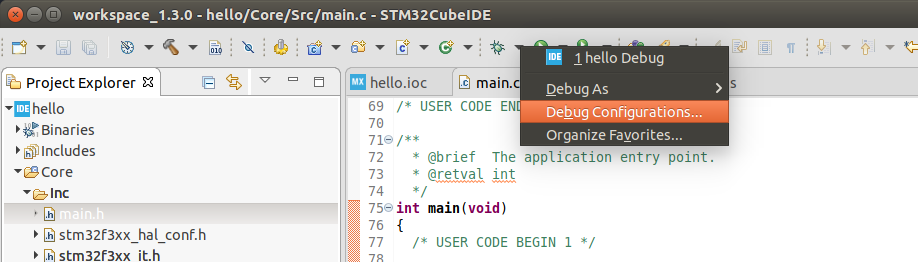

Go to the Debugger tab, Enable SWV (Serial Wire Viewer), then change your clock rate to the FCLK from earlier (remember when we chose the clock rate for all of our components?)

You may leave the SWO Clock drop down set to its maximum.

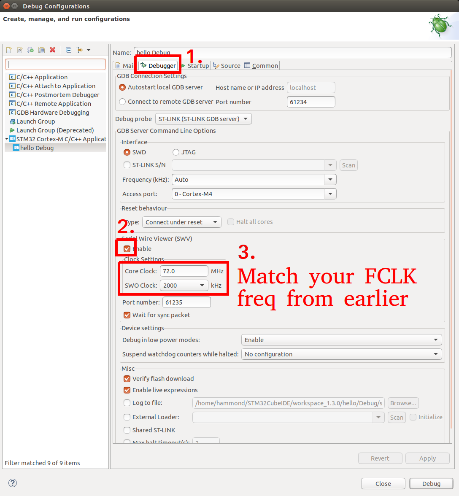

Now press Apply/Close.

Let’s add a test to send some characters. In the main loop, add the following:

```c
 /* Infinite loop */
  /* USER CODE BEGIN WHILE */
  while (1)
  {
    /* USER CODE END WHILE */

    /* USER CODE BEGIN 3 */
    HAL_GPIO_TogglePin(LD2_GPIO_Port, LD2_Pin);
    HAL_Delay(1000);
    ITM_SendChar('!');
  }
  /* USER CODE END 3 */
```

`ITM_SendChar` is a special function which sends a character to the debugger’s serial viewer. You shouldn’t need to `#include` anything new or special to use this.

You can now launch the debug session as before. But, before you press `Resume` to get it started, we need to enable a few more debugging options.

First, open the ITM data console through the `Window` menu:

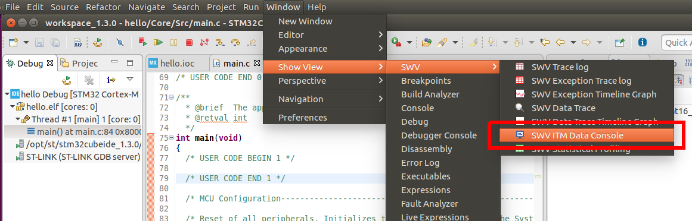

This will bring up the ITM data console window. Now, enter the configuration menu:

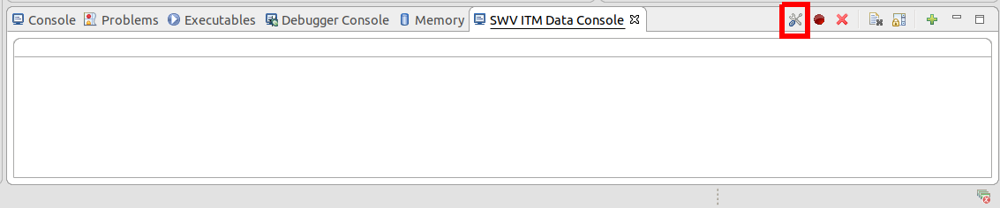

Enable ITM stimulus port 0:

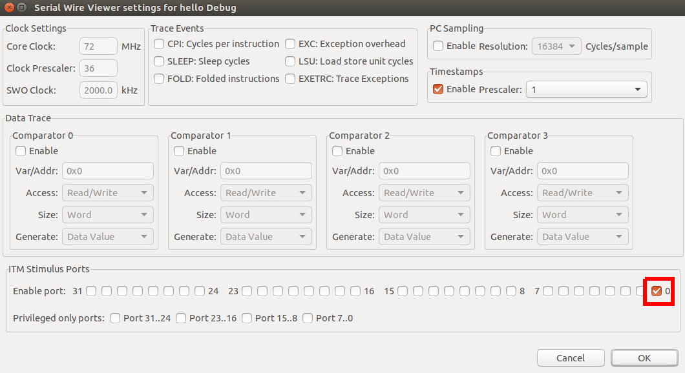

Press OK.

Port 0 will appear in the console view. Now press `Start` - this actually contacts your microcontroller and adjusts some registers internally to enable this mechanism:

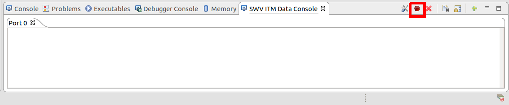

Now, and only now, can you press Resume. You’ll notice your Port 0 terminal slowly start filling with exclamation marks (since that’s the character we’re sending!)

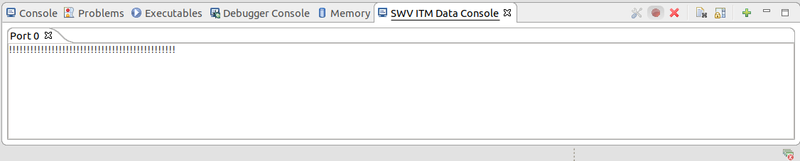

As you can imagine, this is pretty handy when your design might not have a free UART for debugging.

Without too much difficulty, we can also spin up a custom `printf` function for debugging. There’s a few options for this, but my preferred approach is to actually create my own `debug_printf` function, like so:

Adding more to `main.c`, as detailed:

```c
// . . .

/* USER CODE BEGIN Includes */
#include <stdbool.h>
#include <stdio.h>
#include <stdarg.h>
/* USER CODE END Includes */

// . . .

/* USER CODE BEGIN PD */
#define PRIMES_LEN 62
/* USER CODE END PD */

// . . . 

/* USER CODE BEGIN PV */
uint16_t primes[PRIMES_LEN] = {0};
/* USER CODE END PV */

// . . . 

/* USER CODE BEGIN 0 */

//check if a number is prime
bool is_prime(uint16_t v) {
  // . . .
}

//debug_printf sends a max of 256 characters to the ITM SWO trace debugger
//It uses a _variable length argument_, same as normal printf
//Indeed, just call this function as if it was printf, and you'll get the behaviour you expect
//I also like doing it this way since I can change the definition of the function as needed
void debug_printf(const char *fmt, ...) { 
  char buffer[256];
  va_list args;
  va_start(args, fmt);
  vsnprintf(buffer, sizeof(buffer), fmt, args);
  va_end(args);

  uint16_t i = 0;
  while(buffer[i] != '\0') {
    ITM_SendChar(buffer[i]);
    i++;
  }

}
/* USER CODE END 0 */

// . . . (inside int main())

  /* Infinite loop */
  /* USER CODE BEGIN WHILE */
  uint32_t count = 0;
  while (1)
  {
    /* USER CODE END WHILE */

    /* USER CODE BEGIN 3 */
    HAL_GPIO_TogglePin(LD2_GPIO_Port, LD2_Pin);
    HAL_Delay(1000);
    debug_printf("Hello debugger, this is iteration %d\r\n", count);
    count++;
  }
  /* USER CODE END 3 */
```

Now we save, build, and `debug` that. Remember to `Start` the ITM trace before pressing `Resume`!

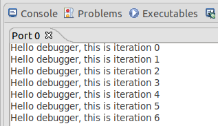

## The ST-Link Virtual COM Port

The very last thing I want to talk about today is a neat feature included in my Nucleo board. The inbuilt ST-Link v2.1 interface that we’ve been using for programming and debugging *also* includes a *virtual COM port*. As of the time of this tutorial, the COM port uses drivers which are included natively in most operating systems (including Windows and Ubuntu Linux).

Indeed, if I run `dmesg | grep tty` in my terminal, I can see it has been made available as `/dev/ttyACM0` thus:

```bash
$ dmesg | grep tty
[30318.354183] cdc_acm 3-10.4:1.2: ttyACM0: USB ACM device
```

This is really handy for your user applications, as this virtual COM port is wired directly onto one of the USART peripherals on the nucleo board! Recall from the CubeMX view that pins *PA2* and *PA3* were automatically configured as a USART for us.

A quick sanity check to make sure this makes sense by looking on the schematic:

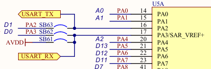

Sure looks like they’re connected to a USART (and indeed, tracing it through the rest of the schematic shows them connected to the ST-Link V2 programmer). So let’s quickly jump back into the CubeMX view and see how the port was set up:

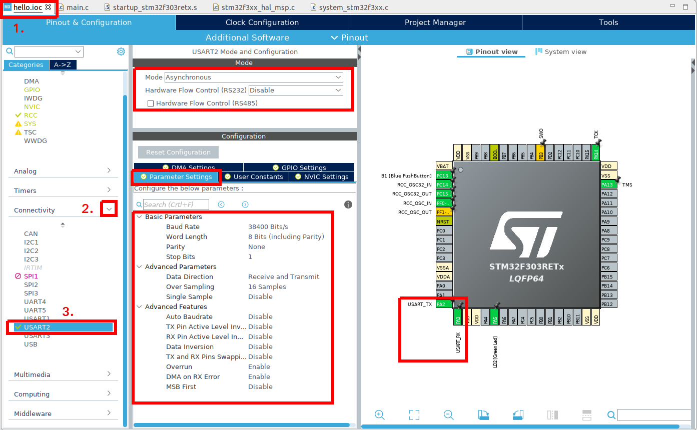

It’s configured as asynchronous, at 38400 baud, 8 data bits, no parity, 1 stop bit.

We could change these settings now if we wanted to. The virtual COM port works the same as any other USB to serial adapter, and so any baud rate and config can work with it. For now I’m happy with the defaults though.

Let’s have a go at sending some characters to it.

```c
/* Infinite loop */
  /* USER CODE BEGIN WHILE */
  uint32_t count = 0;
  while (1)
  {
    /* USER CODE END WHILE */

    /* USER CODE BEGIN 3 */
    HAL_GPIO_TogglePin(LD2_GPIO_Port, LD2_Pin);
    HAL_Delay(1000);
    debug_printf("Hello debugger, this is iteration %d\r\n", count);
    HAL_UART_Transmit(&huart2, (uint8_t*)"Hello world, this is a UART\r\n", 30, 1000); //30 is the number of characters, 1000 milliseconds timeout
    count++;
  }
  /* USER CODE END 3 */

```

We now build and download that, before running Minicom:

```bash
$ minicom -b 38400 -D /dev/ttyACM0
```

And here’s the output:

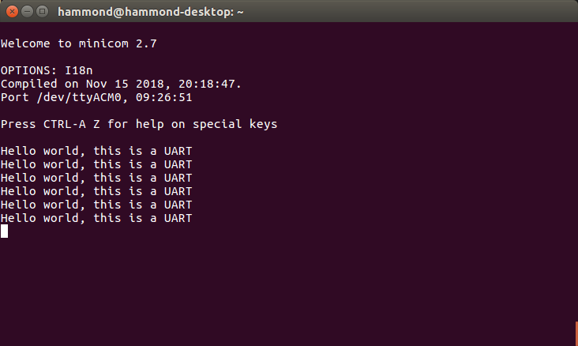

If we wanted, we could now make a `usart_printf` like our `debug_printf` from earlier, but I’ll leave that as an exercise for the reader.

---

> From: <https://01001000.xyz/2020-05-11-Tutorial-STM32CubeIDE-Getting-started/>