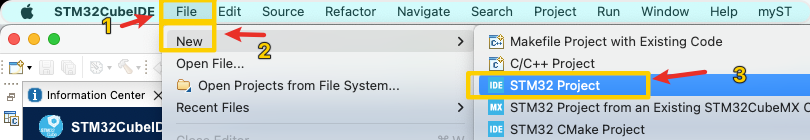
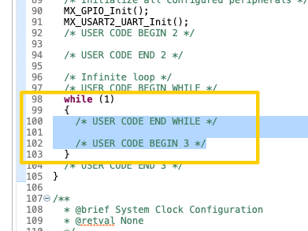
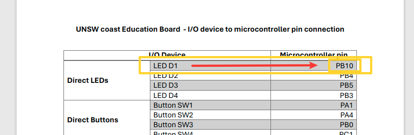

## Week 1 Monday

> [!NOTE]
> IDE: `STM32CubeIDE` - 1.15.1

### Getting Started with cubeIDE

::: warning
`STM32CubeIDE` must be registered and logged in before use, otherwise you cannot create a project
:::

::: tip
* Download link: [STM32CubeIDE](https://www.st.com/en/development-tools/stm32cubeide.html#get-software)

* UNSW WebCMS3: [Getting Started](https://webcms3.cse.unsw.edu.au/files/12a63b255ed3a3ea67875e4b90eeedc6484d05e47d52f8735f78d4313c9761aa)

:::

::: details How to create a project

> [!TIP]
> Follow the instructions in the order shown in the figure

* `File` → `New` → `STM32 Project`



* In the window that opens, select `Board Selector`, select `NUCLEO-F303RE`, and click `Next`


* Enter the project name in `Project Name` and click `Finish`


* Generate code in `Project` → `Generate Code`


Since then, the project initialization has been completed

:::

### Project Structure

 In the `Project Explorer` on the left, you can see the structure of the project.


* `Core/Inc`: header File

* `Core/Src`: Source File
 Here `main.c` and some stored generated drivers and libraries, we call it `HAL` library. (Hardware Abstraction Layer)

* `Core/Startup`: Startup file

#### `main.c` File



In the `main.c` file, we can see the `main` function, which is the entry point of the program.

Usually when writing code, make sure to write the code in the `while(1)` loop in the `main` function.

The reason is that if you change something in the project settings, the code in other places may be overwritten. Or you can create a new file and call it here.

#### 实现一个简单的LED闪烁

::: details How to find LED pinouts




:::

::: tip
MacOS: `⌥` + `/` to open code completion
:::


Add the following to `while(1)`:

```c
  /* Infinite loop */
  /* USER CODE BEGIN WHILE */
  while (1)
  {
    /* USER CODE END WHILE */

    /* USER CODE BEGIN 3 */

	  HAL_GPIO_WritePin(GPIOB, GPIO_PIN_5, 1);		// LED ON
	  HAL_Delay(500);								// Sleep 5000ms
	  HAL_GPIO_WritePin(GPIOB, GPIO_PIN_5, 0);		// LED OFF
	  HAL_Delay(500);								// Sleep 5000ms
  }
  /* USER CODE END 3 */
```

Or use the `HAL_GPIO_TogglePin` function.

```c
  /* Infinite loop */
  /* USER CODE BEGIN WHILE */
  while (1)
  {
    /* USER CODE END WHILE */

    /* USER CODE BEGIN 3 */
      HAL_GPIO_TogglePin(GPIOB, GPIO_PIN_5);
      HAL_Delay(500);
  }
  /* USER CODE END 3 */
```

#### Turn on the LED of the external board

###### 1. Define the LED pin in `Private defines` in `main.h`

```c
/* USER CODE BEGIN Private defines */
#define D1_GPIO_Port GPIOB
#define D1_Pin GPIO_PIN_10
/* USER CODE END Private defines */
```

###### 2. Replace the code in `while(1)` of `main.c`

```c
  /* Infinite loop */
  /* USER CODE BEGIN WHILE */
  while (1)
  {
    /* USER CODE END WHILE */

    /* USER CODE BEGIN 3 */

//	  HAL_GPIO_WritePin(GPIOA, GPIO_PIN_5, 1);		// LED ON
//	  HAL_Delay(500);								// Sleep 5000ms
//	  HAL_GPIO_WritePin(GPIOA, GPIO_PIN_5, 0);		// LED OFF
//	  HAL_Delay(500);								// Sleep 5000ms

	  // OR
	  HAL_GPIO_TogglePin(D1_GPIO_Port, D1_Pin);		// Switch Status // [!code focus]
	  HAL_Delay(500); // [!code focus]
  }
  /* USER CODE END 3 */
```

Then initialize the port

---