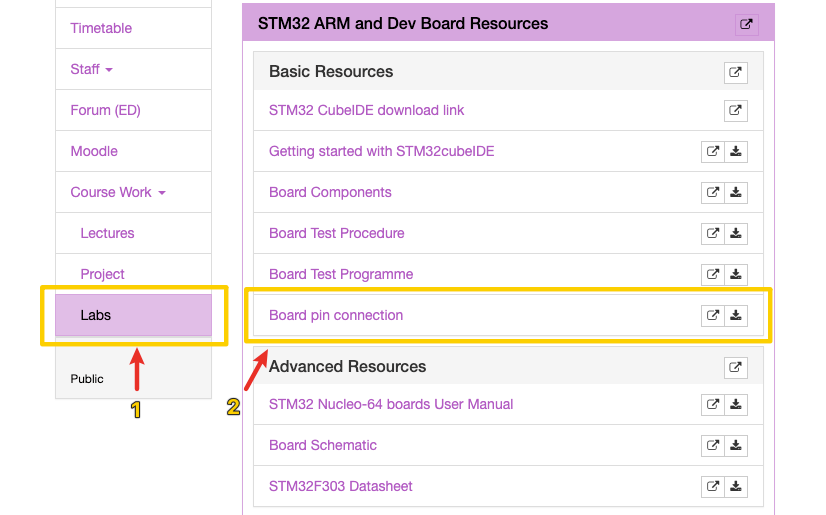

# Lecture Notes

## Week 1 Monday

::: info
 IDE: `STM32CubeIDE` - 1.15.1
:::

### Getting Started with cubeIDE

::: warning
`STM32CubeIDE` 使用前必须先注册并登录，否则无法创建项目
:::

::: tip
* 下载地址：[STM32CubeIDE](https://www.st.com/en/development-tools/stm32cubeide.html#get-software)

* UNSW WebCMS3: [Getting Started](https://webcms3.cse.unsw.edu.au/files/12a63b255ed3a3ea67875e4b90eeedc6484d05e47d52f8735f78d4313c9761aa)

:::

::: details 如何创建项目

> [!TIP] 提示
> 按照图示顺序操作

* `File` → `New` → `STM32 Project`

* 在打开的窗口中选择`Board Selector`，选择`NUCLEO-F303RE`，点击`Next`

* 在`Project Name`中输入项目名称，点击`Finish`

* 在`Project` → `Generate Code`生成代码

自此，项目初始化完成

:::

### Project Structure

 在左侧`Project Explorer`中可以看到项目的结构

* `Core/Inc`：头文件

* `Core/Src`：源文件
 这里`main.c`和一些储存生成的驱动程序和库，我们称之为`HAL`库。(硬件抽象层)

* `Core/Startup`：启动文件

#### `main.c`文件

在`main.c`文件中，我们可以看到`main`函数，这是程序的入口。

通常编写代码时，确保在`main`函数中的`while(1)`的循环中编写代码。

原因是，如果你在项目设置中更改了某些内容，其他位置的代码可能会被覆盖。或者你可以创建一个新文件，并在这里调用它。

#### 实现一个简单的LED闪烁

::: details 如何找到LED引脚

:::

::: tip 提示
MacOS: `⌥` + `/` 开启代码补全
:::

