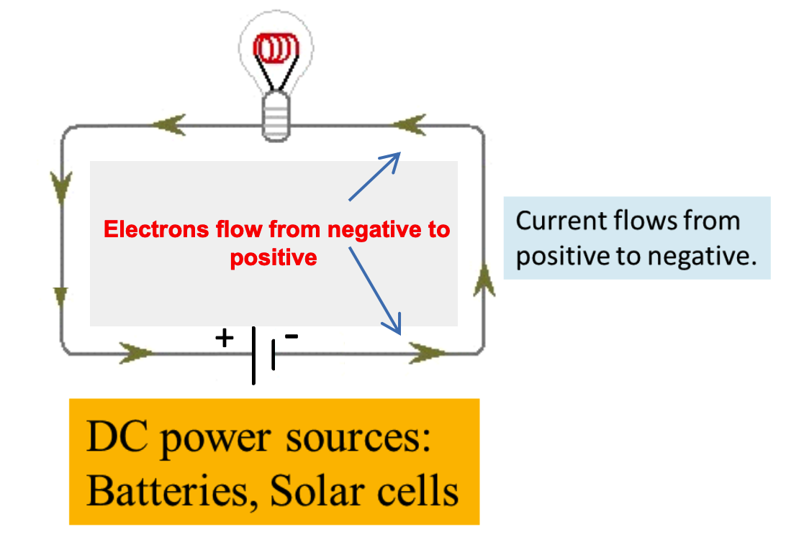
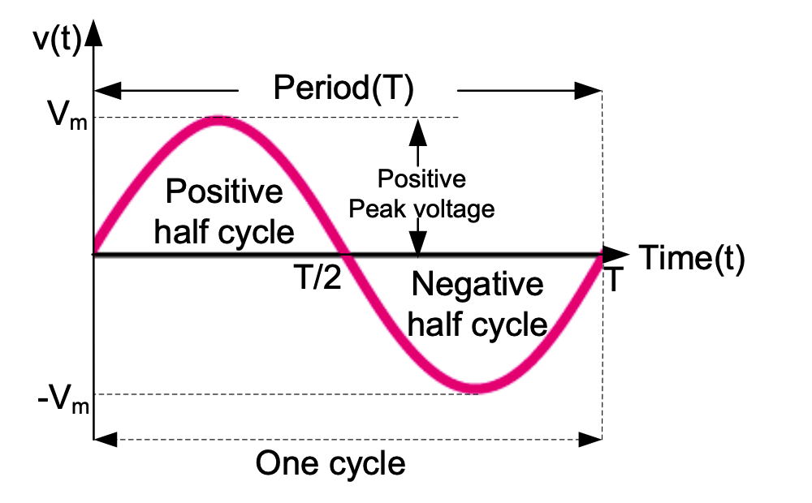
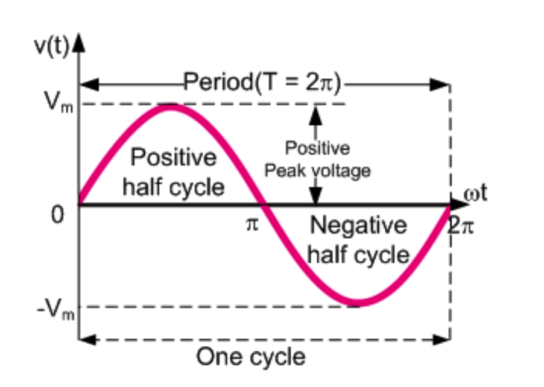

<!--编写时主题Katex丢内容bug-->

## AC fundamentals

- In Direct Current (DC), the electric charge flows only in one direction.

 

-  In Alternating Current (AC), the flow of electric charge periodically reverses direction.

## AC transmission

- AC is more efficient and economical to transmit over  long distances

- AC voltage may be increased or decreased with a  transformer

- The power losses ($P_L$) in a conductor are a product of  the square of the current and the resistance of the  conductor. 
    $$Power \;\; loss = I^2R$$
    
- When transmitting a fixed power through a power  line, if the current is doubled, the power loss will be  four times greater. 

- The power transmitted ($P_T$) is equal to the product of  the current and the voltage
    $$P_T = V I$$
    
- The same amount of power can be transmitted with a lower current by increasing the voltage.
  
- Use of a higher voltage leads to significantly more efficient transmission of power.

_Note: DC cannot be stepped-up  or stepped- down by a  transformer_

_Note: High voltage DC  transmission (HVDC) is becoming available but tend to be more expensive, less efficient over short distances._

- **Transformers** can step-up or step-down AC voltage.

## Characteristics of Alternating Current and voltage (AC)

- An alternating current or voltage wave can take several different forms but we will initially only consider the **sine wave (sinusoidal waveform)**

$$v(t) = V_m \sin(2\pi f t)$$

- $v(t)$: Instantaneous  voltage
- $V_m$: Peak voltage
- $f$: Frequency (Hz)
- $t$: Time (s)

$$v(t) = V_m \sin \left(\frac{2\pi}{T}t \right)$$

Therefore $v(t)$ can be re-wirtten as:
$$v(t) = V_m \sin \left(\omega t \right)$$

  

- Frequency $f = \frac{1}{T} Hz \; (Hertz)$, $T$: Period (s)
- Angular Velocity $\omega = 2\pi f = \frac{2\pi}{T} \; radians/sec$

> The sine wave (or sinusoid) has a pattern that repeats. Hence it is a periodic wave.

## Phase Angle

- Sinusoidal waveform may have a phase delay $\phi$ (degrees or radians).
- General formula: $v(t) = V_m \sin(\omega t \pm \phi)$

::: details Example: Phase Angle Calculation
Given:
- $i_1 = -4 \sin(100\pi t + 25^\circ)$
- $i_2 = 5 \cos(100\pi t - 40^\circ)$

Solution:
- $i_1$ lags $i_2$ by 205°.

(155° + 50° which is the same as 360° -155°)

:::

## Measurements of AC quantities:

From a sinusoidal waveform we can measure the following values:
1. Peak value
2. Peak-peak value
3. Average value
4. Root Mean Square (RMS) value

## Average Value

- **Average value** $V_{ave}$ or $I_{ave}$ of a sine wave is the average of all its instantaneous values over a full **cycle**.

$$V_{ave} = \frac{1}{T} \int_{0}^{T} v(t)\, dt = \frac{\text{Area under the curve over a full cycle}}{\text{Period (T)}}$$

$$\begin{align*}
V_{ave} &= \frac{1}{T} \int_0^T v(t) dt \\
        &= \frac{1}{T} \int_0^{\frac{2\pi}{\omega}} V_m \sin(\omega t) dt \\
        &= \frac{V_m}{T} \left[ \frac{-\cos(\omega t)}{\omega} \right]_0^{\frac{2\pi}{\omega}} \\
V_{ave} &= \frac{V_m}{T\omega} \left[ \cos(\omega t) \right]_0^{\frac{2\pi}{\omega}} = 0
\end{align*}$$

- The average value of a sine wave over a full cycle is **zero** due to the positive and negative halves canceling each other out.

## RMS: Root Mean Square Value

- RMS value measures the **heating effect** of a sine wave, equivalent to the **DC value** that produces the same power in a load.

- RMS value or Effective Value of a periodic waveform:

$$P_{\text{average}} = RI_{\text{rms}}^2 = RI_{\text{dc}}^2$$

$$I_{\text{rms}} = \sqrt{\frac{1}{T} \int_0^T i^2(t) \, dt}$$

$$V_{\text{rms}} = \sqrt{\frac{1}{T} \int_0^T v^2(t) \, dt}$$

