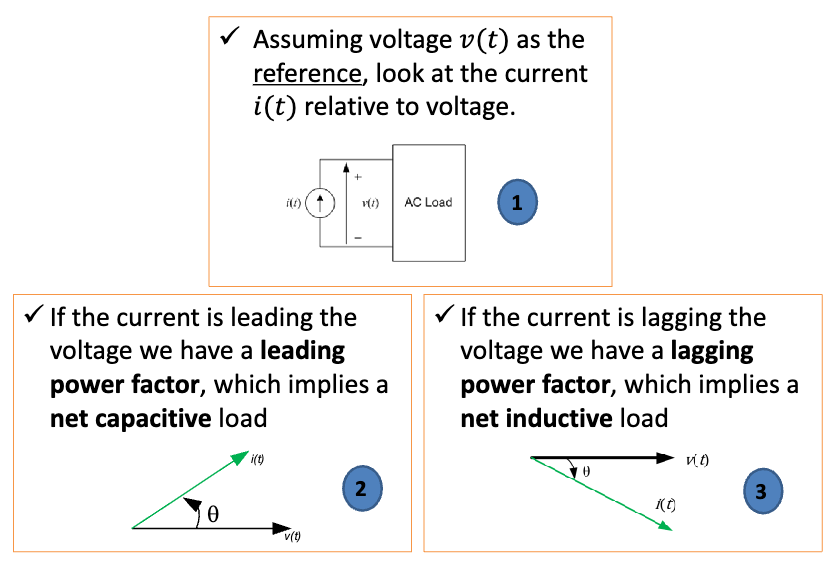
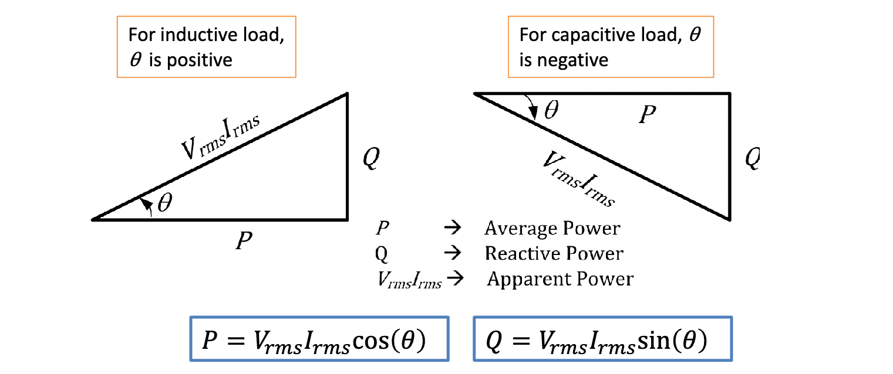
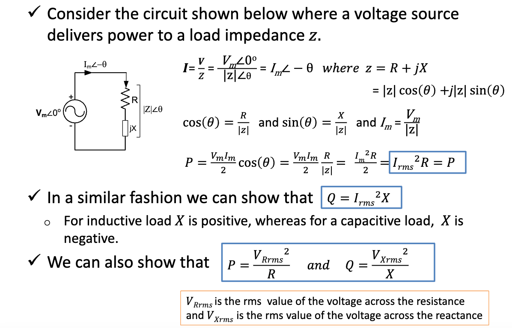

<!--编写时主题Katex丢内容bug-->

## AC Transmission

- **Power Loss**: $P_{\text{loss}} = I^2 R$
- **Power Transmitted**: $P_T = VI$
- AC is more efficient for long-distance transmission.
- Higher voltage reduces current, making power transmission more efficient.

## Load

### Resistive Load
- Voltage: $v(t) = V_m \cos(\omega t)$
- Current: $i(t) = I_m \sin(\omega t)$
- **Instantaneous Power**: $p(t) = v(t) \times i(t) = V_m I_m \boxed{ \cos^2(\omega t) } ← \text{always positive}$
- **Average Power**: 

    $P_{\text{avg}} = \frac{V_m I_m}{2} \cos(\theta) = \frac{V_m}{\sqrt{2}} \frac{I_m}{\sqrt{2}} \cos(\theta)$

    $P_{\text{avg}} = v_{rms} I_{rms} \cos(\theta)$

    > Unit: Watt ($W$)

### Inductive Load
- Voltage: $v(t) = V_m \cos(\omega t)$
- Current: $i(t) = I_m \cos(\omega t - 90^\circ ) = I_m \sin(\omega t)$
    > The current though an inductor lags the voltage by $90^\circ$.
- **Instantaneous Power**: $p(t) = \frac{V_m I_m}2 \boxed{ \sin(2\omega t) } ← \text{average power} = 0$
- ~~**Average Power**~~: Zero (energy alternates between source and load).

### Capacitive Load
- Voltage: $v(t) = V_m \cos(\omega t)$
- Current: $i(t) = I_m \cos(\omega t + 90^\circ ) = -I_m \sin(\omega t)$
    > The current though a capacitor leads the voltage by $90^\circ$.
- **Instantaneous Power**: $p(t) = - \frac{V_m I_m}2 \boxed{ \sin(2\omega t) } ← \text{always positive}$
- ~~**Average Power**~~: Zero (similar to inductive load but opposite in sign).

## Reactive Power (Q)

- $Q = \frac{V_m I_m}{2} \sin(\theta)$
- $Q = V_{\text{rms}} I_{\text{rms}} \sin(\theta)$
    > Unit: Volt-Ampere Reactive ( $\text{VAR}$ )
- Measured in Volt-Ampere Reactive ( $\text{VAR}$ ).
- It represents energy that oscillates between the source and reactive components.

## Apparent Power (S)
- $S = V_{\text{rms}} I_{\text{rms}}$
- Measured in Volt-Amperes ( $\text{VA}$ ).
- **Relationship**: $S^2 = P^2 + Q^2$

## Power Factor (pf)

- $pf = \cos(\theta)$
  - $\theta$ is the phase angle between voltage and current ($\theta = \theta_v - \theta_i$).
  - If current lags voltage (inductive load): **Lagging Power Factor**.
  - If current leads voltage (capacitive load): **Leading Power Factor**.

## Power Triangle

The relationship between **average power** $P$, **reactive power** $Q$, **apparent power** $V_{rms} I_{rms}$, and the **power angle** can be represented by the **power triangle**.

- For an **inductive load**:
  - $\theta$ \[ $\theta = \theta_v - \theta_i$ \] and the reactive power $Q$ are **positive**, and the power triangle is shown below.
  
- For a **capacitive load**:
  - $\theta$ \[ $\theta = \theta_v - \theta_i$ \] and the reactive power $Q$ are **negative**.

---

 

::: details AC Power - Additional Relationships

:::

## Complex Power (S)

- $S = \frac 1 2 V I^* = \frac{1}{2}(V_m \angle \theta_v)(I_m \angle -\theta_i) = \frac{1}{2}V_m I_m \angle (\theta_v - \theta_i) = \frac{V_m I_m}{2} \angle \theta$
  - $S = \frac{V_m I_m}{2} \cos(\theta) + j \frac{V_m I_m}{2} \sin(\theta) = P + jQ$
  - Real part: Active Power $P = \text{Re}(S) = \text{Re}(\frac 1 2 VI^*)$.
  - Imaginary part: Reactive Power $Q = \text{Im}(S) = \text{Im}(\frac 1 2 VI^*)$.
  - **Apparent Power**: $|S| = |\frac 1 2 VI^*|$.

## Maximum Average Power Transfer
- Maximum power is transferred when the load impedance is the complex conjugate of the source impedance.
- **Condition**: $Z_L = Z_{\text{eq}}^*$
- **Maximum Power**: $P_{L \, (max)} = \frac 1 8 \frac{|V_{\text{oc}}|^2}{R_{\text{eq}}} = \frac 1 8 \frac{|V_{\text{Th}}|^2}{R_{\text{eq}}}$  ($|V_{oc}|$ is the maximum amplitude of the source voltage).

> Note: For purely resistive loads, $R_L = |Z_L|$ and ower needs to be calculated directly from the circuit

## Power Factor Correction
- Capacitors are added in parallel to inductive loads to improve the power factor.
- **Goal**: Increase $\cos(\theta)$ towards unity (1).
- $\theta → 0, Q → 0$ ➡️ $\cos(\theta) → 1$ (unity or 100% power factor).
- Improves system efficiency and reduces energy costs.

