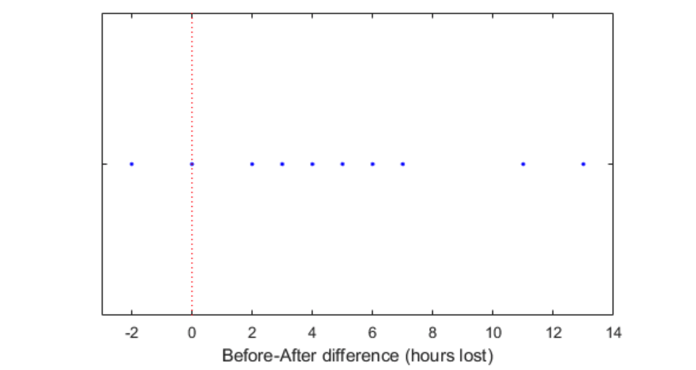
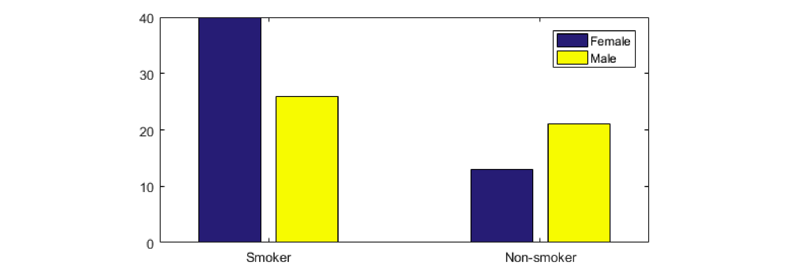
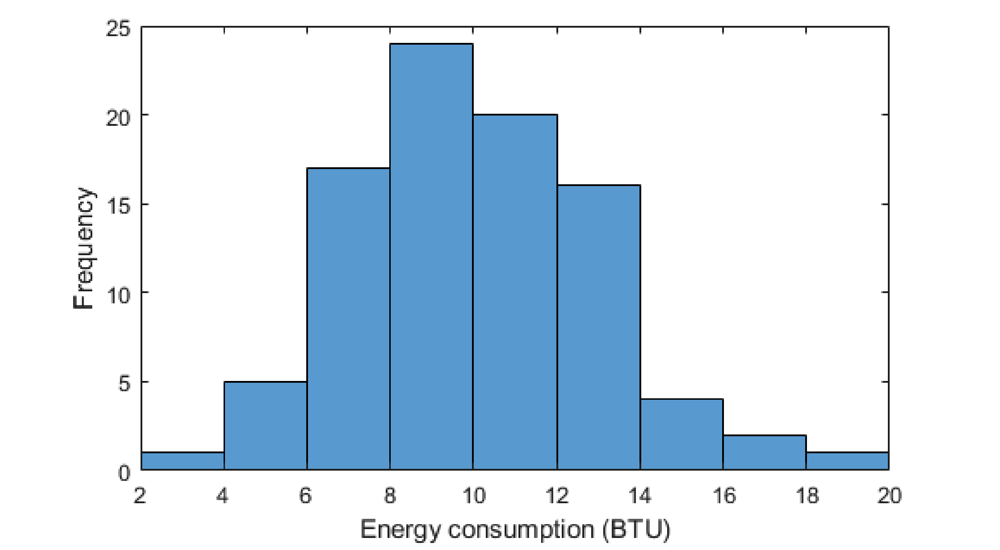
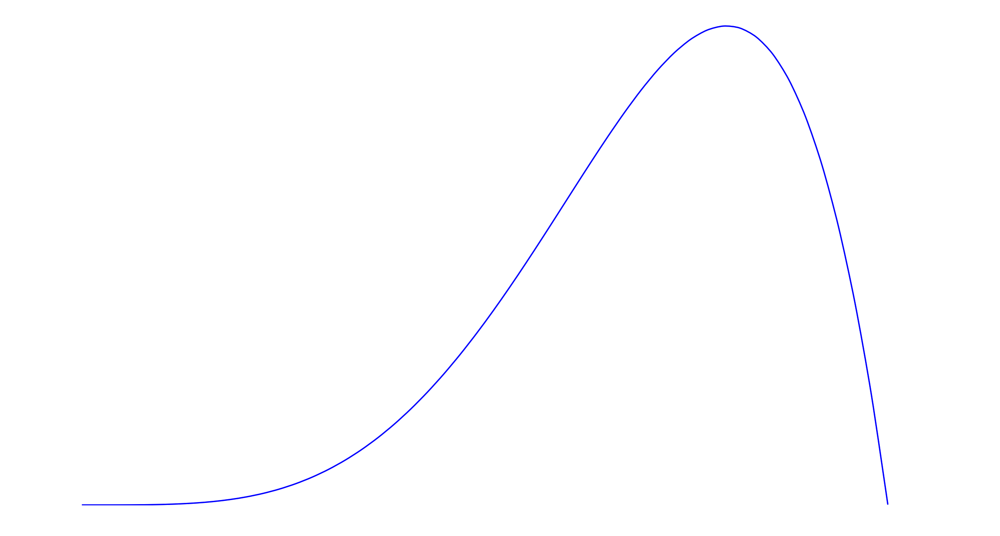
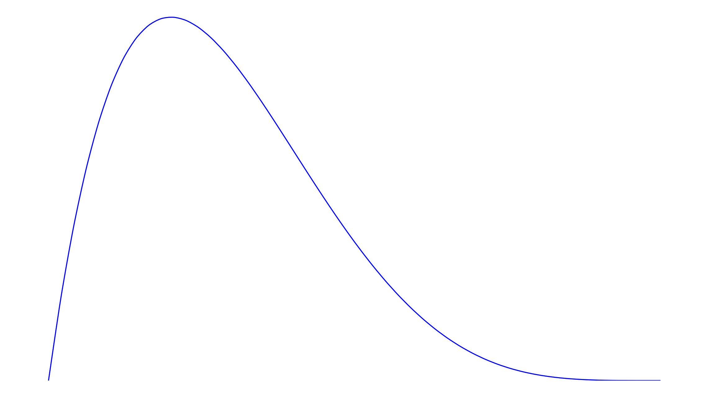
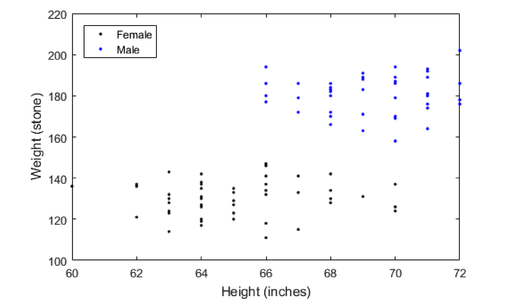
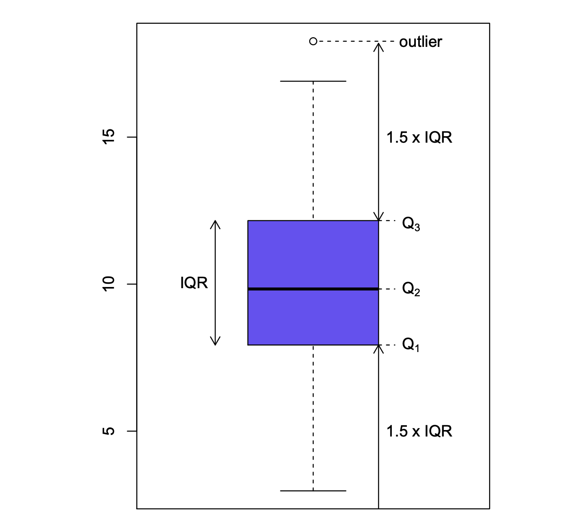
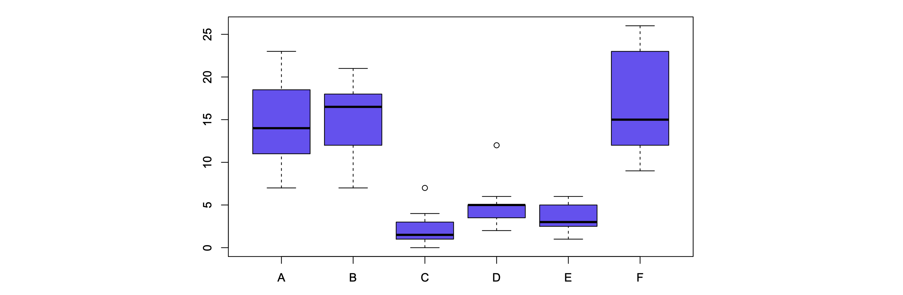
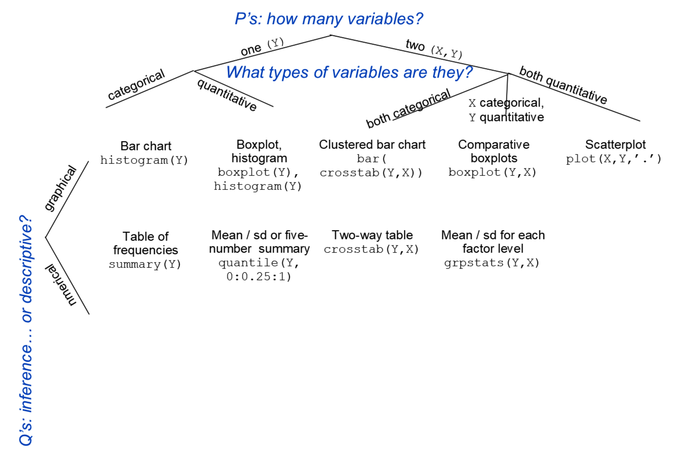

# Introduction and descriptive statistics

<HGlobalLink title="Lecture 1" md5="58d9212c7481def58bc0dab2c3ee983a"/>

### Objectives

Now you should be able to:
- Identify the role that statistics can play in the engineering problem-solving process
- Discuss the importance of random sampling
- Identify key considerations when deciding how to analyse data
- Construct and interpret appropriate graphs of a variable, or of the association between two variables
- Compute and interpret appropriate numerical summaries of a variable, or of the association between two variables

### Some quotes

“I am not much given to regret, so I puzzled over this one a while. Should have taken much more statistics in college, I think.”  
::: right
*Max Levchin, Paypal Co-founder, Slide Founder, 2010*
:::

“I keep saying that the sexy job in the next 10 years will be statisticians, and I’m not kidding.”  
::: right
*Hal Varian, Chief Economist at Google, 2009*
:::

## 1.1 What is statistics?

::: tip Definition:
**Statistics** is the science of the collection, processing, analysis, and interpretation of data.
:::

In short, statistics is **learning from data**.

- Statistical concepts and methods are key tools for learning about the world around us.
- Statistics allows us to turn observational evidence into **information for decision making**.
- Statistics makes use of mathematics, computer science, and subject matter expertise.

A challenge is that when we collect data, we get different answers for different subjects. Data comes with variability.

::: tip Statistics

Statistics allows us to **describe**, **understand**, and **control** the variability insofar as possible and to **take this uncertainty into account** when making judgements and decisions.

:::

## 1.2 The Statistical Process

**Example: Does cloud seeding work?**

Cloud seeding attempts to increase the precipitation that falls from clouds by dispersing substances (such as silver nitrate) into the air that serve as cloud condensation nuclei.

1. **Research question:** Does cloud seeding really work?
2. **Experiment:** For 52 clouds, choose 26 at random and seed with silver nitrate. Observe the amount of precipitation that falls from seeded clouds, as well as from unseeded clouds.

**The following rainfall (in acre-feet) are recorded:**

- Unseeded Clouds: 

`1202.6, 830.1, 372.4, 345.5, 321.2, 244.3, 163.0, 147.8, 95.0, 87.0, 81.2, 68.5, 47.3, 41.1, 36.6, 29.0, 28.6, 26.3, 26.1, 24.4, 21.7, 17.3, 11.5, 4.9, 4.9, 1.0`

- Seeded Clouds: 

`2745.6, 1697.8, 1656.0, 978.0, 703.4, 489.1, 430.0, 334.1, 302.8, 274.7, 274.7, 255.0, 242.5, 200.7, 198.6, 129.6, 119.0, 118.3, 115.3, 92.4, 40.6, 32.7, 31.4, 17.5, 7.7, 4.1`

⇒ These values are our data.

::: warning Note there is variability: 
Different clouds have different precipitation.
:::

3. **Summarise the data** using descriptive statistics (week 1) such
as graphs:

and numerical summaries:

- Average precipitation (seeded) = 441.98
- Average precipitation (unseeded) = 164.58

The seeded clouds had more precipitation than the unseeded clouds, on average.

But every time you sample 26 clouds, you will get a different set of precipitation measurements, with different averages.

Is our difference in means too big to be explained by chance alone?

4. When analysing and interpreting the data we need to consider if ***the observed features may be consequences of chance only***

This part of statistics is called **inferential statistics** or **statistical inference** (Weeks 4-10).

Before discussing statistical inference, we will discuss **probability theory** (Weeks 2-3) to learn how to apply notions of chance to data.

5. Draw a conclusion:
    - “Does cloud seeding using silver nitrate tend to result in more rainfall than not cloud seeding?”

---

### The statistical process

The points (1) to (5) in the above example form the ***typical procedure for statistical inference***:

1. Formulate the **research question**.
2. **Design the study** and collect data.
3. **Summarise the data** efficiently; check for any unusual data features.
4. Choose and apply appropriate statistical methods to extract useful information from the data.
5. **Draw conclusions** and communicate the results to others.

::: caution Fact:
Every step in this process requires understanding statistical principles and concepts as well as knowledge and skills in statistical methods.
:::

## 1.3 Populations and Samples

**Population:**

- Usually, we are interested in obtaining information about a total collection of elements, which is referred to as the population.
- The elements are often called individuals (or units).
- Given the research question, we have observed some characteristic for each individual. This characteristic, which could be quantitative or qualitative, is called a variable.

::: info Example
In the cloud seeding example, the population might be all clouds in the sky for the region and timeframe over which the experiment was conducted. An individual is a cloud and the variable of interest is the amount of rainfall.
:::

**Sample**

It is often physically impossible, infeasible, or just inefficient to obtain data on the whole population.

- The subset of the population which is effectively observed is called the sample.
- The data are the measurements that are actually collected over the sample in the course of the investigation.

::: info Example
- In the cloud seeding example, the sample is the 52 clouds whose rainfall amounts were recorded.
:::

::: caution Fact:
The distinction between the data actually acquired (the sample) and the vast collection of all potential observations (the population) is key to understanding statistics.
:::

## 1.4 Random Sampling

- The process of selecting the sample is called **sampling**.
- If the sample is to be informative about the total population, it must be **representative** of that population.
    - Suppose you are interested in the average age of UNSW students, would you select a sample made up of postgraduate students only?
- The quality of the data is paramount in a statistical study. **Your results are only as good as your data!**
- Sampling must be carefully done, impartially and objectively.
- In practice, the only sampling scheme that guarantees the sample to be representative of the population is **random sampling**.

### Importance of Random Sampling

Once a random sample is chosen, we can use statistical inference to draw conclusions about the entire population, taking the randomness into account (using probabilities).

- Not possible if the sample is not random!

Information drawn from a non-random sample cannot, as a rule, be generalised to larger populations.

::: caution Fact:
The statistical procedures presented in this course may not be valid when applied to non-random samples.
:::

***Never unquestioningly accept samples without knowing how the data have been generated / collected / observed.***

## 1.5 Two key considerations in data analysis

When deciding how to analyse data, there are two key considerations:

1. What are the main **Properties** of the data?
2. What is the **research** Question?

**The “P’s and Q’s” of data analysis.**

### The research question guides analysis

::: info Example – Safety Program Effectiveness:

Below are the average weekly losses of worker-hours due to accidents in 10 industrial plants before and after a certain safety program was put into operation.

**Data:**

| Plant | 1  | 2  | 3  | 4   | 5  | 6  | 7  | 8  | 9  | 10 |
|-------|----|----|----|-----|----|----|----|----|----|----|
| Before| 47 | 73 | 46 | 124 | 33 | 58 | 83 | 32 | 26 | 15 |
| After | 36 | 60 | 44 | 119 | 35 | 51 | 77 | 29 | 26 | 11 |

How should we plot the data? It depends on the research question...

::: details

#### Is before related to after?

#### Is before bigger than after?

:::

### Other Important Aspects of the Research Question

Is it **descriptive** (specific to the sample data at hand) or asking for **inference** (generalising about a population from a sample)?

Are we trying to **estimate** a key quantity (what is the effect of cloud seeding?), or **test a specific hypothesis** (is there an effect of cloud seeding)?

### Data Properties Guide Analysis Too

::: info Example – Safety Program Effectiveness:

How many hours are typically lost to accidents after the program?

::: details

If the data look like this:

| Plant | 1  | 2  | 3  | 4   | 5  | 6  | 7  | 8  | 9  | 10 |
|-------|----|----|----|-----|----|----|----|----|----|----|
| After | 36 | 60 | 44 | 119 | 35 | 51 | 77 | 29 | 26 | 11 |

you could calculate an average:

<u>On average, 48.8 worker hours are lost to accidents per week.</u>

If the data look like this:

|Hours|$\le 80$|$\geq 80$|
|---|---|---|
|# plants|9|1|

you could calculate a proportion:

<u>90% of plants have less than 80 hours lost to accidents per week.</u>

:::

### Key Aspects of Data Properties

**How many variables** are involved in the research question?

Are these variables **categorical** or **quantitative**?

1. **Categorical (or qualitative) variables:** Take a value that is one of several possible categories (no numerical meaning) e.g. gender, hair colour, field of study, status, etc.
2. **Quantitative (or numerical) variables:** Naturally measured as a number for which meaningful arithmetic operations make sense e.g. height, age, temperature, pressure, salary, etc.

::: info Exercise – What Variables?

How many variables are involved in the following questions? For each, is it categorical or quantitative?

1. What aircraft types were produced?
2. Is whether or not you are a smoker related to gender?
3. How much energy is used? (By 90 homes)
4. Is precipitation (in acre/feet) related to cloud seeding treatment?
5. Is height (in inches) related to weight (in pounds)?

:::

## 1.6 Descriptive Statistics

The first step in learning from data is to present summaries that facilitate interpretation and subsequent analysis.

The process of organising, describing and summarising data is called **descriptive statistics**.

**Key descriptive statistics tools are**

1. **Graphical** summaries
2. **Numerical** summaries

Precisely which methods you use depends what types of variables you have.

## 1.7 Graphical Summaries

:::right
***A Picture is Worth a Thousand Words***
:::

- Graphical representations are often the most effective way to quickly obtain a feel for the essential characteristics of the data.

::: caution Fact:
Any good statistical analysis of data should always begin with plotting the data.
:::

- Plots often reveal useful information and open paths of inquiry.
- They might also highlight the presence of irregularities or unusual observations (“outliers”).

::: info Exercise – Which Graph?

What graph would you use to look at the following?

1. What aircraft types were produced?
2. Is whether or not you are a smoker related to gender?
3. How much energy is used? (By 90 homes)
4. Is precipitation (in acre/feet) related to cloud seeding treatment?
5. Is height (in inches) related to weight (in pounds)?

:::

#### Graphing a Categorical Variable? Use a Bar Chart

**Example:**

In 1985 the Boeing Company published the figures for its production of transport aircraft. That year, they produced 5 Boeing 707’s, 140 Boeing 737’s, 35 Boeing 747’s, 40 Boeing 757’s, and 20 Boeing 767’s.

Construct a suitable graphical summary.

#### Comparing Two Categorical Variables? Use a Clustered Bar Chart

**Example:**

Is smoking related to gender?

Data from 100 patients from three American hospitals:

| Gender | Smoker | Non-smoker |
|--------|--------|------------|
| Female | 40     | 13         |
| Male   | 26     | 21         |

Construct a suitable graphical summary.

#### Graphing a Quantitative Variable?

**Example:**

Power companies need information about customer usage to obtain accurate forecasts of demand. Here we consider the energy consumption (BTUs) during a particular period for a sample of 90 gas-heated homes.

**The sample is:**

`10.04, 13.47, 13.43, 9.07, 11.43, 12.31, 4.00, 9.84, 10.28, 8.29, 6.94, 10.35, 12.91, 10.49, 9.52, 12.62, 11.09, 6.85, 15.24, 18.26, 11.21, 11.12, 10.28, 8.37, 7.15, 9.37, 9.82, 9.76, 8.00, 10.21, 6.62, 12.69, 13.38, 7.23, 6.35, 5.56, 5.98, 6.78, 7.73, 9.43, 9.27, 8.67, 15.12, 11.70, 5.94, 11.29, 7.69, 10.64, 12.71, 9.96, 13.60, 16.06, 7.62, 2.97, 11.70, 13.96, 8.81, 12.92, 12.19, 16.90, 9.60, 9.83, 8.26, 8.69, 6.80, 9.58, 8.54, 7.87, 9.83, 10.30, 8.61, 7.93, 13.11, 7.62, 10.95, 13.42, 6.72, 10.36, 12.16, 10.40, 5.20, 10.50, 8.58, 14.24, 14.35, 8.47, 7.29, 12.28, 11.62, 7.16`

#### Graphing a Quantitative Variable? Option 1: A Boxplot

#### Graphing a Quantitative Variable? Option 2: A Histogram

::: details How Many Histogram Classes?

The number of classes or bins to use is a trade-off:

- Too few classes lose too much information.
- Too many classes make frequencies too small, so patterns are harder to see.

An empirical rule is

$$\text{number of classes} \simeq \sqrt{\text{number of observations}}$$

For the power example, there were 90 observations, and $\sqrt{90} \simeq 9.48$.

Data range from 2.97 to 18.26, so we could use:

|$[2,4)$|$[4,6)$|$[6,8)$|$[8,10)$|$[10,12)$|$[12,14)$|$[14,16)$|$[16,18)$|$[18,20)$|
|---|---|---|---|---|---|---|---|---|
| 1 | 5 | 18 | 23 | 20 | 16 | 4 | 2 | 1 |

Note: we adopt the left-end inclusion convention, i.e. a class contains
its left-end but not its right-end boundary point (interval $[a, b)$,
left-closed right-open)

:::

### Histogram Comments

The histogram provides a <u>visual impression of the shape of the distribution</u> of the observations, as well as information about the **central tendency** and **dispersion** in the data, that may not be immediately apparent from the data themselves.

::: tip Typical Descriptions:

- Symmetric, or skewed to the right/left (⇒ with right/left tail);
- Possible outliers around..., or no outliers;
- Typical value of the data is..., the range of the data is...
- Unimodal (one peak), or bimodal/multimodal;
- Bell-shaped (if symmetric & unimodal);

A boxplot tells you about just the first three of these points.
:::

::: details Example Shapes

#### Example: Symmetric Shape

---
#### Example: Skewed to the Left

---
#### Example: Skewed to the Right

---
#### Example: Bimodal

:::

::: info Exercise – Commenting on a Histogram of Precipitation

Below is a histogram of precipitation from the cloud seeding experiment (for the 26 seeded clouds only).

Comment on its main features.

:::

### Histograms with Unequal Class Width

When there are occasional extreme observations, it might make sense to use histograms with unequal class widths.

e.g. Consider the following histogram:

⇒ The last 5 classes together have only 3 observations!

⇒ It might be preferable to regroup the observations > 30 into a wider class.

In such cases, we use a **density histogram.**

### Density Histogram

- The **relative frequency** of a class is the _proportion_ of observations in that class, ie, the frequency of the class divided by the total number of observations
- We call the **density** of a class the relative frequency of the class divided by the _class width_
- A **density histogram** is a histogram whose rectangle heights are the _densities_ of each class (no longer the frequencies)

So we have 

$$
\begin{aligned}
\text{relative frequency} &= \text{density} \times \text{class width}   \\
&= \text{rectangle height} \times \text{rectangle width}    \\
&= \text{rectangle area}    \\
\end{aligned}
$$

::: info Note:
The **total area of the rectangles must be equal to 1**, as the sum of all relative frequencies must be 1.
:::

For the previous example, the density histogram is

⇒ We can check that the area of the first rectangle is $10 × 0.063 = 0.63$, that is the first class $[0,10)$ includes $63\%$ of the observations.

⇒ We could calculate the areas of the other rectangles the same way and check that their sum is equal to 1.

---

**Comparing a Quantitative and Categorical Variable?**

### Use Comparative Boxplots

**Comparing Two Quantitative Variables?**

### Use a Scatterplot

## 1.8 Numerical Summaries

#### Numerical Summaries of Categorical Variables

A useful numerical summary of a categorical variable is a table of frequencies:

| Boeing Plane | B-707 | B-737 | B-747 | B-757 | B-767 |
|--------------|-------|-------|-------|-------|-------|
| Frequency    | 5     | 140   | 35    | 40    | 20    |

To compare two categorical variables, try a two-way table of frequencies:

| Gender | Smoker | Non-smoker |
|--------|--------|------------|
| Female | 40     | 13         |
| Male   | 26     | 21         |

#### Numerical Summaries of a Quantitative Variable

For a quantitative variable the two most important aspects to summarise are:

- **Location:** A value most of the sample is centred around.
- **Variability:** How spread the values are around the centre.

Usual Notation:

$$x_1, x_2, \ldots, x_n$$ 

for a sample consisting of $n$ observations of the quantitative variable $X$.

### Measure of Location

#### Option 1: The Sample Mean

::: tip Sample mean
$$\bar{x} = \frac{1}{n} \sum_{i=1}^{n} x_i$$
:::

---

#### Option 2: The Sample Median

::: caution Sample median
The median, usually denoted $m$ (or $\tilde{x}$), is the value which **divides the data into two equal parts**, half below the median and half above.
:::

⇒ The sample median $m$ is the “middlemost” value of the sample.

**Ordered Sample (smallest to largest observation):**

$$x_{(1)} \leq x_{(2)} \leq \ldots \leq x_{(n-1)} \leq x_{(n)}$$

- If $n$ is ***odd***, the median is the middle observation in the ordered sample,
$$m = x_{\left(\frac{n+1}{2}\right)}$$
- If $n$ is ***even***, the median is defined as the average of the middle two observations in the ordered sample,
$$m = \frac{1}{2} \left( x_{\left(\frac{n}{2}\right)} + x_{\left(\frac{n}{2}+1\right)} \right)$$

::: info Example

Metabolic rate is the rate at which someone consumes energy. Data (calories per 24 hours) from 7 people in a study of dieting are

  `1792; 1666; 1362; 1614; 1460; 1867; 1439`

Find the mean and the median.
:::

Sometimes, it is preferable to use the median instead of the mean, _as it is resistant/robust to outliers_.

::: info Example

A small company employs four young engineers, who each earn $70,000, and the owner (also an engineer), who gets $320,000. The latter claims that on average, the company pays $120,000 to its engineers and, hence, is a good place to work.

Do you think this is a reasonable claim?
:::

### Quartiles and Percentiles

**Quartiles:**

- We can divide a sample into four equal parts at sample ***quartiles***.

  1. The **first** or **lower quartile** $q_1$ is the value that has 25% of the observations below (or equal to) it and 75% of the observations above (or equal to) it.
  2. The **third** or **upper quartile** $q_3$ is the value that has 75% of the observations below (or equal to) it and 25% of the observations above (or equal to) it.
  3. The second quartile $q_2$ would split the sample into two equal halves (50% below - 50% above): that is the median ($m = q_2$).

---

More generally, the sample (100 × p)th **percentile** (or _quantile_) is the value such that 100 × $p\%$ of the observations are below this value (or equal to it), and the other $100 × (1 − p)\%$ are above this value (or equal to it).

⇒ $q_1$ is the 25th, the median is the 50th, and $q_3$ is the 75th percentile.

---

- lower quartile = median of the lower half of the data
- upper quartile = median of the upper half of the data

**Note: if n is an odd number, include the median in each half**

::: info Example (ctd.)
Metabolic rate is the rate at which someone consumes energy. Data (calories per 24 hours) from 7 men in a study of dieting are:

`1792; 1666; 1362; 1614; 1460; 1867; 1439`

Find the quartiles.
:::

### Five Number Summary

The three quartiles (i.e., including the median) together with the minimum and maximum observation are the **five-number summary** of a data set.

::: tip Five Number Summary:
$$\{ x_{(1)}, q_1, m, q_3, x_{(n)} \}$$
:::

**Note:**
- $m = q_2$ is the 50th percentile
- $q_1$ is the 25th percentile, $q_3$ is the 75th 75th percentile
- $x_{(1)}$ is the “0th percentile”, $x_{(n)}$ is the “100th percentile”

::: info Example:
Find the 5-number summary for the metabolic data:

  $$\{ 1362, 1449.5, 1614, 1729, 1867 \}$$
:::

### Measure of Variability

#### Option 1: The Sample Variance

The most common measure of variability is the sample variance, usually denoted $s^2$.

The sample variance $s^2$ is essentially the average of the squared deviations from the mean $\bar{x}$.

::: tip Sample variance
$$s^2 = \frac{1}{n-1} \sum_{i=1}^{n} (x_i - \bar{x})^2$$
:::
The divisor for the sample variance is $n - 1$, not $n$.

⇒ $s^2$ is based on the $n$ quantities $x_1 - \bar{x}, x_2 - \bar{x}, \ldots, x_n - \bar{x}$. But $\sum_{i=1}^{n} (x_i - \bar{x}) = 0$.

⇒ Thus, specifying the values of any $n - 1$ of the quantities determines the value of the remaining one. The number $n - 1$ is the ***number of degrees of freedom*** for $s^2$.

#### Option 2: The Sample Standard Deviation

The units of the variance are not those of the data:

  $$\text{unit of } s^2 = (\text{unit of } X)^2$$

⇒ This is difficult to interpret.

Consequently, one often works with the **sample standard deviation** $s$.

::: tip Sample standard deviation
$$s = \sqrt{s^2} = \sqrt{\frac{1}{n-1} \sum_{i=1}^{n} (x_i - \bar{x})^2}$$
:::
The unit of $s$ is the same as the original unit of $X$.

The standard deviation $s$ has a rough interpretation as the average distance from an observation to the sample mean.

::: info Example (ctd.)
Metabolic rate is the rate at which someone consumes energy. Data (calories per 24 hours) from 7 men in a study of dieting are:

  `1792; 1666; 1362; 1614; 1460; 1867; 1439`

Find the variance and the standard deviation.
:::

#### Option 3: IQR

::: tip Sample Interquartile Range:
$$\text{IQR} = q_3 - q_1$$
:::

The interquartile range is the difference between the upper and the lower quartiles. This range of values captures **the middle half of observations**.

iqr is much less sensitive to outliers than the sample variance.

### Detecting outliers from iqr

- An **outlier** is an observation that is _very different_ from the bulk of the data.

⇒ But how different, exactly?

::: info One rule is the following:
An outlier is an observation farther than $1.5 \times \text{IQR}$ from the closest quartile.
:::

It is important to examine data for possible outliers.

Most analyses are overly sensitive to abnormal observations

::: info Outliers Example
Consider the energy consumption data on Slide 34. Find possible outliers.
:::

### How to Make a Boxplot

- A **boxplot** is a graph of the five-number summary and outliers.

**Components:**

1. A central box spans the quartiles.
2. A line in the box marks the median.
3. Lines extend from the box out to the smallest and largest observations that are not suspected outliers.
4. Observations more than $1.5 \times \text{IQR}$ outside the central box are plotted individually as outliers.

Boxplots are very useful graphical comparisons among data sets, because they have high visual impact and are easy to understand.

The following boxplots refer to the counts of insects in agricultural experimental units treated with six different insecticides (A to F).

At a glance, you can tell that Insecticide C is the most effective (but outlier → need to investigate), D and E are also doing well, unlike A, B, and F, which is especially unreliable (largest variability).

### Numerical Summaries Comparing a Quantitative and Categorical Variable

Just construct an appropriate numerical summary of the quantitative
variable, separately each category.

e.g. for the cloud seed experiment:

  |         | Min | Q1 | Median | Q3 | Max  |
  |---------|-----|----|--------|----|------|
  | Seeded  | 4   | 92 | 221    | 430| 2746 |
  | Unseeded| 1   | 24 | 44     | 463| 1203 |

---

