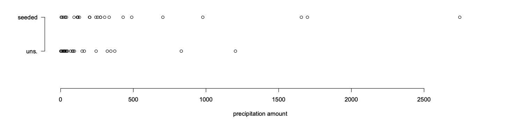

# Introduction and descriptive statistics

<HGlobalLink md5="58d9212c7481def58bc0dab2c3ee983a"/>

### Objectives

Now you should be able to:
- Identify the role that statistics can play in the engineering problem-solving process
- Discuss the importance of random sampling
- Identify key considerations when deciding how to analyse data
- Construct and interpret appropriate graphs of a variable, or of the association between two variables
- Compute and interpret appropriate numerical summaries of a variable, or of the association between two variables

### Some quotes

“I am not much given to regret, so I puzzled over this one a while. Should have taken much more statistics in college, I think.”  
::: right
*Max Levchin, Paypal Co-founder, Slide Founder, 2010*
:::

“I keep saying that the sexy job in the next 10 years will be statisticians, and I’m not kidding.”  
::: right
*Hal Varian, Chief Economist at Google, 2009*
:::

## 1.1 What is statistics?

::: tip Definition:
**Statistics** is the science of the collection, processing, analysis, and interpretation of data.
:::

In short, statistics is **learning from data**.

- Statistical concepts and methods are key tools for learning about the world around us.
- Statistics allows us to turn observational evidence into **information for decision making**.
- Statistics makes use of mathematics, computer science, and subject matter expertise.

A challenge is that when we collect data, we get different answers for different subjects. Data comes with variability.

::: tip Statistics

Statistics allows us to **describe**, **understand**, and **control** the variability insofar as possible and to **take this uncertainty into account** when making judgements and decisions.

:::

## 1.2 The Statistical Process

**Example: Does cloud seeding work?**

Cloud seeding attempts to increase the precipitation that falls from clouds by dispersing substances (such as silver nitrate) into the air that serve as cloud condensation nuclei.

1. **Research question:** Does cloud seeding really work?
2. **Experiment:** For 52 clouds, choose 26 at random and seed with silver nitrate. Observe the amount of precipitation that falls from seeded clouds, as well as from unseeded clouds.

**The following rainfall (in acre-feet) are recorded:**

- Unseeded Clouds: 

`1202.6, 830.1, 372.4, 345.5, 321.2, 244.3, 163.0, 147.8, 95.0, 87.0, 81.2, 68.5, 47.3, 41.1, 36.6, 29.0, 28.6, 26.3, 26.1, 24.4, 21.7, 17.3, 11.5, 4.9, 4.9, 1.0`

- Seeded Clouds: 

`2745.6, 1697.8, 1656.0, 978.0, 703.4, 489.1, 430.0, 334.1, 302.8, 274.7, 274.7, 255.0, 242.5, 200.7, 198.6, 129.6, 119.0, 118.3, 115.3, 92.4, 40.6, 32.7, 31.4, 17.5, 7.7, 4.1`

⇒ These values are our data.

::: warning Note there is variability: 
Different clouds have different precipitation.
:::

3. **Summarise the data** using descriptive statistics (week 1) such
as graphs:

and numerical summaries:

- Average precipitation (seeded) = 441.98
- Average precipitation (unseeded) = 164.58

The seeded clouds had more precipitation than the unseeded clouds, on average.

But every time you sample 26 clouds, you will get a different set of precipitation measurements, with different averages.

Is our difference in means too big to be explained by chance alone?

4. When analysing and interpreting the data we need to consider if ***the observed features may be consequences of chance only***

This part of statistics is called **inferential statistics** or **statistical inference** (Weeks 4-10).

Before discussing statistical inference, we will discuss **probability theory** (Weeks 2-3) to learn how to apply notions of chance to data.

5. Draw a conclusion:
    - “Does cloud seeding using silver nitrate tend to result in more rainfall than not cloud seeding?”

---

### The statistical process

The points (1) to (5) in the above example form the ***typical procedure for statistical inference***:

1. Formulate the **research question**.
2. **Design the study** and collect data.
3. **Summarise the data** efficiently; check for any unusual data features.
4. Choose and apply appropriate statistical methods to extract useful information from the data.
5. **Draw conclusions** and communicate the results to others.

::: caution Fact:
Every step in this process requires understanding statistical principles and concepts as well as knowledge and skills in statistical methods.
:::

## 1.3 Populations and Samples

**Population:**

- Usually, we are interested in obtaining information about a total collection of elements, which is referred to as the population.
- The elements are often called individuals (or units).
- Given the research question, we have observed some characteristic for each individual. This characteristic, which could be quantitative or qualitative, is called a variable.

::: info Example
In the cloud seeding example, the population might be all clouds in the sky for the region and timeframe over which the experiment was conducted. An individual is a cloud and the variable of interest is the amount of rainfall.
:::

**Sample**

It is often physically impossible, infeasible, or just inefficient to obtain data on the whole population.

- The subset of the population which is effectively observed is called the sample.
- The data are the measurements that are actually collected over the sample in the course of the investigation.

::: info Example
- In the cloud seeding example, the sample is the 52 clouds whose rainfall amounts were recorded.
:::

::: caution Fact:
The distinction between the data actually acquired (the sample) and the vast collection of all potential observations (the population) is key to understanding statistics.
:::

## 1.4 Random Sampling

- The process of selecting the sample is called **sampling**.
- If the sample is to be informative about the total population, it must be **representative** of that population.
    - Suppose you are interested in the average age of UNSW students, would you select a sample made up of postgraduate students only?
- The quality of the data is paramount in a statistical study. **Your results are only as good as your data!**
- Sampling must be carefully done, impartially and objectively.
- In practice, the only sampling scheme that guarantees the sample to be representative of the population is **random sampling**.

### Importance of Random Sampling

Once a random sample is chosen, we can use statistical inference to draw conclusions about the entire population, taking the randomness into account (using probabilities).

- Not possible if the sample is not random!

Information drawn from a non-random sample cannot, as a rule, be generalised to larger populations.

::: caution Fact:
The statistical procedures presented in this course may not be valid when applied to non-random samples.
:::

==Never unquestioningly accept samples without knowing how the data have been generated / collected / observed.==

## 1.5 Two key considerations in data analysis

When deciding how to analyse data, there are two key considerations:

1. What are the main **Properties** of the data?
2. What is the **research** Question?

**The “P’s and Q’s” of data analysis.**

### The research question guides analysis

::: info Example – Safety Program Effectiveness:

Below are the average weekly losses of worker-hours due to accidents in 10 industrial plants before and after a certain safety program was put into operation.

**Data:**

| Plant | 1  | 2  | 3  | 4   | 5  | 6  | 7  | 8  | 9  | 10 |
|-------|----|----|----|-----|----|----|----|----|----|----|
| Before| 47 | 73 | 46 | 124 | 33 | 58 | 83 | 32 | 26 | 15 |
| After | 36 | 60 | 44 | 119 | 35 | 51 | 77 | 29 | 26 | 11 |

How should we plot the data? It depends on the research question...

::: details

#### Is before related to after?

#### Is before bigger than after?

:::

### Other Important Aspects of the Research Question

Is it **descriptive** (specific to the sample data at hand) or asking for **inference** (generalising about a population from a sample)?

Are we trying to **estimate** a key quantity (what is the effect of cloud seeding?), or **test a specific hypothesis** (is there an effect of cloud seeding)?

### Data Properties Guide Analysis Too

::: info Example – Safety Program Effectiveness:

How many hours are typically lost to accidents after the program?

::: details

If the data look like this:

| Plant | 1  | 2  | 3  | 4   | 5  | 6  | 7  | 8  | 9  | 10 |
|-------|----|----|----|-----|----|----|----|----|----|----|
| After | 36 | 60 | 44 | 119 | 35 | 51 | 77 | 29 | 26 | 11 |

**Analysis:**

- If the data look like this:
  - On average, 48.8 worker hours are lost to accidents per week.
- If the data look like this:
  - 90% of plants have less than 80 hours lost to accidents per week.

:::

## Key Aspects of Data Properties

- How many variables are involved in the research question?
- Are these variables categorical or quantitative?

**Types of Variables:**

1. **Categorical (or qualitative) variables:** Take a value that is one of several possible categories (no numerical meaning) e.g. gender, hair colour, field of study, status, etc.
2. **Quantitative (or numerical) variables:** Naturally measured as a number for which meaningful arithmetic operations make sense e.g. height, age, temperature, pressure, salary, etc.

**Lecture 1 Statistics for Engineers Term 2, 2022**

---

## Exercise – What Variables?

How many variables are involved in the following questions? For each, is it categorical or quantitative?

1. What aircraft types were produced?
2. Is whether or not you are a smoker related to gender?
3. How much energy is used? (By 90 homes)
4. Is precipitation (in acre/feet) related to cloud seeding treatment?
5. Is height (in inches) related to weight (in pounds)?

**Lecture 1 Statistics for Engineers Term 2, 2022**

---

**Lecture 1 Statistics for Engineers Term 2, 2022**

---

## 1.6 Descriptive Statistics

The first step in learning from data is to present summaries that facilitate interpretation and subsequent analysis.

**Descriptive Statistics:**

- The process of organising, describing, and summarising data.

**Key Tools:**

1. Graphical summaries
2. Numerical summaries

- The methods used depend on the types of variables you have.

**Lecture 1 Statistics for Engineers Term 2, 2022**

---

## 1.7 Graphical Summaries

**A Picture is Worth a Thousand Words**

**Key Points:**

- Graphical representations are often the most effective way to quickly obtain a feel for the essential characteristics of the data.
- Any good statistical analysis of data should always begin with plotting the data.
- Plots often reveal useful information and open paths of inquiry.
- They might also highlight the presence of irregularities or unusual observations (“outliers”).

**Lecture 1 Statistics for Engineers Term 2, 2022**

---

**Lecture 1 Statistics for Engineers Term 2, 2022**

---

## Exercise – Which Graph?

**Questions:**

1. What aircraft types were produced?
2. Is whether or not you are a smoker related to gender?
3. How much energy is used? (By 90 homes)
4. Is precipitation (in acre/feet) related to cloud seeding treatment?
5. Is height (in inches) related to weight (in pounds)?

**Lecture 1 Statistics for Engineers Term 2, 2022**

---

## Graphing a Categorical Variable? Use a Bar Chart

**Example:**

In 1985 the Boeing Company published the figures for its production of transport aircraft. That year, they produced 5 Boeing 707’s, 140 Boeing 737’s, 35 Boeing 747’s, 40 Boeing 757’s, and 20 Boeing 767’s.

**Graphical Summary:**

| Airplane Model | Number of Airplanes Manufactured |
|----------------|----------------------------------|
| Boeing 707     | 5                                |
| Boeing 737     | 140                              |
| Boeing 747     | 35                               |
| Boeing 757     | 40                               |
| Boeing 767     | 20                               |

**Lecture 1 Statistics for Engineers Term 2, 2022**

---

## Comparing Two Categorical Variables? Use a Clustered Bar Chart

**Example:**

Is smoking related to gender?

**Data:**

| Gender | Smoker | Non-smoker |
|--------|--------|------------|
| Female | 40     | 13         |
| Male   | 26     | 21         |

**Lecture 1 Statistics for Engineers Term 2, 2022**

---

## Graphing a Quantitative Variable?

**Example:**

Power companies need information about customer usage to obtain accurate forecasts of demand. Here we consider the energy consumption (BTUs) during a particular period for a sample of 90 gas-heated homes.

**Sample:**

10.04, 13.47, 13.43, 9.07, 11.43, 12.31, 4.00, 9.84, 10.28, 8.29, 6.94, 10.35, 12.91, 10.49, 9.52, 12.62, 11.09, 6.85, 15.24, 18.26, 11.21, 11.12, 10.28, 8.37, 7.15, 9.37, 9.82, 9.76, 8.00, 10.21, 6.62, 12.69, 13.38, 7.23, 6.35, 5.56, 5.98, 6.78, 7.73, 9.43, 9.27, 8.67, 15.12, 11.70, 5.94, 11.29, 7.69, 10.64, 12.71, 9.96, 13.60, 16.06, 7.62, 2.97, 11.70, 13.96, 8.81, 12.92, 12.19, 16.90, 9.60, 9.83, 8.26, 8.69, 6.80, 9.58, 8.54, 7.87, 9.83, 10.30, 8.61, 7.93, 13.11, 7.62, 10.95, 13.42, 6.72, 10.36, 12.16, 10.40, 5.20, 10.50, 8.58, 14.24, 14.35, 8.47, 7.29, 12.28, 11.62, 7.16

**Lecture 1 Statistics for Engineers Term 2, 2022**

---

## Graphing a Quantitative Variable? Option 1: A Boxplot

**Lecture 1 Statistics for Engineers Term 2, 2022**

---

## Graphing a Quantitative Variable? Option 2: A Histogram

**Lecture 1 Statistics for Engineers Term 2, 2022**

---

## How Many Histogram Classes?

The number of classes or bins to use is a trade-off:

- Too few classes lose too much information.
- Too many classes make frequencies too small, so patterns are harder to see.

**Empirical Rule:**

- Number of classes ≈ √number of observations.

**Example:**

- For the power example, there were 90 observations, and √