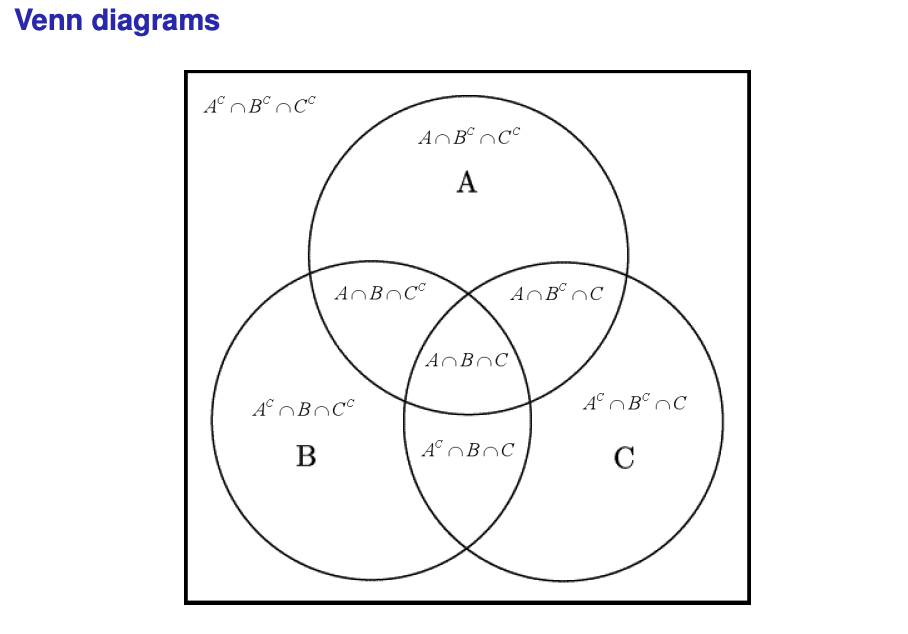

# Elements of Probability

<HGlobalLink md5="a098b20c5e903866aad48edcb912b946"/>

### Objectives

Now you should be able to:
 - Define probability and use rules to the probability of one event from others
 - Calculate probabilities for equally likely outcomes
 - Define and calculate conditional probability
 - Use conditional probability rules in practical settings
 - Determine whether events are independent and use independence to calculate probabilities

## R.1 Definitions and Notation

::: tip Definitions
- **Random experiment**: any experiment whose exact outcome cannot be predicted with certainty.
- **Outcome**: the result of a random experiment.
- **Event**: a set of possible outcomes.
- **Sample space**: the set containing all possible outcomes.
- **Probability of an event $E$**, $P(E)$: a number measuring how likely event $E$ is from a random experiment. Usually, this is interpreted as the long run frequency of $E$ in repeat experiments.
:::

**Example:**

- $P(F) \approx 0.5$ around UNSW campus.
- $P(F) \approx 0.2$ in this course.
- $P(F) \approx 1$ in the women’s toilets.

### Notation for events

::: tip Set notation:

$
\begin{aligned}
&\text{Union} & A &\cup B &= &\quad\text{event “either A or B occurs”}  \\
&\text{Intersection} & A &\cap B &= &\quad\text{event “both A and B occur”} \\
&\text{Complement} &  &A^c &= &\quad\text{event “A does not occur” (= A')}
\end{aligned}
$

:::

$A \subseteq B \Rightarrow A$ implies $B$

$A \cap B = \emptyset \Rightarrow$ mutually exclusive events (they cannot occur together)

**De Morgan’s laws:**

- $(A \cup B)^c = A^c \cap B^c$
- $(A \cap B)^c = A^c \cup B^c$

Venn diagrams often help in understanding relations between sets.

## R.2 Probability rules

Any probability measure should satisfy Kolmogorov’s axioms (1933)

::: tip Kolmogorov’s probability axioms:

The probability measure $\mathbb{P}( \cdot )$ satisfies:

1. $0 \leq \mathbb{P}(E) \leq 1$ for any event $E$
2. $\mathbb{P}(S) = 1$
3. For any (infinite) sequence of <u>mutually exclusive</u> events $E_1, E_2, \ldots$:

$$\mathbb{P}\left( \bigcup_{i=1}^{\infty} E_i \right) = \sum_{i=1}^{\infty} \mathbb{P}(E_i)$$

:::

**Many results can be derived from these axioms, including:**

- If $A$ and $B$ are <u>mutually exclusive</u>, $\mathbb{P}(A \cup B) = \mathbb{P}(A) + \mathbb{P}(B)$
- $\mathbb{P}(A^c) = 1 - \mathbb{P}(A)$
- The additive law, $\mathbb{P}(A \cup B) = \mathbb{P}(A) + \mathbb{P}(B) - \mathbb{P}(A \cap B)$

::: info Example: Winter is coming (?)

40% of people watched Game of Thrones, and 50% think we need to do more to address climate change. 30% of people watched Game of Thrones and think we need to do more about climate change.

1. What proportion of people either watched Game of Thrones or think we need to do more about climate change?
2. What proportion of people neither watched Game of Thrones nor think we need to do more about climate change?

::: details Solution

1. $\mathbb{P}(A \cup B) = \mathbb{P}(A) + \mathbb{P}(B) - \mathbb{P}(A \cap B) = 0.4 + 0.5 - 0.3 = 0.6$

2. $\mathbb{P}((A \cup B)^c) = 1 - \mathbb{P}(A \cup B) = 0.4$
:::

## R.3 Equally likely outcomes

If all outcomes are equally likely,

$$\mathbb{P}(E) = \frac{\text{number of outcomes in } E}{\text{total number of possible outcomes}}$$

The following counting rules help calculate the number of outcomes:

**Multiplication rule:** If there are $k$ steps in obtaining an outcome, and $n_i$ ways of completing step $i$, then the total number of outcomes is

$$n_1 \times n_2 \times \cdots \times n_k$$

A permutation is an ordered sequence of the elements in a set. The number of different permutations of $n$ elements is:

$$P_n = n \times (n - 1) \times (n - 2) \times \cdots \times 2 \times 1 = n!$$

A combination is a subset of elements selected from a larger set. The number of combinations of size $r$ that can be selected from a set of $n$ elements is:

$$\binom{n}{r} = C_{n}^{r} = \frac{n!}{r!(n - r)!}$$

::: info Example: Survey responses

You survey ten people and ask them if they think marijuana should be legalized. An outcome is a set of ten yes/no responses, e.g., YYNNYNNNYN.

1. How many possible outcomes are there?
2. How many ways could four people, out of the ten, answer “yes"?
3. Assume all outcomes are equally likely (meaning that the true probability of each person saying “yes" is 50%). What is the probability that exactly four out of the ten respondents say “yes"?

::: details Solution

1. There are $2^{10} = 1024$ possible outcomes.

2. There are $\binom{10}{4} = 210$ ways to choose four people to answer “yes".

3. The probability that exactly four out of the ten respondents say “yes" is $\binom{10}{4} \times 0.5^{4} \times 0.5^{6} = 0.2051$.

:::

## R.4 Conditional probability

::: tip Definition:

The conditional probability of $B$, conditional on $A$, is defined as:

$$\mathbb{P}(B|A) = \frac{\mathbb{P}(A \cap B)}{\mathbb{P}(A)} \quad (\text{if } \mathbb{P}(A) > 0)$$

This is the probability of $B$, given that $A$ has occurred.

:::

If $A$ has occurred, $A$ is the new sample space. 

The probability of $B$ has to be calculated within $A$ and relative to $\mathbb{P}(A)$. In a tree diagram, $\mathbb{P}(B|A)$ is the probability on the branch from $A$ to $B$.

::: info Example: Transistors

A bin contains 5 defective, 10 partially defective, and 25 acceptable transistors. Defective transistors immediately fail when put in use, while partially defective ones fail after a couple of hours of use. A transistor is chosen at random from the bin and put into use. If it does not immediately fail, what is the probability it is acceptable?

::: details Solution

Let $A$ be the event that the transistor is acceptable, and $B$ be the event that the transistor does not immediately fail. We want to find $\mathbb{P}(A|B)$.

$$\mathbb{P}(A|B) = \frac{\mathbb{P}(A \cap B)}{\mathbb{P}(B)} = \frac{\mathbb{P}(A)}{\mathbb{P}(B)} = \frac{25}{35} = \frac{5}{7}$$

:::

## R.5 Conditional probability rules

- If $B \subseteq A$, $\mathbb{P}(A|B) = 1$

- **Multiplication law:**

$$\mathbb{P}(A \cap B) = \mathbb{P}(A|B) \times \mathbb{P}(B)$$

- **Law of total probability:**

$$\mathbb{P}(A) = \mathbb{P}(A|B) \times \mathbb{P}(B) + \mathbb{P}(A|B^c) \times \mathbb{P}(B^c)$$

- **Bayes’ rule:** if $\mathbb{P}(A) > 0$ and $\mathbb{P}(B) > 0$,

$$\mathbb{P}(A|B) = \mathbb{P}(B|A) \times \frac{\mathbb{P}(A)}{\mathbb{P}(B)}$$

::: info Example: A screening test

A new medical procedure has been shown to be effective in the early detection of an illness and a medical screening of the population is proposed. The probability that the test correctly identifies someone with the illness as positive is 0.99, and the probability that someone without the illness is correctly identified by the test is 0.95. The incidence of the illness in the general population is 0.001.

1. What is the chance that a randomly selected person gets a positive result?
2. You take the test, and the result is positive. What is the probability that you have the disease?

::: details Solution

1. The probability that a randomly selected person gets a positive result is:

$$\mathbb{P}(B) = \mathbb{P}(B|A) \times \mathbb{P}(A) + \mathbb{P}(B|A^c) \times \mathbb{P}(A^c) = 0.99 \times 0.001 + 0.05 \times 0.999 = 0.051$$

2. The probability that you have the disease is:

$$\mathbb{P}(A|B) = \mathbb{P}(B|A) \times \frac{\mathbb{P}(A)}{\mathbb{P}(B)} = \frac{0.99 \times 0.001}{0.051} = 0.0194$$

:::

## R.6 Independence of two events

::: tip Definition

Two events $A$ and $B$ are said to be independent if and only if:

$$\mathbb{P}(A \cap B) = \mathbb{P}(A) \times \mathbb{P}(B)$$

:::

Note that independence implies:

$$\mathbb{P}(A|B) = \mathbb{P}(A) \text{ and } \mathbb{P}(B|A) = \mathbb{P}(B)$$

i.e., the probability of the occurrence of one event is unaffected by the occurrence or non-occurrence of the other.

::: caution 
Only multiply $\mathbb{P}(A)$ and $\mathbb{P}(B)$ if $A$ and $B$ are independent.
:::

This rule extends to multiple events if all possible intersections of events need to equal the corresponding product of event probabilities.

### Important applications of independence

Independence is a key idea in this course, and in life! Here are some examples of where it comes up:

- It is common in engineering research to study if two variables are related to each other – to test for independence.
- Random sampling ensures that observations are independent of each other. Rules for independent variables will help us understand the statistics we calculate from data (weeks 4-12).
- Parallel “back-ups": ensuring a system has an independent backup considerably reduces the chance of system failure.
- False positives: if you independently check for a problem many times, with a non-zero chance of a false positive each time, false positives accumulate quickly.

::: info Example: Buses, maths, and Opal cards

Let’s assume that the probability a student caught the bus to UNSW today is 60%, the probability that they passed first-year maths is 90%, and the probability they caught the bus today and passed first-year maths is 54%. The probability a student has an Opal card on them is 90%, and the probability they have an Opal card and caught the bus today is 59%. Use this information to answer the following questions.

1. Is catching a bus to UNSW independent of whether or not a student passed first-year maths?
2. Is catching a bus to UNSW independent of whether a student has an Opal card on them?

::: details Solution

1. To check if catching a bus to UNSW is independent of passing first-year maths, we need to check if $\mathbb{P}(A \cap B) = \mathbb{P}(A) \times \mathbb{P}(B)$.

$$\mathbb{P}(A \cap B) = 0.54 = 0.6 \times 0.9 = 0.54$$

So, catching a bus to UNSW is independent of passing first-year maths.

2. To check if catching a bus to UNSW is independent of having an Opal card, we need to check if $\mathbb{P}(A \cap B) = \mathbb{P}(A) \times \mathbb{P}(B)$.

$$\mathbb{P}(A \cap B) = 0.59 \neq 0.6 \times 0.9 = 0.54$$

So, catching a bus to UNSW is not independent of having an Opal card.

:::

::: info Example: Parallel back-ups

An electric system composed of $n$ separate components is said to be a parallel system if it functions when at least one of the components functions. For such a system, if component $i$, independently of other components, functions with probability $p_i$, $i = 1, \ldots, n$, what is the probability the system functions?

::: details Solution

The system functions if at least one component functions. The probability that the system functions is:

$$1 - \mathbb{P}(\text{all components fail}) = 1 - \prod_{i=1}^{n} (1 - p_i)$$

:::
::: info Example: False positives

Many companies must monitor the effluent that is discharged from their plants in waterways. It is the law that some substances have water-quality limits that are below some limit $L$. The effluent is judged to satisfy the limit if every test specimen is below $L$. Suppose the water does not contain the contaminant but that the variability in the chemical analysis still gives a 1% chance that a measurement on a test specimen will exceed $L$.

1. Find the probability that neither of two test specimens, both free of the contaminant, will fail to be in compliance.
2. If one test specimen is taken each week for two years (all free of the contaminant), find the probability that none of the test specimens will fail to be in compliance, and comment.

::: details Solution

1. The probability that neither of two test specimens will fail to be in compliance is:

$$\mathbb{P}(\text{both pass}) = (0.99)^2 = 0.9801$$

2. The probability that none of the test specimens will fail to be in compliance is:

$$\mathbb{P}(\text{both pass}) = (0.99)^2 = 0.9801$$

:::