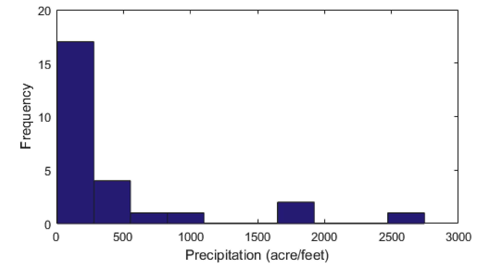

## Question 1

**Concept**

<iframe width="672" height="378" src="https://www.youtube.com/embed/Uh8n8tULRPw" title="L1 16 Graphical Summaries" frameborder="0" allow="accelerometer; autoplay; clipboard-write; encrypted-media; gyroscope; picture-in-picture; web-share" referrerpolicy="strict-origin-when-cross-origin" allowfullscreen></iframe>

Video Recap
- The following table summarises the appropriate graphical summaries for each type of variable(s).

|   | one variable || two variables                                            |||
|----------------|--------------|---|-------------------------------------------------------------|---|---|
|variable type| categorical  | quantitative       | both categorical       | one categorical, one quantitative | both quantitative  |
| useful graphs: | bar chart    | boxplot or histogram| clustered bar chart | comparative boxplots                 | scatterplot       |

## Question 2

**Example**

Determine the most appropriate type of graphical summary for each of the following research questions.

1. What aircraft types were produced?

    Which is the most appropriate type of graphical summary? <HSelect type="Mobius" :values="[{label: 'Boxplot'}, {label: 'Scatterplot'}, {label: 'Clustered bar chart'}, {label: 'Histogram'},{label: 'Comparative boxplots'},{label: 'Bar chart', selected: true}, {label: 'Pie chart'}]" />
    
2. Is whether or not you are a smoker related to gender?

    Which is the most appropriate type of graphical summary? <HSelect type="Mobius" :values="[{label: 'Boxplot'}, {label: 'Scatterplot'}, {label: 'Clustered bar chart', selected: true}, {label: 'Histogram'},{label: 'Comparative boxplots'},{label: 'Bar chart'}, {label: 'Pie chart'}]" />

3. How much energy is used?

    Which is the most appropriate type of graphical summary? <HSelect type="Mobius" :values="[{label: 'Boxplot', selected: true}, {label: 'Scatterplot'}, {label: 'Clustered bar chart'}, {label: 'Histogram'},{label: 'Comparative boxplots'},{label: 'Bar chart'}, {label: 'Pie chart'}]" /> OR <HSelect type="Mobius" :values="[{label: 'Boxplot'}, {label: 'Scatterplot'}, {label: 'Clustered bar chart'}, {label: 'Histogram', selected: true},{label: 'Comparative boxplots'},{label: 'Bar chart'}, {label: 'Pie chart'}]" />

4. Is precipitation related to cloud seeding treatment?

    Which is the most appropriate type of graphical summary? <HSelect type="Mobius" :values="[{label: 'Boxplot'}, {label: 'Scatterplot'}, {label: 'Clustered bar chart'}, {label: 'Histogram'},{label: 'Comparative boxplots', selected: true},{label: 'Bar chart'}, {label: 'Pie chart'}]" />

5. Is height related to weight?

    Which is the most appropriate type of graphical summary? <HSelect type="Mobius" :values="[{label: 'Boxplot'}, {label: 'Scatterplot', selected: true}, {label: 'Clustered bar chart'}, {label: 'Histogram'},{label: 'Comparative boxplots'},{label: 'Bar chart'}, {label: 'Pie chart'}]" />

<iframe width="672" height="378" src="https://www.youtube.com/embed/4Pu07jsJGWw" title="L1 14 Graphical Summaries Example" frameborder="0" allow="accelerometer; autoplay; clipboard-write; encrypted-media; gyroscope; picture-in-picture; web-share" referrerpolicy="strict-origin-when-cross-origin" allowfullscreen></iframe>

## Question 3

**Example**

n 1985 the Boeing Company published the figures for its production of transport aircraft. That year, they produced 5 Boeing 707’s, 140 Boeing 737’s, 35 Boeing 747’s, 40 Boeing 757’s and 20 Boeing 767’s. 

Construct a graphical summary to represent this data.

<iframe width="672" height="378" src="https://www.youtube.com/embed/K2mFUrU3FNk" title="L1 17 Bar Chart Example" frameborder="0" allow="accelerometer; autoplay; clipboard-write; encrypted-media; gyroscope; picture-in-picture; web-share" referrerpolicy="strict-origin-when-cross-origin" allowfullscreen></iframe>

## Question 4

**Example**

Is smoking related to gender?

The following table shows data from 100 patients from three American hospitals:

| Gender | Smoker | Non-smoker |
|--------|--------|------------|
| Female | 40     | 13         |
| Male   | 26     | 21         |

Construct the graphical summary(s) to represent this data.

<iframe width="672" height="378" src="https://www.youtube.com/embed/f4U0OmvoAWo" title="L1 18 Clustered Bar Chart Example" frameborder="0" allow="accelerometer; autoplay; clipboard-write; encrypted-media; gyroscope; picture-in-picture; web-share" referrerpolicy="strict-origin-when-cross-origin" allowfullscreen></iframe>

## Question 5

**Example**

Power companies need information about customer usage to obtain accurate forecasts of demand. Here we consider the energy consumption (BTUs) during a particular period for a sample of 90 gas-heated homes.

The sample is

`10.04 13.47 13.43 9.07 11.43 12.31 4.00 9.84 10.28 8.29 6.94 10.35 12.91 10.49 9.52 12.62 11.09 6.85 15.24 18.26 11.21 11.12 10.28 8.37 7.15 9.37 9.82 9.76 8.00 10.21 6.62 12.69 13.38 7.23 6.35 5.56 5.98 6.78 7.73 9.43 9.27 8.67 15.12 11.70 5.94 11.29 7.69 10.64 12.71 9.96 13.60 16.06 7.62 2.97 11.70 13.96 8.81 12.92 12.19 16.90 9.60 9.83 8.26 8.69 6.80 9.58 8.54 7.87 9.83 10.30 8.61 7.93 13.11 7.62 10.95 13.42 6.72 10.36 12.16 10.40 5.20 10.50 8.58 14.24 14.35 8.47 7.29 12.28 11.62 7.16`

Construct the graphical summary(s) to represent this data.

 <iframe width="672" height="378" src="https://www.youtube.com/embed/kdmnfBNs-zY" title="L1 19 Boxplot and Histogram Example" frameborder="0" allow="accelerometer; autoplay; clipboard-write; encrypted-media; gyroscope; picture-in-picture; web-share" referrerpolicy="strict-origin-when-cross-origin" allowfullscreen></iframe>

## Question 6

**Concept**

<iframe width="672" height="378" src="https://www.youtube.com/embed/5Ds42zQ1UHQ" title="L1 20 Commenting on Histograms" frameborder="0" allow="accelerometer; autoplay; clipboard-write; encrypted-media; gyroscope; picture-in-picture; web-share" referrerpolicy="strict-origin-when-cross-origin" allowfullscreen></iframe>

Video Recap:
- An empirical rule for determining the number of classes in a histogram is 
$$\text{number of classes} \simeq \sqrt{\text{number of observations}}$$
- When commenting on a histogram, we should comment on:
  - whether the data is ***symmetric*** or ***skewed*** to the right/left,
  - if there are any possible ***outliers***,
  - the ***typical value*** of the data and the ***range*** of the data,
  - if the data is ***unimodal*** or bimodal/multimodal,
  - if the data is ***bell-shaped*** or not.

- When commenting on a boxplot, we should comment on:
  - whether the data is ***symmetric*** or ***skewed*** to the right/left,
  - if there are any possible ***outliers***,
  - the ***typical value*** of the data and the ***range*** of the data.

## Question 7

**Example**

Below is a histogram of precipitation from the cloud seeding experiment (for the 26 seeded clouds only).

Comment on its main features.

<iframe width="672" height="378" src="https://www.youtube.com/embed/3rXRlvlXQNQ" title="L1 21 Commenting on Histograms Example" frameborder="0" allow="accelerometer; autoplay; clipboard-write; encrypted-media; gyroscope; picture-in-picture; web-share" referrerpolicy="strict-origin-when-cross-origin" allowfullscreen></iframe>

## Question 7

**Example**

Observe the following data. Can you combine some of the classes to produce a better histogram?

| [0, 10) | [10, 20) | [20, 30) | [30, 40) | [40, 50) | [50, 60) | [60, 70) | [70, 80) |
|---------|----------|----------|----------|----------|----------|----------|----------|
| 32      | 9        | 7        | 1        | 1        | 0        | 0        | 1        |

<iframe width="672" height="378" src="https://www.youtube.com/embed/HmewQmO_CYA" title="L1 22 Density Histograms" frameborder="0" allow="accelerometer; autoplay; clipboard-write; encrypted-media; gyroscope; picture-in-picture; web-share" referrerpolicy="strict-origin-when-cross-origin" allowfullscreen></iframe>

Video recap
- A ***density histogram*** is a histogram whose rectangle heights are the densities of each class (no longer the frequencies).

## Question 8

**Example**

Suppose we want to compare the amount of precipitation between the seeded clouds and unseeded clouds. 

Which of these is/are suitable graphical summaries for this data?

 

Suppose we want to study the relationship between the weight and the height of the people in a population.

Which of these is/are suitable graphical summaries for this data?

<iframe width="672" height="378" src="https://www.youtube.com/embed/UT9szJjBgEo" title="L1 23 Comparative Boxplots and Scatterplot Example" frameborder="0" allow="accelerometer; autoplay; clipboard-write; encrypted-media; gyroscope; picture-in-picture; web-share" referrerpolicy="strict-origin-when-cross-origin" allowfullscreen></iframe>

