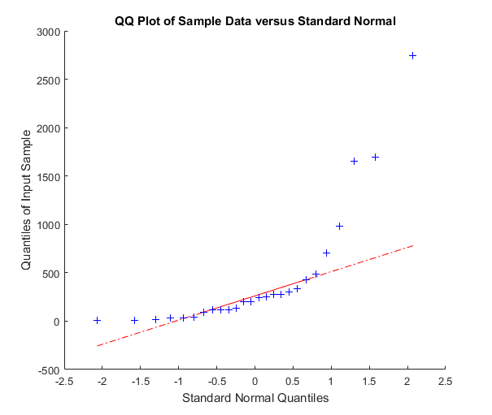

## Question 1

**Concept**

<iframe width="672" height="378" src="https://www.youtube.com/embed/xIqRDhxdDhU" title="L3 20 Normal Quantile Plots (with plots)" frameborder="0" allow="accelerometer; autoplay; clipboard-write; encrypted-media; gyroscope; picture-in-picture; web-share" referrerpolicy="strict-origin-when-cross-origin" allowfullscreen></iframe>

Video Recap

- A **normal quantile plot** is the best way to check how close your data are to a normal distribution.
- This plot compares the data, ordered from smallest to largest, to relevant quantiles from the standard normal distribution.
-  If the data are close to normally distributed, they should be close to a straight line on the normal quantile plot.

## Question 2

**Exercise**

Below is a normal quantile plot of rainfall of seeded clouds from the cloud seeding experiment introduced in Week 1.

Choose the answer that best described what you can say about the distribution of the data, based on this plot.

- [ ] We cannot comment on the distribution of the data based on this plot

- [x] The data are clearly right-skewed

- [ ] The normality assumption appears acceptable

- [ ] The sample size is too small to say anything

## Question 3

**Concept**

<iframe width="672" height="378" src="https://www.youtube.com/embed/70CkW_gt28Y" title="L3 21 Transforming Observations" frameborder="0" allow="accelerometer; autoplay; clipboard-write; encrypted-media; gyroscope; picture-in-picture; web-share" referrerpolicy="strict-origin-when-cross-origin" allowfullscreen></iframe>

Video Recap

- If our data are not normal, we can **transform** it so there is less right-skew and the data are closer to being normal.

